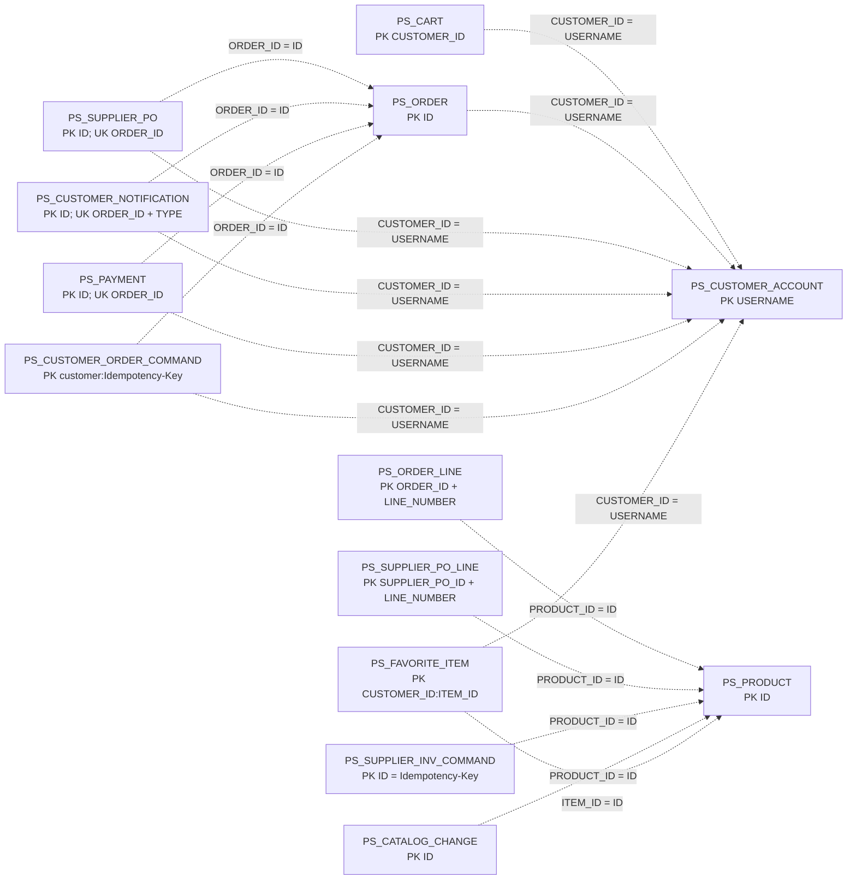
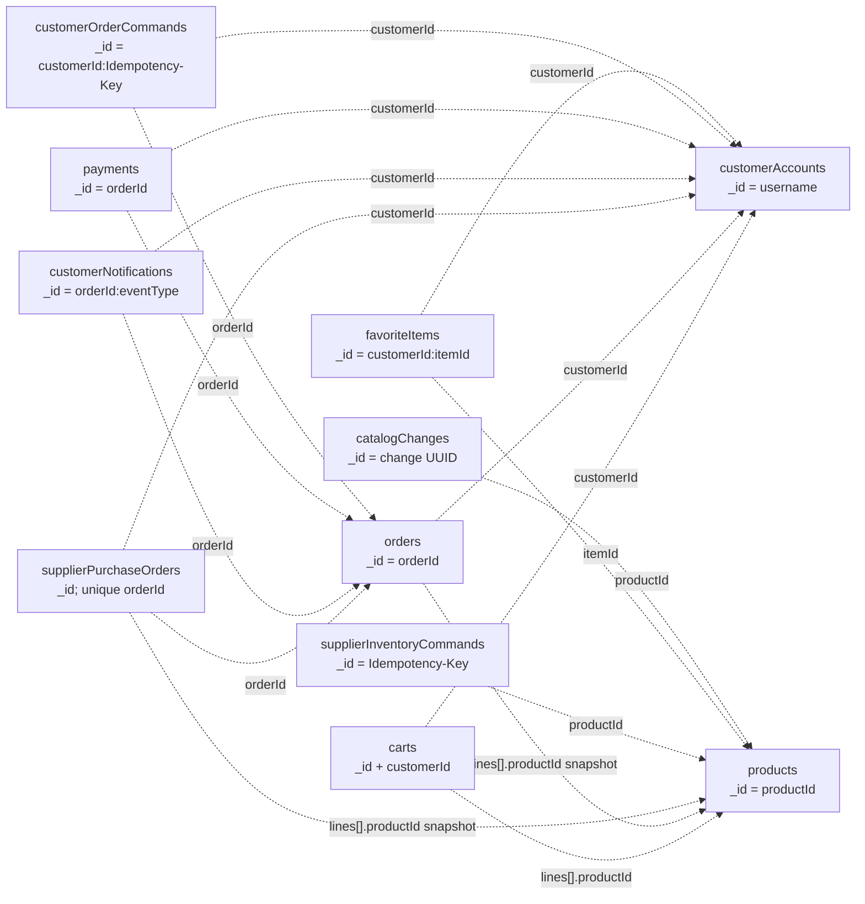

# PetStore database schemas: Oracle and MongoDB

## Scope and notation

This document describes the schema implemented by the current application, including customer accounts, administratively managed product/item variants and prices, catalog-change auditing, MyList favourites, carts, customer orders/backorders, payment authorization/capture/void/refund, customer cancellation/refund commands, administrator review, replay-safe supplier inventory commands, supplier purchase orders, and the customer notification outbox/inbox. It is derived from the JPA entities and MongoDB document mappings.

Key labels used below:

- **PK** — relational primary key. For MongoDB, `_id` is the equivalent enforced unique document identifier.
- **FK** — database-enforced foreign key.
- **UK** — database-enforced unique key/index.
- **IX** — non-unique index.
- **Logical reference** — an identifier understood by the application, but not protected by a database foreign-key constraint.
- **Snapshot** — copied purchase-time data intentionally embedded/stored with the transaction so later catalog changes do not rewrite history.

## High-level comparison

| Concern | Oracle | MongoDB |
|---|---|---|
| Storage model | Fourteen normalized/outbox/command/audit tables | Eleven aggregate-oriented collections |
| Child lines | Separate `PS_*_LINE` tables | Embedded arrays inside cart/order/PO documents |
| Primary identity | Declared primary-key constraints | Mandatory unique `_id` index |
| Referential integrity | Enforced for parent-to-line tables; business references are otherwise logical | No foreign keys; aggregate ownership and cross-collection references are enforced by application transactions |
| Money | `NUMBER(12,2)` | BSON `Decimal128` |
| Optimistic concurrency | JPA `@Version` mapped to `NUMBER(19,0)` | Spring Data `@Version`/explicit version mapped to BSON `Int64` |
| Timestamps | `TIMESTAMP(9) WITH TIME ZONE` | BSON Date (UTC instant) |

---

# Oracle relational schema

## Physical entity-relationship diagram

Only database-enforced foreign-key relationships are drawn as relationships here. The dashed logical-reference diagram below shows the important identifiers that deliberately do not have Oracle FK constraints.

```mermaid
erDiagram
    PS_CART {
        VARCHAR2 CUSTOMER_ID PK "100 chars; cart/customer identity"
        NUMBER VERSION "19,0; optimistic token"
    }
    PS_CART_LINE {
        VARCHAR2 CUSTOMER_ID PK, FK "100 chars; owning cart"
        NUMBER LINE_NUMBER PK "10,0; array position"
        VARCHAR2 PRODUCT_ID "40 chars; logical product ref"
        VARCHAR2 PRODUCT_NAME "120 chars; cart snapshot"
        NUMBER UNIT_PRICE "12,2"
        NUMBER QUANTITY "10,0"
    }
    PS_CUSTOMER_ACCOUNT {
        VARCHAR2 USERNAME PK "50 chars"
        VARCHAR2 PASSWORD_HASH "100 chars; BCrypt"
        VARCHAR2 FULL_NAME "100 chars"
        VARCHAR2 EMAIL "254 chars"
        VARCHAR2 PHONE "40 chars"
        VARCHAR2 SHIP_FULL_NAME "100 chars"
        VARCHAR2 SHIP_LINE1 "150 chars"
        VARCHAR2 SHIP_LINE2 "150 chars; nullable"
        VARCHAR2 SHIP_CITY "80 chars"
        VARCHAR2 SHIP_STATE "80 chars"
        VARCHAR2 SHIP_POSTAL_CODE "20 chars"
        VARCHAR2 SHIP_COUNTRY "80 chars"
        VARCHAR2 PREFERRED_LANGUAGE "10 chars"
        VARCHAR2 FAVORITE_CATEGORY "30 chars"
        BOOLEAN MY_LIST_PREFERENCE
        BOOLEAN BANNER_PREFERENCE
    }
    PS_PRODUCT {
        VARCHAR2 ID PK "40 chars"
        VARCHAR2 PRODUCT_GROUP_ID "40 chars; parent product"
        VARCHAR2 VARIANT_NAME "80 chars; item attribute"
        VARCHAR2 CATEGORY_ID "40 chars; indexed"
        VARCHAR2 CATEGORY_NAME "80 chars"
        VARCHAR2 NAME "120 chars"
        VARCHAR2 DESCRIPTION "1000 chars"
        NUMBER PRICE "12,2"
        NUMBER STOCK "10,0"
        BOOLEAN ACTIVE "published in storefront"
        NUMBER VERSION "19,0; optimistic token"
    }
    PS_CATALOG_CHANGE {
        VARCHAR2 ID PK "40 chars; UUID"
        VARCHAR2 PRODUCT_ID "40 chars; logical product ref"
        VARCHAR2 ACTION "CREATED or UPDATED"
        VARCHAR2 CHANGED_BY "administrator"
        TIMESTAMPTZ OCCURRED_AT "indexed"
        NUMBER PREVIOUS_PRICE "12,2; nullable"
        NUMBER NEW_PRICE "12,2"
        BOOLEAN PREVIOUS_ACTIVE "nullable"
        BOOLEAN NEW_ACTIVE
        NUMBER PREVIOUS_VERSION "nullable"
        NUMBER NEW_VERSION
    }
    PS_FAVORITE_ITEM {
        VARCHAR2 ID PK "101 chars; customer:item"
        VARCHAR2 CUSTOMER_ID UK "50 chars; logical account ref"
        VARCHAR2 ITEM_ID UK "40 chars; logical item ref"
        TIMESTAMPTZ ADDED_AT "not null; indexed with customer"
    }
    PS_ORDER {
        VARCHAR2 ID PK "36 chars; UUID"
        VARCHAR2 CUSTOMER_ID UK "100 chars; logical account ref"
        VARCHAR2 IDEMPOTENCY_KEY UK "100 chars; unique with customer"
        TIMESTAMPTZ CREATED_AT "not null"
        VARCHAR2 STATUS "30 chars"
        VARCHAR2 SHIP_FULL_NAME "100 chars"
        VARCHAR2 SHIP_LINE1 "150 chars"
        VARCHAR2 SHIP_LINE2 "150 chars; nullable"
        VARCHAR2 SHIP_CITY "80 chars"
        VARCHAR2 SHIP_STATE "80 chars"
        VARCHAR2 SHIP_POSTAL_CODE "20 chars"
        VARCHAR2 SHIP_COUNTRY "80 chars"
        NUMBER TOTAL "12,2"
        NUMBER VERSION "19,0; optimistic token"
        TIMESTAMPTZ REVIEWED_AT "nullable"
        VARCHAR2 REVIEWED_BY "100 chars; nullable"
    }
    PS_ORDER_LINE {
        VARCHAR2 ORDER_ID PK, FK "36 chars; owning order"
        NUMBER LINE_NUMBER PK "10,0; array position"
        VARCHAR2 PRODUCT_ID "40 chars; logical product ref"
        VARCHAR2 PRODUCT_NAME "120 chars; purchase snapshot"
        NUMBER UNIT_PRICE "12,2; purchase snapshot"
        NUMBER QUANTITY "10,0"
        NUMBER SUBTOTAL "12,2"
    }
    PS_SUPPLIER_PO {
        VARCHAR2 ID PK "36 chars"
        VARCHAR2 ORDER_ID UK "36 chars; logical order ref"
        VARCHAR2 CUSTOMER_ID "100 chars; logical account ref"
        TIMESTAMPTZ CREATED_AT "not null"
        VARCHAR2 STATUS "30 chars"
        NUMBER VERSION "19,0; optimistic token"
        TIMESTAMPTZ PROCESSED_AT "nullable"
    }
    PS_SUPPLIER_PO_LINE {
        VARCHAR2 SUPPLIER_PO_ID PK, FK "36 chars; owning PO"
        NUMBER LINE_NUMBER PK "10,0; array position"
        VARCHAR2 PRODUCT_ID "40 chars; logical product ref"
        VARCHAR2 PRODUCT_NAME "120 chars; purchase snapshot"
        NUMBER UNIT_PRICE "12,2; purchase snapshot"
        NUMBER QUANTITY "10,0"
        NUMBER SUBTOTAL "12,2"
    }
    PS_CUSTOMER_NOTIFICATION {
        VARCHAR2 ID PK "80 chars; order + event type"
        VARCHAR2 CUSTOMER_ID "100 chars; logical account ref"
        VARCHAR2 ORDER_ID UK "36 chars; logical order ref"
        VARCHAR2 TYPE UK "30 chars; unique with order"
        VARCHAR2 TITLE "120 chars"
        VARCHAR2 MESSAGE "500 chars"
        TIMESTAMPTZ CREATED_AT "event time"
        VARCHAR2 DELIVERY_STATUS "PENDING or DELIVERED"
        NUMBER DELIVERY_ATTEMPTS "delivery audit"
        TIMESTAMPTZ NEXT_ATTEMPT_AT "nullable when delivered"
        TIMESTAMPTZ DELIVERED_AT "nullable"
        VARCHAR2 LAST_ERROR "nullable"
        TIMESTAMPTZ READ_AT "nullable"
        NUMBER VERSION "optimistic token"
    }
    PS_SUPPLIER_INV_COMMAND {
        VARCHAR2 ID PK "100 chars; idempotency key"
        VARCHAR2 PRODUCT_ID "40 chars; logical product ref"
        NUMBER EXPECTED_VERSION "19,0; request snapshot"
        NUMBER QUANTITY "10,0; requested absolute stock"
        NUMBER RESULT_STOCK "10,0; committed result"
        NUMBER RESULT_VERSION "19,0; committed result"
        TIMESTAMPTZ COMPLETED_AT "command audit time"
    }
    PS_PAYMENT {
        VARCHAR2 ID PK "36 chars; equals order ID"
        VARCHAR2 ORDER_ID UK "36 chars; logical order ref"
        VARCHAR2 CUSTOMER_ID "100 chars; logical account ref"
        NUMBER AMOUNT "12,2; immutable order amount"
        VARCHAR2 CURRENCY "3 chars; USD"
        VARCHAR2 METHOD_LABEL "80 chars; masked display only"
        VARCHAR2 STATUS "AUTHORIZED/CAPTURED/VOIDED/REFUNDED"
        VARCHAR2 AUTHORIZATION_REFERENCE "80 chars"
        VARCHAR2 CAPTURE_REFERENCE "80 chars; nullable"
        VARCHAR2 REFUND_REFERENCE "80 chars; nullable"
        TIMESTAMPTZ CREATED_AT "customer-history index"
        TIMESTAMPTZ AUTHORIZED_AT "not null"
        TIMESTAMPTZ CAPTURED_AT "nullable"
        TIMESTAMPTZ VOIDED_AT "nullable"
        TIMESTAMPTZ REFUNDED_AT "nullable"
        NUMBER VERSION "19,0; optimistic token"
    }
    PS_CUSTOMER_ORDER_COMMAND {
        VARCHAR2 ID PK "customer:idempotency-key"
        VARCHAR2 CUSTOMER_ID "100 chars"
        VARCHAR2 IDEMPOTENCY_KEY "100 chars"
        VARCHAR2 ORDER_ID "36 chars; logical order ref"
        VARCHAR2 ACTION "CANCEL or REFUND"
        NUMBER EXPECTED_VERSION "request token"
        VARCHAR2 REASON "250 chars"
        VARCHAR2 RESULT_STATUS "committed order status"
        NUMBER RESULT_VERSION "committed order version"
        TIMESTAMPTZ CREATED_AT "command audit time"
    }

    PS_CART ||--o{ PS_CART_LINE : "FK: CUSTOMER_ID"
    PS_ORDER ||--|{ PS_ORDER_LINE : "FK: ORDER_ID"
    PS_SUPPLIER_PO ||--|{ PS_SUPPLIER_PO_LINE : "FK: SUPPLIER_PO_ID"
```

The child tables use composite primary keys consisting of the parent identifier plus `LINE_NUMBER`. `LINE_NUMBER` is generated by JPA's `@OrderColumn`, preserving the array/list order while also ensuring that one parent cannot have two lines in the same position.

## Logical references not enforced as Oracle foreign keys

These are deliberately shown as dashed lines. The application treats them as references, but the entity model stores scalar IDs instead of `@ManyToOne` associations, so Oracle does not enforce them as FKs. This keeps historical order/PO snapshots independent of later catalog/account deletion or mutation. It also means any future administrative delete API must preserve these invariants itself or introduce explicit migration-managed constraints.

## Oracle column dictionary

### `PS_PRODUCT`

| Column | Type | Null | Key/index | Meaning |
|---|---|---:|---|---|
| `ID` | `VARCHAR2(40)` | No | PK | Stable catalog/product identifier such as `K9-BD-01`. |
| `PRODUCT_GROUP_ID` | `VARCHAR2(40)` | Yes during migration | — | Parent product key such as `K9-BD`; multiple independently stocked item rows can share it. |
| `VARIANT_NAME` | `VARCHAR2(80)` | Yes during migration | — | Item-level attribute such as `Male Adult` or `Female Puppy`; legacy rows fall back to `Standard`. |
| `CATEGORY_ID` | `VARCHAR2(40)` | No | IX `IX_PS_PRODUCT_CATEGORY` | Category lookup key such as `DOGS`. Categories are values, not a separate table. |
| `CATEGORY_NAME` | `VARCHAR2(80)` | No | — | Display snapshot/name for the category. |
| `NAME` | `VARCHAR2(120)` | No | — | Product display name. |
| `DESCRIPTION` | `VARCHAR2(1000)` | No | — | Product description. |
| `PRICE` | `NUMBER(12,2)` | No | — | Current catalog unit price. |
| `STOCK` | `NUMBER(10,0)` | No | — | Currently available inventory. Conditional SQL prevents decrement below zero. |
| `ACTIVE` | Oracle `BOOLEAN` | Yes during migration | — | `TRUE` publishes the item. Missing pre-feature values are read as active; new writes populate it. |
| `VERSION` | `NUMBER(19,0)` | No | Optimistic token | Shared by catalog updates, inventory updates, checkout reservation, and denial restoration. |

### `PS_CATALOG_CHANGE`

| Column | Type | Null | Key/index | Meaning |
|---|---|---:|---|---|
| `ID` | `VARCHAR2(40)` | No | PK | UUID for one committed administrative change. |
| `PRODUCT_ID` | `VARCHAR2(40)` | No | Logical product reference | Item/SKU changed. |
| `ACTION` | `VARCHAR2(20)` | No | — | `CREATED` or `UPDATED`. |
| `CHANGED_BY` | `VARCHAR2(80)` | No | — | Authenticated administrator username. |
| `OCCURRED_AT` | `TIMESTAMP(9) WITH TIME ZONE` | No | IX `IX_PS_CATALOG_CHANGE_TIME` | Newest-first audit ordering. |
| `PREVIOUS_PRICE`, `NEW_PRICE` | `NUMBER(12,2)` | Previous only | — | Before/after price; previous is null for creation. |
| `PREVIOUS_ACTIVE`, `NEW_ACTIVE` | Oracle `BOOLEAN` | Previous only | — | Before/after publishing state. |
| `PREVIOUS_VERSION`, `NEW_VERSION` | `NUMBER(19,0)` | Previous only | — | Before/after optimistic token. |

### `PS_CUSTOMER_ACCOUNT`

| Column/group | Type | Null | Key/index | Meaning |
|---|---|---:|---|---|
| `USERNAME` | `VARCHAR2(50)` | No | PK | Login name and stable account identifier. |
| `PASSWORD_HASH` | `VARCHAR2(100)` | No | — | BCrypt hash; the raw password is never stored. |
| `FULL_NAME` | `VARCHAR2(100)` | No | — | Profile name. |
| `EMAIL` | `VARCHAR2(254)` | No | — | Contact email; not currently unique. |
| `PHONE` | `VARCHAR2(40)` | No | — | Contact phone. |
| `SHIP_FULL_NAME` | `VARCHAR2(100)` | No | — | Default-address recipient. |
| `SHIP_LINE1` | `VARCHAR2(150)` | No | — | Default-address first line. |
| `SHIP_LINE2` | `VARCHAR2(150)` | Yes | — | Optional second line. |
| `SHIP_CITY`, `SHIP_STATE` | `VARCHAR2(80)` | No | — | Default-address locality. |
| `SHIP_POSTAL_CODE` | `VARCHAR2(20)` | No | — | Default postal code. |
| `SHIP_COUNTRY` | `VARCHAR2(80)` | No | — | Default country. |
| `PREFERRED_LANGUAGE` | `VARCHAR2(10)` | No | — | Customer language preference. |
| `FAVORITE_CATEGORY` | `VARCHAR2(30)` | No | Logical category value | Preference only; no category FK/table. |
| `MY_LIST_PREFERENCE` | Oracle `BOOLEAN` | No | — | Enables the legacy-style MyList preference. |
| `BANNER_PREFERENCE` | Oracle `BOOLEAN` | No | — | Enables the legacy-style banner/tip preference. |

The reusable `AddressJpa` embeddable uses `SHIP_*` column names in both `PS_CUSTOMER_ACCOUNT` and `PS_ORDER`. In the account table these are the default address; in the order table they are an immutable shipping snapshot.

### `PS_FAVORITE_ITEM`

| Column | Type | Null | Key/index | Meaning |
|---|---|---:|---|---|
| `ID` | `VARCHAR2(101)` | No | PK | Deterministic `customerId:itemId` key; makes repeated adds converge. |
| `CUSTOMER_ID` | `VARCHAR2(50)` | No | UK part 1; IX part 1 | Authenticated customer and list partition; logical account reference. |
| `ITEM_ID` | `VARCHAR2(40)` | No | UK part 2 | Saved sellable item/SKU; logical `PS_PRODUCT.ID` reference. |
| `ADDED_AT` | `TIMESTAMP(9) WITH TIME ZONE` | No | IX part 2 | First-save time; repeated adds do not rewrite it. |

The deterministic PK and `(CUSTOMER_ID, ITEM_ID)` UK express the same uniqueness invariant. `MERGE` provides the ordinary idempotent path; if two transactions race on a first insert, the losing unique-key attempt reads and accepts the winner.

### `PS_CART` and `PS_CART_LINE`

| Table.column | Type | Null | Key/index | Meaning |
|---|---|---:|---|---|
| `PS_CART.CUSTOMER_ID` | `VARCHAR2(100)` | No | PK | One cart per customer. It is a logical reference to account username, not an FK. |
| `PS_CART.VERSION` | `NUMBER(19,0)` | No | Optimistic token | Every accepted cart mutation advances it; stale writes receive HTTP 409. |
| `PS_CART_LINE.CUSTOMER_ID` | `VARCHAR2(100)` | No | PK + FK; IX | Owning cart. FK is database-enforced. |
| `PS_CART_LINE.LINE_NUMBER` | `NUMBER(10,0)` | No | PK | Zero-based JPA list position; combined with customer ID. |
| `PS_CART_LINE.PRODUCT_ID` | `VARCHAR2(40)` | No | Logical product reference | Used to reserve inventory at checkout; no physical FK. |
| `PS_CART_LINE.PRODUCT_NAME` | `VARCHAR2(120)` | No | — | Current cart display snapshot. |
| `PS_CART_LINE.UNIT_PRICE` | `NUMBER(12,2)` | No | — | Current cart price snapshot; server recomputes totals. |
| `PS_CART_LINE.QUANTITY` | `NUMBER(10,0)` | No | — | Requested quantity. Domain validation restricts accepted values. |

### `PS_ORDER` and `PS_ORDER_LINE`

| Table.column | Type | Null | Key/index | Meaning |
|---|---|---:|---|---|
| `PS_ORDER.ID` | `VARCHAR2(36)` | No | PK | UUID order identifier. |
| `PS_ORDER.CUSTOMER_ID` | `VARCHAR2(100)` | No | UK part 1; IX part 1 | Logical account reference and history partition key. |
| `PS_ORDER.IDEMPOTENCY_KEY` | `VARCHAR2(100)` | No | UK part 2 | Together with customer ID prevents duplicate checkout orders. |
| `PS_ORDER.CREATED_AT` | `TIMESTAMP(9) WITH TIME ZONE` | No | History IX part 2; analytics IX | UTC creation instant; customer history sorts newest first and analytics performs bounded range reads. |
| `PS_ORDER.STATUS` | `VARCHAR2(30)` | No | — | `BACKORDERED`, `PENDING`, `APPROVED`, `DENIED`, `COMPLETED`, `CANCELLED`, or `REFUNDED`. |
| `PS_ORDER.SHIP_*` | Address columns above | `LINE2` only nullable | — | Immutable checkout-time shipping snapshot. |
| `PS_ORDER.TOTAL` | `NUMBER(12,2)` | No | — | Immutable server-calculated order total. |
| `PS_ORDER.VERSION` | `NUMBER(19,0)` | No | Optimistic token | Protects admin review and supplier completion. |
| `PS_ORDER.REVIEWED_AT` | `TIMESTAMP(9) WITH TIME ZONE` | Yes | — | Set when an administrator approves or denies. Auto-approved orders leave it null. |
| `PS_ORDER.REVIEWED_BY` | `VARCHAR2(100)` | Yes | — | Administrator username; null for policy auto-approval. |
| `PS_ORDER_LINE.ORDER_ID` | `VARCHAR2(36)` | No | PK + FK; IX | Owning order; database-enforced FK. |
| `PS_ORDER_LINE.LINE_NUMBER` | `NUMBER(10,0)` | No | PK | Stable line position within the order. |
| `PS_ORDER_LINE.PRODUCT_ID` | `VARCHAR2(40)` | No | Logical product reference | Identifies the purchased product without an FK. |
| `PS_ORDER_LINE.PRODUCT_NAME` | `VARCHAR2(120)` | No | — | Immutable purchase-time name. |
| `PS_ORDER_LINE.UNIT_PRICE` | `NUMBER(12,2)` | No | — | Immutable purchase-time price. |
| `PS_ORDER_LINE.QUANTITY` | `NUMBER(10,0)` | No | — | Purchased quantity. |
| `PS_ORDER_LINE.SUBTOTAL` | `NUMBER(12,2)` | No | — | Immutable `unitPrice × quantity` snapshot. |

Indexes/constraints:

- PK on `ID`.
- UK `UK_PS_ORDER_IDEMPOTENCY (CUSTOMER_ID, IDEMPOTENCY_KEY)`.
- IX `IX_PS_ORDER_CUSTOMER_CREATED (CUSTOMER_ID, CREATED_AT)` for customer history.
- IX `IX_PS_ORDER_ANALYTICS_CREATED (CREATED_AT)` for administrator date-range analytics.
- Child PK `(ORDER_ID, LINE_NUMBER)`, child FK to `PS_ORDER(ID)`, and `IX_PS_ORDER_LINE_ORDER`.

### `PS_PAYMENT`

| Column | Type | Null | Key/index | Meaning |
|---|---|---:|---|---|
| `ID` | `VARCHAR2(36)` | No | PK | Equal to the order UUID, making one payment aggregate per order. |
| `ORDER_ID` | `VARCHAR2(36)` | No | UK; logical order ref | Order whose immutable total is being settled. |
| `CUSTOMER_ID` | `VARCHAR2(100)` | No | IX part 1; logical account ref | Payment owner/history partition. |
| `AMOUNT` | `NUMBER(12,2)` | No | — | Immutable server-calculated order amount. |
| `CURRENCY` | `VARCHAR2(3)` | No | — | ISO-style currency code; currently `USD`. |
| `METHOD_LABEL` | `VARCHAR2(80)` | No | — | Safe masked display label. No PAN, CVV, expiry, or payment token is stored. |
| `STATUS` | `VARCHAR2(20)` | No | — | `AUTHORIZED`, `CAPTURED`, `VOIDED`, or `REFUNDED`. |
| `AUTHORIZATION_REFERENCE` | `VARCHAR2(80)` | No | — | Synthetic local authorization reference; provider reference in a production adapter. |
| `CAPTURE_REFERENCE`, `REFUND_REFERENCE` | `VARCHAR2(80)` | Yes | — | Populated only when the corresponding transition commits. |
| `CREATED_AT`, `AUTHORIZED_AT` | `TIMESTAMP(9) WITH TIME ZONE` | No | Customer IX part 2 on created | Creation/authorization audit instants. |
| `CAPTURED_AT`, `VOIDED_AT`, `REFUNDED_AT` | `TIMESTAMP(9) WITH TIME ZONE` | Yes | — | Terminal transition audit instants. |
| `VERSION` | `NUMBER(19,0)` | No | Optimistic token | Prevents competing capture/void/refund transitions from clobbering one another. |

`IX_PS_PAYMENT_CUSTOMER_CREATED (CUSTOMER_ID, CREATED_AT)` supports principal-scoped payment history. The order-ID unique constraint and primary key express the same one-payment-per-order invariant defensively.

### `PS_CUSTOMER_ORDER_COMMAND`

| Column | Type | Null | Key/index | Meaning |
|---|---|---:|---|---|
| `ID` | `VARCHAR2(220)` | No | PK | Deterministic `<customer-id>:<Idempotency-Key>` command identity. |
| `CUSTOMER_ID` | `VARCHAR2(100)` | No | IX part 1; logical account ref | Authenticated command owner. |
| `IDEMPOTENCY_KEY` | `VARCHAR2(100)` | No | Encoded in PK | Caller key retained for audit. |
| `ORDER_ID` | `VARCHAR2(36)` | No | IX part 2; logical order ref | Target order. |
| `ACTION` | `VARCHAR2(10)` | No | — | `CANCEL` or `REFUND`. |
| `EXPECTED_VERSION` | `NUMBER(19,0)` | No | — | Order version supplied by the original request. |
| `REASON` | `VARCHAR2(250)` | No | — | Bounded customer-supplied reason. |
| `RESULT_STATUS` | `VARCHAR2(30)` | No | — | Order status returned by the committed command. |
| `RESULT_VERSION` | `NUMBER(19,0)` | No | — | Order version returned by the committed command. |
| `CREATED_AT` | `TIMESTAMP(9) WITH TIME ZONE` | No | IX part 3 | Completion/audit instant. |

The full request tuple is compared on replay. An identical request returns the stored result; reusing the key for a different order/action/version/reason is a conflict.

### `PS_SUPPLIER_PO` and `PS_SUPPLIER_PO_LINE`

| Table.column | Type | Null | Key/index | Meaning |
|---|---|---:|---|---|
| `PS_SUPPLIER_PO.ID` | `VARCHAR2(36)` | No | PK | PO identifier; currently equal to the customer order ID. |
| `PS_SUPPLIER_PO.ORDER_ID` | `VARCHAR2(36)` | No | UK | Logical reference to `PS_ORDER.ID`; uniqueness guarantees one PO per customer order. |
| `PS_SUPPLIER_PO.CUSTOMER_ID` | `VARCHAR2(100)` | No | — | Logical account reference copied for supplier display. |
| `PS_SUPPLIER_PO.CREATED_AT` | `TIMESTAMP(9) WITH TIME ZONE` | No | IX `IX_PS_SUPPLIER_PO_CREATED` | PO creation instant/newest-first listing key. |
| `PS_SUPPLIER_PO.STATUS` | `VARCHAR2(30)` | No | — | `READY`, `PROCESSED`, or `CANCELLED`. A customer cancellation atomically cancels an unprocessed PO. |
| `PS_SUPPLIER_PO.VERSION` | `NUMBER(19,0)` | No | Optimistic token | Makes processing and identical retries converge. |
| `PS_SUPPLIER_PO.PROCESSED_AT` | `TIMESTAMP(9) WITH TIME ZONE` | Yes | — | Set exactly once on first successful processing. |
| `PS_SUPPLIER_PO_LINE.SUPPLIER_PO_ID` | `VARCHAR2(36)` | No | PK + FK; IX | Owning PO; database-enforced FK. |
| `PS_SUPPLIER_PO_LINE.LINE_NUMBER` | `NUMBER(10,0)` | No | PK | Stable line position. |
| Remaining PO-line columns | Same as `PS_ORDER_LINE` | No | Product ID is logical | Immutable copy of the approved order lines. |

### `PS_CUSTOMER_NOTIFICATION`

| Column | Type | Null | Key/index | Meaning |
|---|---|---:|---|---|
| `ID` | `VARCHAR2(80)` | No | PK | Deterministic `<order-id>:<event-type>` deduplication/provider-idempotency key. |
| `CUSTOMER_ID` | `VARCHAR2(100)` | No | IX part 1; logical account ref | Inbox owner and authorization partition. |
| `ORDER_ID` | `VARCHAR2(36)` | No | UK part 1; logical order ref | Order whose committed transition emitted the event. |
| `TYPE` | `VARCHAR2(30)` | No | UK part 2 | Order lifecycle and payment lifecycle event type. Current values include backorder/allocation/pending/approval/denial/completion/cancellation/refund plus payment authorization/capture/void/refund. |
| `TITLE` | `VARCHAR2(120)` | No | — | Inbox/timeline heading. |
| `MESSAGE` | `VARCHAR2(500)` | No | — | Customer-facing lifecycle explanation. |
| `CREATED_AT` | `TIMESTAMP(9) WITH TIME ZONE` | No | IX part 2 | Transition time; inbox sorts newest first. |
| `DELIVERY_STATUS` | `VARCHAR2(20)` | No | IX part 1 | Outbox state: `PENDING` or `DELIVERED`. |
| `DELIVERY_ATTEMPTS` | `NUMBER(10,0)` | No | — | Gateway calls recorded so far. |
| `NEXT_ATTEMPT_AT` | `TIMESTAMP(9) WITH TIME ZONE` | Yes | IX part 2 | Earliest retry time; null after delivery. |
| `DELIVERED_AT` | `TIMESTAMP(9) WITH TIME ZONE` | Yes | — | Successful delivery acknowledgement. |
| `LAST_ERROR` | `VARCHAR2(500)` | Yes | — | Bounded last error; cleared on success. |
| `READ_AT` | `TIMESTAMP(9) WITH TIME ZONE` | Yes | — | Customer read acknowledgement. |
| `VERSION` | `NUMBER(19,0)` | No | Optimistic token | Protects delivery/read transitions. |

Constraints/indexes are PK `ID`, UK `UK_PS_NOTIFICATION_ORDER_TYPE (ORDER_ID, TYPE)`, IX `IX_PS_NOTIFICATION_CUSTOMER (CUSTOMER_ID, CREATED_AT)`, and IX `IX_PS_NOTIFICATION_DELIVERY (DELIVERY_STATUS, NEXT_ATTEMPT_AT)`.

### `PS_SUPPLIER_INV_COMMAND`

| Column | Type | Null | Key/index | Meaning |
|---|---|---:|---|---|
| `ID` | `VARCHAR2(100)` | No | PK | Supplier-provided `Idempotency-Key`; one durable result per command. |
| `PRODUCT_ID` | `VARCHAR2(40)` | No | IX `IX_PS_SUPPLIER_INV_CMD_PRODUCT`; logical product ref | Product whose absolute stock was replaced. |
| `EXPECTED_VERSION` | `NUMBER(19,0)` | No | — | Optimistic version supplied with the original request. |
| `QUANTITY` | `NUMBER(10,0)` | No | — | Requested absolute stock before waiting orders were allocated. |
| `RESULT_STOCK` | `NUMBER(10,0)` | No | — | Stock returned after the transaction also released satisfiable backorders. |
| `RESULT_VERSION` | `NUMBER(19,0)` | No | — | Product version returned by the committed command. |
| `COMPLETED_AT` | `TIMESTAMP(9) WITH TIME ZONE` | No | — | Audit time for the committed command. |

The stored request tuple detects accidental key reuse with a different payload. The stored result makes a retry return the original command outcome even if later orders consume or replenish the same product.

## Oracle key and integrity summary

| Object | Enforced rule |
|---|---|
| `PS_CART` | PK `CUSTOMER_ID` |
| `PS_CART_LINE` | PK `(CUSTOMER_ID, LINE_NUMBER)`; FK `CUSTOMER_ID → PS_CART.CUSTOMER_ID` |
| `PS_CUSTOMER_ACCOUNT` | PK `USERNAME` |
| `PS_PRODUCT` | PK `ID`; category index |
| `PS_CATALOG_CHANGE` | PK `ID`; occurred-time audit index |
| `PS_ORDER` | PK `ID`; UK `(CUSTOMER_ID, IDEMPOTENCY_KEY)`; customer/history index |
| `PS_ORDER_LINE` | PK `(ORDER_ID, LINE_NUMBER)`; FK `ORDER_ID → PS_ORDER.ID` |
| `PS_SUPPLIER_PO` | PK `ID`; UK `ORDER_ID`; created-time index |
| `PS_SUPPLIER_PO_LINE` | PK `(SUPPLIER_PO_ID, LINE_NUMBER)`; FK `SUPPLIER_PO_ID → PS_SUPPLIER_PO.ID` |
| `PS_CUSTOMER_NOTIFICATION` | PK `ID`; UK `(ORDER_ID, TYPE)`; customer/history and delivery/due indexes |
| `PS_SUPPLIER_INV_COMMAND` | PK `ID`; product audit index |
| `PS_PAYMENT` | PK `ID`; UK `ORDER_ID`; customer/created history index |
| `PS_CUSTOMER_ORDER_COMMAND` | PK deterministic customer/key; customer/order/created audit index |

Oracle-generated `SYS_*` names back constraints for which no explicit name is provided. The application should not depend on those generated names. The named idempotency/category/history indexes are stable. With the deployed UTF-8 Oracle database, catalog `DATA_LENGTH` may report up to four bytes per configured JPA character; the lengths above are the application-level character limits.

---

# MongoDB document schema

## Aggregate/document diagram

```mermaid
classDiagram
    class products {
        string _id "unique document ID"
        string productGroupId "parent product; indexed"
        string variantName "item attribute"
        string categoryId "indexed"
        string categoryName
        string name
        string description
        Decimal128 price
        int32 stock
        bool active "storefront publication"
        int64 version
    }
    class catalogChanges {
        string _id "UUID"
        string productId "logical product reference"
        string action
        string changedBy
        date occurredAt "newest-first index"
        Decimal128 previousPrice "optional"
        Decimal128 newPrice
        bool previousActive "optional"
        bool newActive
        int64 previousVersion "optional"
        int64 newVersion
    }
    class favoriteItems {
        string _id "customerId:itemId"
        string customerId "compound index"
        string itemId
        date addedAt "compound index descending"
    }
    class customerAccounts {
        string _id "username"
        string passwordHash
        string fullName
        string email
        string phone
        Address defaultAddress
        string preferredLanguage
        string favoriteCategory
        bool myListPreference
        bool bannerPreference
    }
    class carts {
        string _id "customer identity"
        string customerId "unique index"
        int64 version
        CartLine[] lines
    }
    class orders {
        string _id "UUID"
        string customerId "compound indexes"
        string idempotencyKey "compound unique"
        date createdAt
        string status
        Address shippingAddress
        OrderLine[] lines
        Decimal128 total
        int64 version
        date reviewedAt "optional"
        string reviewedBy "optional"
    }
    class supplierPurchaseOrders {
        string _id "same value as order ID"
        string orderId "unique index"
        string customerId
        date createdAt
        string status
        OrderLine[] lines
        int64 version
        date processedAt "optional"
    }
    class customerNotifications {
        string _id "orderId:eventType"
        string customerId "inbox partition"
        string orderId
        string type
        string title
        string message
        date createdAt
        string deliveryStatus
        int32 deliveryAttempts
        date nextAttemptAt "optional"
        date deliveredAt "optional"
        string lastError "optional"
        date readAt "optional"
        int64 version
    }
    class supplierInventoryCommands {
        string _id "Idempotency-Key"
        string productId "indexed logical reference"
        int64 expectedVersion
        int32 quantity
        int32 resultStock
        int64 resultVersion
        date completedAt
    }
    class payments {
        string _id "equals order ID"
        string orderId "one payment per order"
        string customerId "history partition"
        Decimal128 amount
        string currency
        string methodLabel "masked display only"
        string status
        string authorizationReference
        string captureReference "optional"
        string refundReference "optional"
        date createdAt
        date authorizedAt
        date capturedAt "optional"
        date voidedAt "optional"
        date refundedAt "optional"
        int64 version
    }
    class customerOrderCommands {
        string _id "customerId:Idempotency-Key"
        string customerId
        string idempotencyKey
        string orderId
        string action
        int64 expectedVersion
        string reason
        string resultStatus
        int64 resultVersion
        date createdAt
    }
    class Address {
        string fullName
        string line1
        string line2
        string city
        string state
        string postalCode
        string country
    }
    class CartLine {
        string productId
        string productName
        Decimal128 unitPrice
        int32 quantity
    }
    class OrderLine {
        string productId
        string productName
        Decimal128 unitPrice
        int32 quantity
        Decimal128 subtotal
    }

    customerAccounts *-- Address : embeds defaultAddress
    carts *-- CartLine : embeds lines
    orders *-- Address : embeds shippingAddress
    orders *-- OrderLine : embeds lines
    supplierPurchaseOrders *-- OrderLine : embeds lines
```

Composition arrows mean the child object exists inside its parent BSON document, not in another collection. Updating a cart and its lines, or an order and its immutable lines/address, is therefore a single-document operation. Checkout and the cross-collection stock/order/cart changes still use a MongoDB transaction.

## MongoDB logical-reference diagram

MongoDB has no foreign-key constraints. These references are checked or produced by application services. Order and PO line data is intentionally duplicated as a historical snapshot, so reading history does not require a product join and later product changes cannot alter a past purchase.

## MongoDB collection dictionary

### `products`

| Field | BSON type | Required by application | Key/index | Meaning |
|---|---|---:|---|---|
| `_id` | String | Yes | Unique `_id_` | Product identifier. |
| `productGroupId` | String | Yes for current writes | IX ascending | Parent product key used to group independently stocked variants in the UI. |
| `variantName` | String | Yes for current writes | — | Item attribute; a missing legacy value maps to `Standard`. |
| `categoryId` | String | Yes | IX `categoryId` ascending | Category filter key. |
| `categoryName` | String | Yes | — | Category display name. |
| `name` | String | Yes | — | Product display name. |
| `description` | String | Yes | — | Product description. |
| `price` | Decimal128 | Yes | — | Current catalog price. |
| `stock` | Int32 | Yes | — | Available inventory. |
| `active` | Boolean | Yes for current writes | — | Published in the public storefront. Missing legacy values map to active. |
| `version` | Int64 | Yes for current writes | Optimistic token | Spring Data `@Version`; catalog and stock mutations increment it. |

### `catalogChanges`

| Field | BSON type | Required by application | Key/index | Meaning |
|---|---|---:|---|---|
| `_id` | String | Yes | Unique `_id_` | UUID for the committed catalog change. |
| `productId` | String | Yes | Logical product reference | Changed item/SKU. |
| `action`, `changedBy` | String | Yes | — | Change type and authenticated administrator. |
| `occurredAt` | Date | Yes | Descending IX | Newest-first audit ordering. |
| `previousPrice`, `newPrice` | Decimal128 | Previous only | — | Before/after customer price. |
| `previousActive`, `newActive` | Boolean | Previous only | — | Before/after storefront publication. |
| `previousVersion`, `newVersion` | Int64 | Previous only | — | Before/after shared optimistic version. |

### `customerAccounts`

| Field | BSON type | Required by application | Key/index | Meaning |
|---|---|---:|---|---|
| `_id` | String | Yes | Unique `_id_` | Username/account identifier. |
| `passwordHash` | String | Yes | — | BCrypt hash. |
| `fullName`, `email`, `phone` | String | Yes | — | Profile/contact values. Email is not unique. |
| `defaultAddress` | Embedded document | Yes | — | Address fields: `fullName`, `line1`, `line2`, `city`, `state`, `postalCode`, `country`. |
| `preferredLanguage`, `favoriteCategory` | String | Yes | — | Preferences; category is a logical value only. |
| `myListPreference`, `bannerPreference` | Boolean | Yes | — | Legacy-compatible display preferences. |

### `favoriteItems`

| Field | BSON type | Required by application | Key/index | Meaning |
|---|---|---:|---|---|
| `_id` | String | Yes | Unique `_id_` | Deterministic `customerId:itemId` key used by atomic upsert. |
| `customerId` | String | Yes | Compound IX part 1 | Authenticated list owner and query partition. |
| `itemId` | String | Yes | — | Logical reference to the saved `products._id`. |
| `addedAt` | Date | Yes | Compound IX part 2, descending | First-save instant/newest-first list order. |

### `carts`

| Field | BSON type | Required by application | Key/index | Meaning |
|---|---|---:|---|---|
| `_id` | String | Yes | Unique `_id_` | Equal to the customer ID. |
| `customerId` | String | Yes | UK `customerId` ascending | Explicit one-cart-per-customer invariant; currently repeats `_id`. |
| `version` | Int64 | Yes for current writes | Optimistic token | Spring Data `@Version`; stale mutations conflict. |
| `lines` | Array of documents | Yes | — | Embedded cart lines. An empty cart stores an empty array. |
| `lines[].productId` | String | Yes | Logical product reference | No MongoDB FK. |
| `lines[].productName` | String | Yes | — | Display snapshot. |
| `lines[].unitPrice` | Decimal128 | Yes | — | Price snapshot used by the domain total. |
| `lines[].quantity` | Int32 | Yes | — | Requested quantity. |

### `orders`

| Field | BSON type | Required by application | Key/index | Meaning |
|---|---|---:|---|---|
| `_id` | String | Yes | Unique `_id_` | UUID order ID. |
| `customerId` | String | Yes | Compound UK/IX part 1 | Logical account reference and history partition. |
| `idempotencyKey` | String | Yes | Compound UK part 2 | Combined with customer ID prevents duplicate checkout. |
| `createdAt` | Date | Yes | Compound IX part 2, descending | UTC order instant/newest-first history. |
| `status` | String | Yes | — | `BACKORDERED`, `PENDING`, `APPROVED`, `DENIED`, `COMPLETED`, `CANCELLED`, or `REFUNDED`. |
| `shippingAddress` | Embedded document | Yes | — | Immutable address snapshot. |
| `lines` | Array of documents | Yes | — | Immutable product/name/price/quantity/subtotal snapshots. |
| `total` | Decimal128 | Yes | — | Immutable server-calculated order total. |
| `version` | Int64 | Yes for current writes | Conditional concurrency token | Explicitly matched and incremented by admin/supplier transitions. Legacy missing values map to zero. |
| `reviewedAt` | Date | No | — | Administrator decision instant. |
| `reviewedBy` | String | No | — | Administrator username. |

Indexes:

- `_id_` — unique `{_id: 1}`.
- `uk_order_idempotency` — unique `{customerId: 1, idempotencyKey: 1}`.
- `ix_order_customer_created` — `{customerId: 1, createdAt: -1}`.

### `payments`

| Field | BSON type | Required by application | Key/index | Meaning |
|---|---|---:|---|---|
| `_id` | String | Yes | Unique `_id_` | Equal to `orderId`, enforcing one payment aggregate per order. |
| `orderId` | String | Yes | Logical order reference | Repeats `_id` for explicit domain mapping. |
| `customerId` | String | Yes | Compound IX part 1 | Authenticated payment owner/history partition. |
| `amount` | Decimal128 | Yes | — | Immutable order total. |
| `currency` | String | Yes | — | Currently `USD`. |
| `methodLabel` | String | Yes | — | Safe masked display text. The opaque token and raw card data are never stored. |
| `status` | String | Yes | — | `AUTHORIZED`, `CAPTURED`, `VOIDED`, or `REFUNDED`. |
| `authorizationReference` | String | Yes | — | Synthetic local authorization reference. |
| `captureReference`, `refundReference` | String | No | — | Set only after their transitions commit. |
| `createdAt`, `authorizedAt` | Date | Yes | Compound IX part 2 on created | Creation/authorization audit instants. |
| `capturedAt`, `voidedAt`, `refundedAt` | Date | No | — | Lifecycle transition instants. |
| `version` | Int64 | Yes | Optimistic token | Protects capture/void/refund races. |

Index `ix_payment_customer_created {customerId: 1, createdAt: -1}` supports principal-scoped history.

### `customerOrderCommands`

| Field | BSON type | Required by application | Key/index | Meaning |
|---|---|---:|---|---|
| `_id` | String | Yes | Unique `_id_` | Deterministic `<customerId>:<Idempotency-Key>`. |
| `customerId`, `idempotencyKey` | String | Yes | Customer IX part 1 | Authenticated owner and retained caller key. |
| `orderId` | String | Yes | Customer IX part 2; logical order ref | Target order. |
| `action` | String | Yes | — | `CANCEL` or `REFUND`. |
| `expectedVersion` | Int64 | Yes | — | Original order concurrency token. |
| `reason` | String | Yes | — | Bounded customer reason. |
| `resultStatus` | String | Yes | — | Committed order status. |
| `resultVersion` | Int64 | Yes | — | Committed order version. |
| `createdAt` | Date | Yes | Customer IX part 3, descending | Command audit instant. |

The stored request tuple rejects conflicting key reuse; the stored result makes identical retries independent of later order changes.

### `supplierPurchaseOrders`

| Field | BSON type | Required by application | Key/index | Meaning |
|---|---|---:|---|---|
| `_id` | String | Yes | Unique `_id_` | PO ID, currently equal to the order ID. |
| `orderId` | String | Yes | UK `orderId` ascending | Logical order reference and one-PO-per-order invariant. |
| `customerId` | String | Yes | — | Copied logical account reference. |
| `createdAt` | Date | Yes | — | PO creation instant. Current repository sorts it; there is no explicit MongoDB created-time index yet. |
| `status` | String | Yes | — | `READY`, `PROCESSED`, or `CANCELLED`. |
| `lines` | Array of embedded `OrderLine` documents | Yes | — | Approved-order snapshot. |
| `version` | Int64 | Yes for current writes | Optimistic token | Spring Data `@Version`; protects processing. |
| `processedAt` | Date | No | — | First successful processing instant. |

### `customerNotifications`

| Field | BSON type | Required by application | Key/index | Meaning |
|---|---|---:|---|---|
| `_id` | String | Yes | Unique `_id_` | Deterministic `<order-id>:<event-type>` deduplication/provider-idempotency key. |
| `customerId` | String | Yes | Compound IX part 1 | Inbox owner/logical account reference. |
| `orderId` | String | Yes | Logical order reference | Groups events into the order timeline. |
| `type` | String | Yes | Encoded in `_id` | Order and payment lifecycle type, including cancellation/refund and authorization/capture/void/refund events. |
| `title`, `message` | String | Yes | — | Customer-facing copy snapshotted with the event. |
| `createdAt` | Date | Yes | Customer IX part 2, descending | Transition time/newest-first inbox key. |
| `deliveryStatus` | String | Yes | Delivery IX part 1 | `PENDING` or `DELIVERED`. |
| `deliveryAttempts` | Int32 | Yes | — | Gateway attempt audit. |
| `nextAttemptAt` | Date | No after delivery | Delivery IX part 2 | Due-time predicate for bounded retries. |
| `deliveredAt`, `readAt` | Date | No | — | Delivery acknowledgement and customer read time. |
| `lastError` | String | No | — | Last bounded delivery error, cleared on success. |
| `version` | Int64 | Yes | Conditional token | Protects acknowledgement/retry/read updates. |

### `supplierInventoryCommands`

| Field | BSON type | Required by application | Key/index | Meaning |
|---|---|---:|---|---|
| `_id` | String | Yes | Unique `_id_` | Supplier `Idempotency-Key`. |
| `productId` | String | Yes | Ascending IX | Product changed by the command. |
| `expectedVersion` | Int64 | Yes | — | Version supplied in the original request. |
| `quantity` | Int32 | Yes | — | Requested absolute inventory quantity. |
| `resultStock` | Int32 | Yes | — | Stock committed after satisfiable backorders were released. |
| `resultVersion` | Int64 | Yes | — | Product version returned for the original command. |
| `completedAt` | Date | Yes | — | Command completion/audit instant. |

The request tuple and result snapshot give the MongoDB adapter the same durable replay behavior as Oracle. The command document is inserted in the same transaction as inventory replacement, backorder allocation, order/PO changes, and notification events.

## MongoDB key and index summary

| Collection | Enforced rule |
|---|---|
| `products` | Unique `_id`; ascending `categoryId` index |
| `catalogChanges` | Unique `_id`; descending `occurredAt` audit index |
| `customerAccounts` | Unique `_id` only |
| `favoriteItems` | Unique deterministic `_id`; `(customerId ASC, addedAt DESC)` list index |
| `carts` | Unique `_id`; unique `customerId` index |
| `orders` | Unique `_id`; unique `(customerId, idempotencyKey)`; `(customerId ASC, createdAt DESC)` history index; ascending `createdAt` analytics index |
| `supplierPurchaseOrders` | Unique `_id`; unique `orderId` index |
| `customerNotifications` | Unique deterministic `_id`; `(customerId ASC, createdAt DESC)` inbox index; `(deliveryStatus ASC, nextAttemptAt ASC)` due-work index |
| `supplierInventoryCommands` | Unique `_id` idempotency key; ascending `productId` audit index |
| `payments` | Unique `_id` equal to order ID; `(customerId ASC, createdAt DESC)` history index |
| `customerOrderCommands` | Unique deterministic customer/key `_id`; `(customerId ASC, orderId ASC, createdAt DESC)` audit index |

There is currently no MongoDB JSON Schema validator attached to these collections. Java validation and mapping define required values for new writes, while the mappers retain limited backward compatibility, such as treating a missing legacy `version` as zero.

---

# How the same domain maps across both stores

| Domain aggregate | Oracle representation | MongoDB representation |
|---|---|---|
| Product | One `PS_PRODUCT` row | One `products` document |
| Catalog change audit | One `PS_CATALOG_CHANGE` row per committed create/update | One `catalogChanges` document per committed create/update |
| Customer account | One `PS_CUSTOMER_ACCOUNT` row with flattened address columns | One `customerAccounts` document with embedded `defaultAddress` |
| MyList favourite | One `PS_FAVORITE_ITEM` row per customer/item pair | One `favoriteItems` document per customer/item pair |
| Cart | `PS_CART` plus FK-owned `PS_CART_LINE` rows | One `carts` document with embedded `lines[]` |
| Customer order | `PS_ORDER` plus FK-owned `PS_ORDER_LINE` rows; flattened shipping address | One `orders` document with embedded `shippingAddress` and `lines[]` |
| Supplier PO | `PS_SUPPLIER_PO` plus FK-owned `PS_SUPPLIER_PO_LINE` rows | One `supplierPurchaseOrders` document with embedded `lines[]` |
| Customer notification/outbox | One `PS_CUSTOMER_NOTIFICATION` row per order transition | One `customerNotifications` document per order transition |
| Supplier inventory command | One `PS_SUPPLIER_INV_COMMAND` row per idempotency key | One `supplierInventoryCommands` document per idempotency key |
| Payment | One `PS_PAYMENT` row per order | One `payments` document whose `_id` equals the order ID |
| Customer cancel/refund command | One `PS_CUSTOMER_ORDER_COMMAND` row per customer/idempotency key | One `customerOrderCommands` document per customer/idempotency key |

The API/domain layer does not expose either storage shape. Both adapters return the same domain records and execute the same shared persistence contract, including optimistic versions, checkout/supplier-command/customer-action/MyList idempotency, all-or-nothing backorder allocation, stock reservation/restoration, payment authorization/capture/void/refund, admin decision races, supplier completion, notification deduplication, and replay-safe read state.

## Source of truth

- Oracle entities and keys: `src/main/java/com/mongodb/modernization/petstore/persistence/oracle/`
- MongoDB documents and indexes: `src/main/java/com/mongodb/modernization/petstore/persistence/mongo/`
- Cross-store behavior: `src/test/java/com/mongodb/modernization/petstore/persistence/StorefrontStoreContract.java`
- Runtime schema selection: `src/main/resources/application-oracle.yml`, `application-mongo.yml`, and `application.yml`

For production, replace automatic schema/index creation with reviewed Flyway/Liquibase migrations for Oracle and controlled index/validator migrations for MongoDB. That will make constraint names, nullability changes, data backfills, and rollout/rollback behavior explicit instead of relying on application startup.
