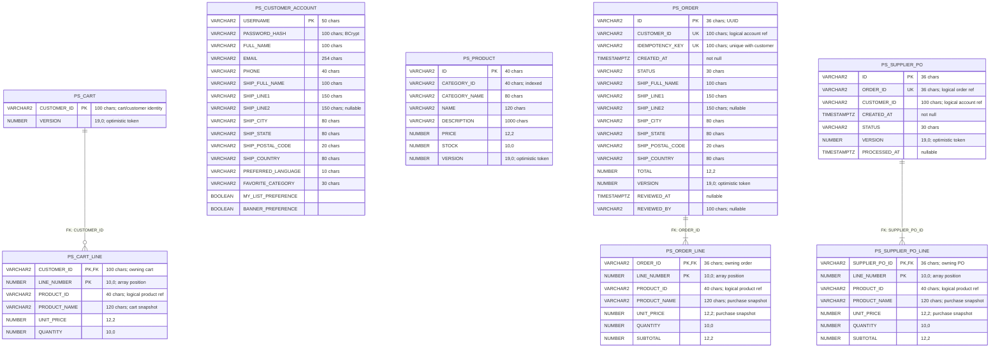
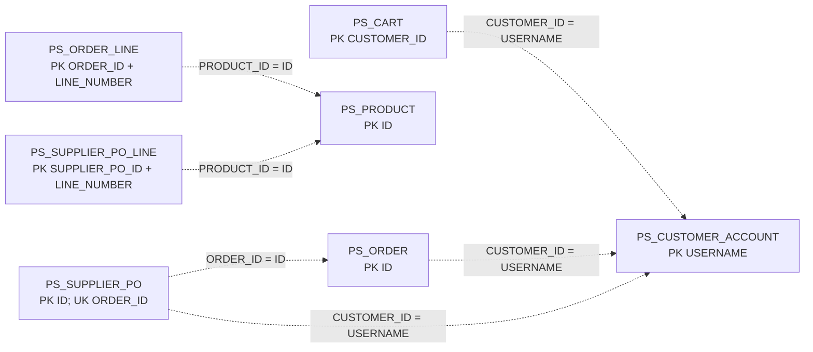
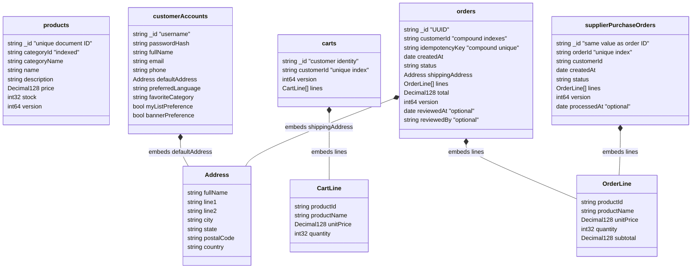
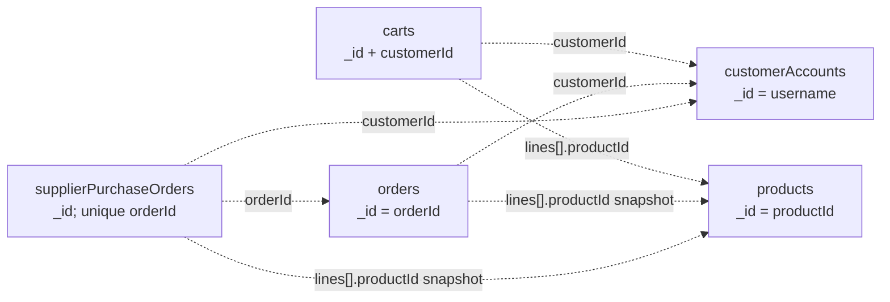

# PetStore database schemas: Oracle and MongoDB

## Scope and notation

This document describes the schema implemented by the current application, including customer accounts, catalog, carts, customer orders, administrator review, and supplier purchase orders. It is derived from the JPA entities and MongoDB document mappings, and its keys/indexes were cross-checked against the running local Oracle and MongoDB catalogs on August 26, 2026.

Key labels used below:

- **PK** — relational primary key. For MongoDB, `_id` is the equivalent enforced unique document identifier.
- **FK** — database-enforced foreign key.
- **UK** — database-enforced unique key/index.
- **IX** — non-unique index.
- **Logical reference** — an identifier understood by the application, but not protected by a database foreign-key constraint.
- **Snapshot** — copied purchase-time data intentionally embedded/stored with the transaction so later catalog changes do not rewrite history.

## High-level comparison

| Concern | Oracle | MongoDB |
|---|---|---|
| Storage model | Seven normalized tables | Five aggregate-oriented collections |
| Child lines | Separate `PS_*_LINE` tables | Embedded arrays inside cart/order/PO documents |
| Primary identity | Declared primary-key constraints | Mandatory unique `_id` index |
| Referential integrity | Enforced for parent-to-line tables; business references are otherwise logical | No foreign keys; aggregate ownership and cross-collection references are enforced by application transactions |
| Money | `NUMBER(12,2)` | BSON `Decimal128` |
| Optimistic concurrency | JPA `@Version` mapped to `NUMBER(19,0)` | Spring Data `@Version`/explicit version mapped to BSON `Int64` |
| Timestamps | `TIMESTAMP(9) WITH TIME ZONE` | BSON Date (UTC instant) |

---

# Oracle relational schema

## Physical entity-relationship diagram

Only database-enforced foreign-key relationships are drawn as relationships here. The dashed logical-reference diagram below shows the important identifiers that deliberately do not have Oracle FK constraints.

The child tables use composite primary keys consisting of the parent identifier plus `LINE_NUMBER`. `LINE_NUMBER` is generated by JPA's `@OrderColumn`, preserving the array/list order while also ensuring that one parent cannot have two lines in the same position.

## Logical references not enforced as Oracle foreign keys

These are deliberately shown as dashed lines. The application treats them as references, but the entity model stores scalar IDs instead of `@ManyToOne` associations, so Oracle does not enforce them as FKs. This keeps historical order/PO snapshots independent of later catalog/account deletion or mutation. It also means any future administrative delete API must preserve these invariants itself or introduce explicit migration-managed constraints.

## Oracle column dictionary

### `PS_PRODUCT`

| Column | Type | Null | Key/index | Meaning |
|---|---|---:|---|---|
| `ID` | `VARCHAR2(40)` | No | PK | Stable catalog/product identifier such as `K9-BD-01`. |
| `CATEGORY_ID` | `VARCHAR2(40)` | No | IX `IX_PS_PRODUCT_CATEGORY` | Category lookup key such as `DOGS`. Categories are values, not a separate table. |
| `CATEGORY_NAME` | `VARCHAR2(80)` | No | — | Display snapshot/name for the category. |
| `NAME` | `VARCHAR2(120)` | No | — | Product display name. |
| `DESCRIPTION` | `VARCHAR2(1000)` | No | — | Product description. |
| `PRICE` | `NUMBER(12,2)` | No | — | Current catalog unit price. |
| `STOCK` | `NUMBER(10,0)` | No | — | Currently available inventory. Conditional SQL prevents decrement below zero. |
| `VERSION` | `NUMBER(19,0)` | No | Optimistic token | Incremented by inventory updates, checkout reservation, and denial restoration. |

### `PS_CUSTOMER_ACCOUNT`

| Column/group | Type | Null | Key/index | Meaning |
|---|---|---:|---|---|
| `USERNAME` | `VARCHAR2(50)` | No | PK | Login name and stable account identifier. |
| `PASSWORD_HASH` | `VARCHAR2(100)` | No | — | BCrypt hash; the raw password is never stored. |
| `FULL_NAME` | `VARCHAR2(100)` | No | — | Profile name. |
| `EMAIL` | `VARCHAR2(254)` | No | — | Contact email; not currently unique. |
| `PHONE` | `VARCHAR2(40)` | No | — | Contact phone. |
| `SHIP_FULL_NAME` | `VARCHAR2(100)` | No | — | Default-address recipient. |
| `SHIP_LINE1` | `VARCHAR2(150)` | No | — | Default-address first line. |
| `SHIP_LINE2` | `VARCHAR2(150)` | Yes | — | Optional second line. |
| `SHIP_CITY`, `SHIP_STATE` | `VARCHAR2(80)` | No | — | Default-address locality. |
| `SHIP_POSTAL_CODE` | `VARCHAR2(20)` | No | — | Default postal code. |
| `SHIP_COUNTRY` | `VARCHAR2(80)` | No | — | Default country. |
| `PREFERRED_LANGUAGE` | `VARCHAR2(10)` | No | — | Customer language preference. |
| `FAVORITE_CATEGORY` | `VARCHAR2(30)` | No | Logical category value | Preference only; no category FK/table. |
| `MY_LIST_PREFERENCE` | Oracle `BOOLEAN` | No | — | Enables the legacy-style MyList preference. |
| `BANNER_PREFERENCE` | Oracle `BOOLEAN` | No | — | Enables the legacy-style banner/tip preference. |

The reusable `AddressJpa` embeddable uses `SHIP_*` column names in both `PS_CUSTOMER_ACCOUNT` and `PS_ORDER`. In the account table these are the default address; in the order table they are an immutable shipping snapshot.

### `PS_CART` and `PS_CART_LINE`

| Table.column | Type | Null | Key/index | Meaning |
|---|---|---:|---|---|
| `PS_CART.CUSTOMER_ID` | `VARCHAR2(100)` | No | PK | One cart per customer. It is a logical reference to account username, not an FK. |
| `PS_CART.VERSION` | `NUMBER(19,0)` | No | Optimistic token | Every accepted cart mutation advances it; stale writes receive HTTP 409. |
| `PS_CART_LINE.CUSTOMER_ID` | `VARCHAR2(100)` | No | PK + FK; IX | Owning cart. FK is database-enforced. |
| `PS_CART_LINE.LINE_NUMBER` | `NUMBER(10,0)` | No | PK | Zero-based JPA list position; combined with customer ID. |
| `PS_CART_LINE.PRODUCT_ID` | `VARCHAR2(40)` | No | Logical product reference | Used to reserve inventory at checkout; no physical FK. |
| `PS_CART_LINE.PRODUCT_NAME` | `VARCHAR2(120)` | No | — | Current cart display snapshot. |
| `PS_CART_LINE.UNIT_PRICE` | `NUMBER(12,2)` | No | — | Current cart price snapshot; server recomputes totals. |
| `PS_CART_LINE.QUANTITY` | `NUMBER(10,0)` | No | — | Requested quantity. Domain validation restricts accepted values. |

### `PS_ORDER` and `PS_ORDER_LINE`

| Table.column | Type | Null | Key/index | Meaning |
|---|---|---:|---|---|
| `PS_ORDER.ID` | `VARCHAR2(36)` | No | PK | UUID order identifier. |
| `PS_ORDER.CUSTOMER_ID` | `VARCHAR2(100)` | No | UK part 1; IX part 1 | Logical account reference and history partition key. |
| `PS_ORDER.IDEMPOTENCY_KEY` | `VARCHAR2(100)` | No | UK part 2 | Together with customer ID prevents duplicate checkout orders. |
| `PS_ORDER.CREATED_AT` | `TIMESTAMP(9) WITH TIME ZONE` | No | IX part 2 | UTC creation instant; the history query sorts newest first. |
| `PS_ORDER.STATUS` | `VARCHAR2(30)` | No | — | `PENDING`, `APPROVED`, `DENIED`, or `COMPLETED`. |
| `PS_ORDER.SHIP_*` | Address columns above | `LINE2` only nullable | — | Immutable checkout-time shipping snapshot. |
| `PS_ORDER.TOTAL` | `NUMBER(12,2)` | No | — | Immutable server-calculated order total. |
| `PS_ORDER.VERSION` | `NUMBER(19,0)` | No | Optimistic token | Protects admin review and supplier completion. |
| `PS_ORDER.REVIEWED_AT` | `TIMESTAMP(9) WITH TIME ZONE` | Yes | — | Set when an administrator approves or denies. Auto-approved orders leave it null. |
| `PS_ORDER.REVIEWED_BY` | `VARCHAR2(100)` | Yes | — | Administrator username; null for policy auto-approval. |
| `PS_ORDER_LINE.ORDER_ID` | `VARCHAR2(36)` | No | PK + FK; IX | Owning order; database-enforced FK. |
| `PS_ORDER_LINE.LINE_NUMBER` | `NUMBER(10,0)` | No | PK | Stable line position within the order. |
| `PS_ORDER_LINE.PRODUCT_ID` | `VARCHAR2(40)` | No | Logical product reference | Identifies the purchased product without an FK. |
| `PS_ORDER_LINE.PRODUCT_NAME` | `VARCHAR2(120)` | No | — | Immutable purchase-time name. |
| `PS_ORDER_LINE.UNIT_PRICE` | `NUMBER(12,2)` | No | — | Immutable purchase-time price. |
| `PS_ORDER_LINE.QUANTITY` | `NUMBER(10,0)` | No | — | Purchased quantity. |
| `PS_ORDER_LINE.SUBTOTAL` | `NUMBER(12,2)` | No | — | Immutable `unitPrice × quantity` snapshot. |

Indexes/constraints:

- PK on `ID`.
- UK `UK_PS_ORDER_IDEMPOTENCY (CUSTOMER_ID, IDEMPOTENCY_KEY)`.
- IX `IX_PS_ORDER_CUSTOMER_CREATED (CUSTOMER_ID, CREATED_AT)` for customer history.
- Child PK `(ORDER_ID, LINE_NUMBER)`, child FK to `PS_ORDER(ID)`, and `IX_PS_ORDER_LINE_ORDER`.

### `PS_SUPPLIER_PO` and `PS_SUPPLIER_PO_LINE`

| Table.column | Type | Null | Key/index | Meaning |
|---|---|---:|---|---|
| `PS_SUPPLIER_PO.ID` | `VARCHAR2(36)` | No | PK | PO identifier; currently equal to the customer order ID. |
| `PS_SUPPLIER_PO.ORDER_ID` | `VARCHAR2(36)` | No | UK | Logical reference to `PS_ORDER.ID`; uniqueness guarantees one PO per customer order. |
| `PS_SUPPLIER_PO.CUSTOMER_ID` | `VARCHAR2(100)` | No | — | Logical account reference copied for supplier display. |
| `PS_SUPPLIER_PO.CREATED_AT` | `TIMESTAMP(9) WITH TIME ZONE` | No | IX `IX_PS_SUPPLIER_PO_CREATED` | PO creation instant/newest-first listing key. |
| `PS_SUPPLIER_PO.STATUS` | `VARCHAR2(30)` | No | — | `READY` or `PROCESSED`. |
| `PS_SUPPLIER_PO.VERSION` | `NUMBER(19,0)` | No | Optimistic token | Makes processing and identical retries converge. |
| `PS_SUPPLIER_PO.PROCESSED_AT` | `TIMESTAMP(9) WITH TIME ZONE` | Yes | — | Set exactly once on first successful processing. |
| `PS_SUPPLIER_PO_LINE.SUPPLIER_PO_ID` | `VARCHAR2(36)` | No | PK + FK; IX | Owning PO; database-enforced FK. |
| `PS_SUPPLIER_PO_LINE.LINE_NUMBER` | `NUMBER(10,0)` | No | PK | Stable line position. |
| Remaining PO-line columns | Same as `PS_ORDER_LINE` | No | Product ID is logical | Immutable copy of the approved order lines. |

## Oracle key and integrity summary

| Object | Enforced rule |
|---|---|
| `PS_CART` | PK `CUSTOMER_ID` |
| `PS_CART_LINE` | PK `(CUSTOMER_ID, LINE_NUMBER)`; FK `CUSTOMER_ID → PS_CART.CUSTOMER_ID` |
| `PS_CUSTOMER_ACCOUNT` | PK `USERNAME` |
| `PS_PRODUCT` | PK `ID`; category index |
| `PS_ORDER` | PK `ID`; UK `(CUSTOMER_ID, IDEMPOTENCY_KEY)`; customer/history index |
| `PS_ORDER_LINE` | PK `(ORDER_ID, LINE_NUMBER)`; FK `ORDER_ID → PS_ORDER.ID` |
| `PS_SUPPLIER_PO` | PK `ID`; UK `ORDER_ID`; created-time index |
| `PS_SUPPLIER_PO_LINE` | PK `(SUPPLIER_PO_ID, LINE_NUMBER)`; FK `SUPPLIER_PO_ID → PS_SUPPLIER_PO.ID` |

Oracle-generated `SYS_*` names back constraints for which no explicit name is provided. The application should not depend on those generated names. The named idempotency/category/history indexes are stable. With the deployed UTF-8 Oracle database, catalog `DATA_LENGTH` may report up to four bytes per configured JPA character; the lengths above are the application-level character limits.

---

# MongoDB document schema

## Aggregate/document diagram

Composition arrows mean the child object exists inside its parent BSON document, not in another collection. Updating a cart and its lines, or an order and its immutable lines/address, is therefore a single-document operation. Checkout and the cross-collection stock/order/cart changes still use a MongoDB transaction.

## MongoDB logical-reference diagram

MongoDB has no foreign-key constraints. These references are checked or produced by application services. Order and PO line data is intentionally duplicated as a historical snapshot, so reading history does not require a product join and later product changes cannot alter a past purchase.

## MongoDB collection dictionary

### `products`

| Field | BSON type | Required by application | Key/index | Meaning |
|---|---|---:|---|---|
| `_id` | String | Yes | Unique `_id_` | Product identifier. |
| `categoryId` | String | Yes | IX `categoryId` ascending | Category filter key. |
| `categoryName` | String | Yes | — | Category display name. |
| `name` | String | Yes | — | Product display name. |
| `description` | String | Yes | — | Product description. |
| `price` | Decimal128 | Yes | — | Current catalog price. |
| `stock` | Int32 | Yes | — | Available inventory. |
| `version` | Int64 | Yes for current writes | Optimistic token | Spring Data `@Version`; stock mutations increment it. |

### `customerAccounts`

| Field | BSON type | Required by application | Key/index | Meaning |
|---|---|---:|---|---|
| `_id` | String | Yes | Unique `_id_` | Username/account identifier. |
| `passwordHash` | String | Yes | — | BCrypt hash. |
| `fullName`, `email`, `phone` | String | Yes | — | Profile/contact values. Email is not unique. |
| `defaultAddress` | Embedded document | Yes | — | Address fields: `fullName`, `line1`, `line2`, `city`, `state`, `postalCode`, `country`. |
| `preferredLanguage`, `favoriteCategory` | String | Yes | — | Preferences; category is a logical value only. |
| `myListPreference`, `bannerPreference` | Boolean | Yes | — | Legacy-compatible display preferences. |

### `carts`

| Field | BSON type | Required by application | Key/index | Meaning |
|---|---|---:|---|---|
| `_id` | String | Yes | Unique `_id_` | Equal to the customer ID. |
| `customerId` | String | Yes | UK `customerId` ascending | Explicit one-cart-per-customer invariant; currently repeats `_id`. |
| `version` | Int64 | Yes for current writes | Optimistic token | Spring Data `@Version`; stale mutations conflict. |
| `lines` | Array of documents | Yes | — | Embedded cart lines. An empty cart stores an empty array. |
| `lines[].productId` | String | Yes | Logical product reference | No MongoDB FK. |
| `lines[].productName` | String | Yes | — | Display snapshot. |
| `lines[].unitPrice` | Decimal128 | Yes | — | Price snapshot used by the domain total. |
| `lines[].quantity` | Int32 | Yes | — | Requested quantity. |

### `orders`

| Field | BSON type | Required by application | Key/index | Meaning |
|---|---|---:|---|---|
| `_id` | String | Yes | Unique `_id_` | UUID order ID. |
| `customerId` | String | Yes | Compound UK/IX part 1 | Logical account reference and history partition. |
| `idempotencyKey` | String | Yes | Compound UK part 2 | Combined with customer ID prevents duplicate checkout. |
| `createdAt` | Date | Yes | Compound IX part 2, descending | UTC order instant/newest-first history. |
| `status` | String | Yes | — | `PENDING`, `APPROVED`, `DENIED`, or `COMPLETED`. |
| `shippingAddress` | Embedded document | Yes | — | Immutable address snapshot. |
| `lines` | Array of documents | Yes | — | Immutable product/name/price/quantity/subtotal snapshots. |
| `total` | Decimal128 | Yes | — | Immutable server-calculated order total. |
| `version` | Int64 | Yes for current writes | Conditional concurrency token | Explicitly matched and incremented by admin/supplier transitions. Legacy missing values map to zero. |
| `reviewedAt` | Date | No | — | Administrator decision instant. |
| `reviewedBy` | String | No | — | Administrator username. |

Indexes:

- `_id_` — unique `{_id: 1}`.
- `uk_order_idempotency` — unique `{customerId: 1, idempotencyKey: 1}`.
- `ix_order_customer_created` — `{customerId: 1, createdAt: -1}`.

### `supplierPurchaseOrders`

| Field | BSON type | Required by application | Key/index | Meaning |
|---|---|---:|---|---|
| `_id` | String | Yes | Unique `_id_` | PO ID, currently equal to the order ID. |
| `orderId` | String | Yes | UK `orderId` ascending | Logical order reference and one-PO-per-order invariant. |
| `customerId` | String | Yes | — | Copied logical account reference. |
| `createdAt` | Date | Yes | — | PO creation instant. Current repository sorts it; there is no explicit MongoDB created-time index yet. |
| `status` | String | Yes | — | `READY` or `PROCESSED`. |
| `lines` | Array of embedded `OrderLine` documents | Yes | — | Approved-order snapshot. |
| `version` | Int64 | Yes for current writes | Optimistic token | Spring Data `@Version`; protects processing. |
| `processedAt` | Date | No | — | First successful processing instant. |

## MongoDB key and index summary

| Collection | Enforced rule |
|---|---|
| `products` | Unique `_id`; ascending `categoryId` index |
| `customerAccounts` | Unique `_id` only |
| `carts` | Unique `_id`; unique `customerId` index |
| `orders` | Unique `_id`; unique `(customerId, idempotencyKey)`; `(customerId ASC, createdAt DESC)` history index |
| `supplierPurchaseOrders` | Unique `_id`; unique `orderId` index |

There is currently no MongoDB JSON Schema validator attached to these collections. Java validation and mapping define required values for new writes, while the mappers retain limited backward compatibility, such as treating a missing legacy `version` as zero.

---

# How the same domain maps across both stores

| Domain aggregate | Oracle representation | MongoDB representation |
|---|---|---|
| Product | One `PS_PRODUCT` row | One `products` document |
| Customer account | One `PS_CUSTOMER_ACCOUNT` row with flattened address columns | One `customerAccounts` document with embedded `defaultAddress` |
| Cart | `PS_CART` plus FK-owned `PS_CART_LINE` rows | One `carts` document with embedded `lines[]` |
| Customer order | `PS_ORDER` plus FK-owned `PS_ORDER_LINE` rows; flattened shipping address | One `orders` document with embedded `shippingAddress` and `lines[]` |
| Supplier PO | `PS_SUPPLIER_PO` plus FK-owned `PS_SUPPLIER_PO_LINE` rows | One `supplierPurchaseOrders` document with embedded `lines[]` |

The API/domain layer does not expose either storage shape. Both adapters return the same domain records and execute the same shared persistence contract, including optimistic versions, idempotency, stock reservation/restoration, admin decision races, and supplier completion.

## Source of truth

- Oracle entities and keys: `src/main/java/com/mongodb/modernization/petstore/persistence/oracle/`
- MongoDB documents and indexes: `src/main/java/com/mongodb/modernization/petstore/persistence/mongo/`
- Cross-store behavior: `src/test/java/com/mongodb/modernization/petstore/persistence/StorefrontStoreContract.java`
- Runtime schema selection: `src/main/resources/application-oracle.yml`, `application-mongo.yml`, and `application.yml`

For production, replace automatic schema/index creation with reviewed Flyway/Liquibase migrations for Oracle and controlled index/validator migrations for MongoDB. That will make constraint names, nullability changes, data backfills, and rollout/rollback behavior explicit instead of relying on application startup.
