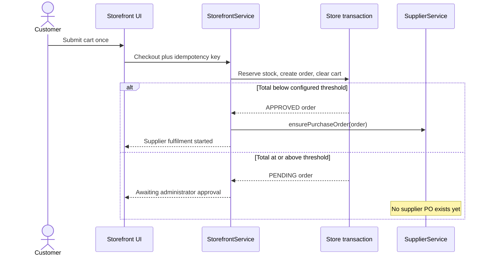
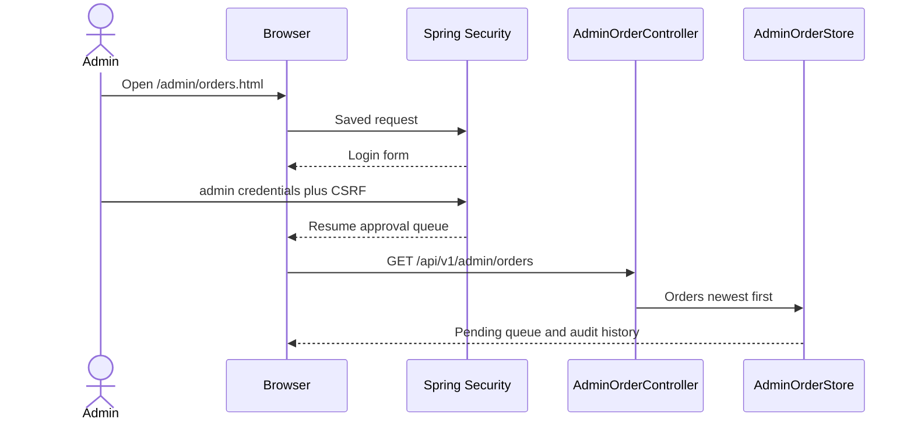
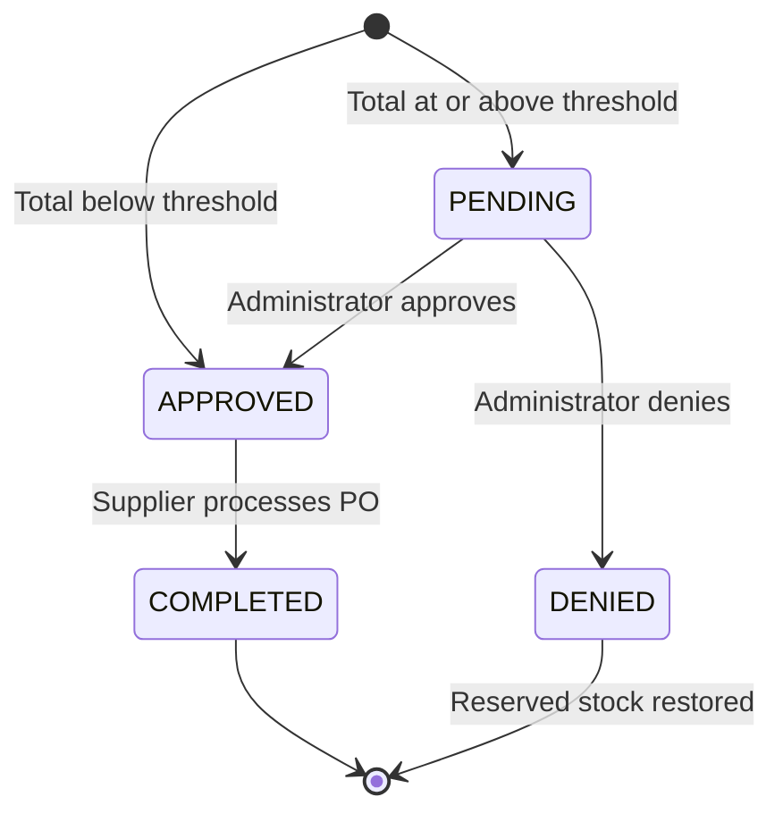
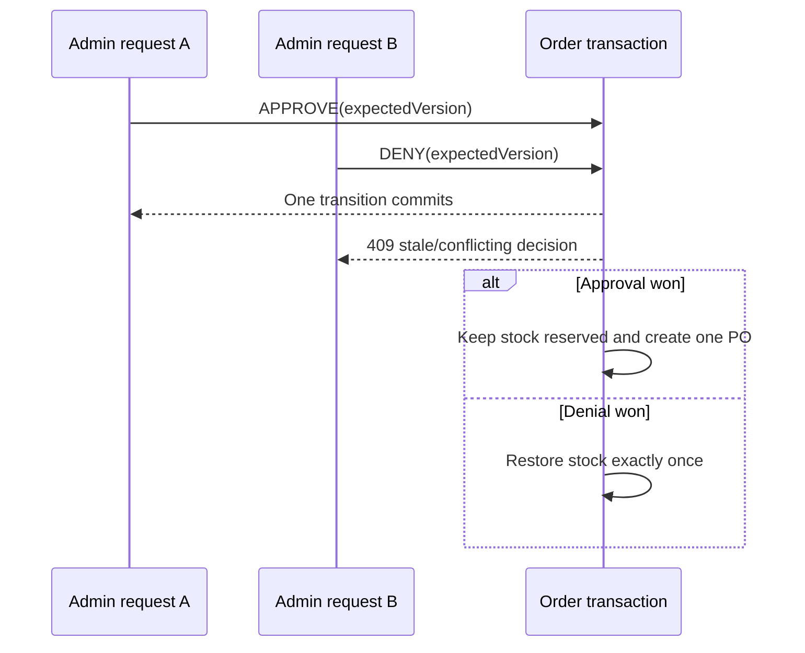

# Administrator order approval: design, reliability, and verification

## Legacy behavior preserved

Java Pet Store 1.3.2 created every US order as `PENDING`, then automatically approved totals below $500. Orders at or above $500 waited for the administrator rich client. Only a `PENDING` order could become `APPROVED` or `DENIED`, and only approval emitted a supplier purchase order.

This behavior is visible in the supplied source at:

- `src/apps/opc/.../PurchaseOrderMDB.java` (`canIApprove`, strict `< 500` rule);
- `src/apps/opc/.../OrderApprovalMDB.java` (pending-only transition and approved supplier handoff); and
- `src/apps/admin/src/client/.../DataSource.java` and `OrdersApprovePanel.java` (pending/non-pending views and approve/deny actions).

The modern implementation keeps that policy while replacing Java Web Start, JMS/MDB coordination, and several EARs with a protected responsive web screen, explicit transactions, and a shared Oracle/MongoDB behavioral contract. The threshold is externalized as `ORDER_APPROVAL_THRESHOLD` and defaults to `500.00`.

## 1. Checkout and approval gate

Inventory is reserved at checkout for both paths. This prevents a high-value order from being approved later only to discover that its items were sold in the meantime. Checkout remains atomic and idempotent: stock, order, and cart commit together, while a repeated `(customerId, idempotencyKey)` returns the original order.

## 2. Administrator authentication and queue

Only `ROLE_ADMIN` can access the page or `/api/v1/admin/orders/**`. Customers and suppliers receive 403; unauthenticated API callers receive 401. Decisions are CSRF-protected. The UI shows live counts, pending order snapshots, approve/deny actions, and reviewed history.

## 3. Approval, denial, and fulfilment

- Approval records `reviewedAt`, `reviewedBy`, and a new optimistic version, then idempotently creates exactly one supplier PO using the customer order ID as its durable key.
- Denial records the same audit fields and restores every reserved line in the same database transaction.
- Replaying the same decision returns the stored result. It does not create another PO, advance the order version, or restore inventory twice.
- Reversing an already committed decision returns HTTP 409.

## 4. Concurrency and retry boundary

MongoDB uses a conditional status/version update inside a transaction. Oracle takes a pessimistic write lock for the decision and also advances its JPA `@Version`. Safe transient database failures use the existing bounded retry executor; every retry re-reads the committed state. This lets duplicate same-decision requests converge while opposite decisions have one winner.

## 5. Observability

Structured logs emit `admin.order.approved` or `admin.order.denied` with the request correlation ID, order/customer IDs, reviewer, total, and resulting version. Database telemetry records `admin.orders.all`, `admin.order.approve`, and `admin.order.deny`, including calls, failures, retries, and latency on `/admin/health.html`.

## Manual walkthrough

1. Open `http://localhost:8080` for MongoDB or `http://localhost:8081` for Oracle.
2. Sign in as `alice` / `petstore-demo`, add one Bulldog ($850) or Golden Retriever ($950), and check out.
3. Confirm the order history says `PENDING` and the confirmation says it is awaiting administrator approval.
4. Sign out and open `/admin/orders.html`; sign in as `admin` / `admin`.
5. Confirm the order appears under **Pending orders**. Click **Approve for supplier** or **Deny & release stock**.
6. For approval, sign in at `/supplier/` with `supplier` / `supplier`; the order appears once as `READY` and can be processed.
7. For denial, return to the storefront and confirm the product’s available quantity was restored.
8. Open `/admin/health.html` and inspect the `admin.order.*` operation rows, or search `/api/v1/admin/logs?limit=200` for the structured decision event.

Automated verification covers the strict $500 boundary, role/CSRF enforcement, same-decision replays, opposite-decision conflicts, supplier gating, inventory restoration, a two-thread approval/denial race, and the real browser queue. The same tests run unchanged against MongoDB and Oracle.
