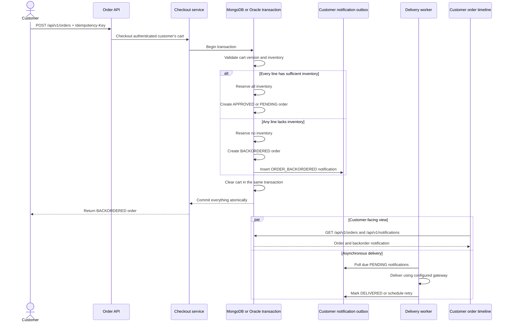
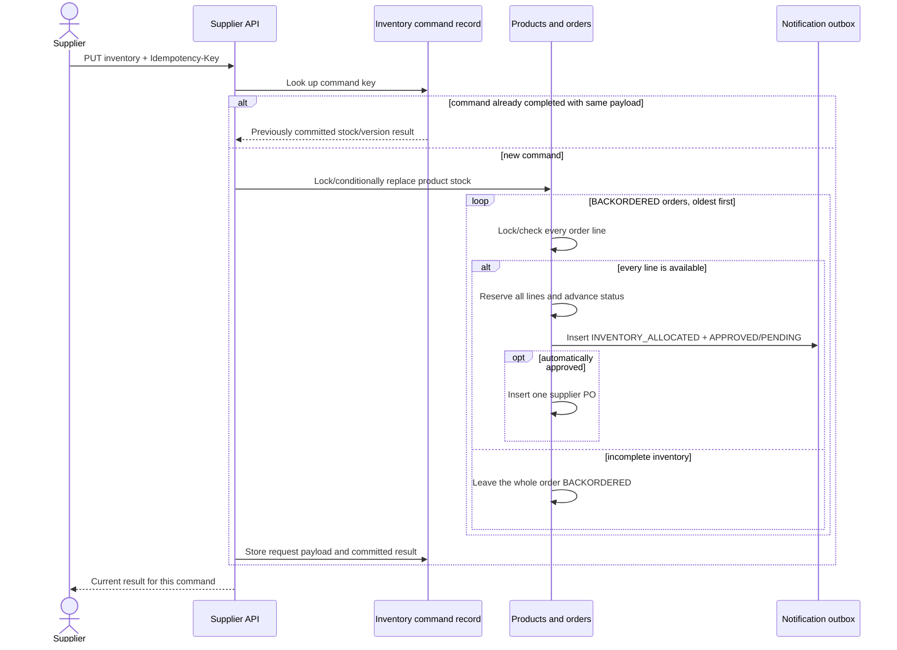

# Backorders and supplier replenishment

## User-visible behavior

Checkout now accepts an order even when one or more requested products are unavailable. The order is stored as `BACKORDERED`, the cart is cleared, and no inventory is reserved partially. The customer can see the status in order history and receives a durable **Order backordered** inbox/timeline event.

The supplier portal has a **Backorders** view. Replacing a product's absolute stock quantity automatically checks waiting orders oldest first. An order is released only when every line can be reserved together. A released order returns to the normal policy path: totals below `$500.00` become `APPROVED` and create one supplier purchase order; totals at or above `$500.00` become `PENDING` for administrator review.

## Order state diagram

```mermaid
stateDiagram-v2
    [*] --> BACKORDERED: Checkout cannot reserve every line
    [*] --> APPROVED: Checkout reserves all lines and total < threshold
    [*] --> PENDING: Checkout reserves all lines and total >= threshold
    BACKORDERED --> APPROVED: Replenishment allocates all lines; total < threshold
    BACKORDERED --> PENDING: Replenishment allocates all lines; total >= threshold
    PENDING --> APPROVED: Administrator approves
    PENDING --> DENIED: Administrator denies
    APPROVED --> COMPLETED: Supplier processes PO
    DENIED --> [*]
    COMPLETED --> [*]
```



## Complete backordered-checkout and notification sequence



## What happens during checkout

The browser sends `POST /api/v1/orders` with an `Idempotency-Key`, the expected cart version, the delivery address, and an opaque demo payment token. The controller derives the customer from the authenticated Spring Security principal; the request cannot choose another customer. The service first looks for an order with the same customer and idempotency key. An exact replay returns the previously committed order instead of creating another order, authorization, or notification.

The persistence adapter loads the cart, rejects an unexpected cart version or an empty cart, and then evaluates the cart as one allocation unit. If every line has sufficient stock, every line is reserved. If any line is short, no stock is changed and an order snapshot is created with status `BACKORDERED`. The snapshot retains the checkout-time item names, quantities, prices, total, and delivery address so later catalog changes do not rewrite order history.

The following writes share one MongoDB or Oracle transaction:

```text
BACKORDERED order
    + AUTHORIZED payment
    + PAYMENT_AUTHORIZED and ORDER_BACKORDERED notification records
    + cleared cart
    = one atomic commit
```

If any write fails—including payment decline—all changes roll back. This prevents a committed backorder without an authorization/notification, a notification for an order that does not exist, or a cleared cart without an order. The database notification is the transactional outbox record; checkout never depends on a synchronous email, SMS, or logging call.

## The transactional outbox record

The notification has a deterministic identifier, `<order-id>:ORDER_BACKORDERED`. Its initial logical shape is:

```text
id                  <order-id>:ORDER_BACKORDERED
customerId          authenticated customer ID
orderId             committed order ID
type                ORDER_BACKORDERED
title               Order backordered
message             Order is safely queued until inventory is replenished
createdAt           transaction timestamp
deliveryStatus      PENDING
deliveryAttempts    0
nextAttemptAt       transaction timestamp
deliveredAt         null
lastError           null
readAt              null
version             0
```

The deterministic ID and the database uniqueness rules make the lifecycle event logically exactly once. Replaying checkout, retrying a transient database failure, or racing two requests with the same checkout key converges on the same order and notification.

This solves the dual-write failure found in a direct "save then send" implementation:

- If the application crashes after saving an order but before sending, a direct implementation loses the message. The outbox retains a `PENDING` record for the worker.
- If it sends before the transaction commits and the transaction then rolls back, the customer could receive a message for a nonexistent order. The outbox is not visible until its transaction commits.
- If the client retries an uncertain checkout, the order idempotency key and deterministic notification ID suppress duplicate business records.

## MongoDB representation and concurrency

MongoDB stores the flow across the `orders`, `customerNotifications`, `carts`, and `products` collections in one Mongo transaction. Order lines and the delivery address are embedded in the order document. The notification document contains the fields shown above and has indexes supporting customer history and delivery polling:

```text
{ customerId: 1, createdAt: -1 }
{ deliveryStatus: 1, nextAttemptAt: 1 }
```

The order has a unique customer/idempotency-key constraint. Notification enqueue uses an upsert keyed by the deterministic notification ID and applies values only on insert, so a replay cannot overwrite or duplicate the event.

Inventory reservation uses conditional updates that require sufficient stock and the expected version. If a competing checkout changes inventory after it was read, the conditional update fails and the complete transaction is retried or rolled back; it cannot commit negative stock or a partial reservation. A backordered checkout deliberately skips every stock decrement.

## Oracle representation and concurrency

Oracle stores the order header in `PS_ORDER`, its lines in `PS_ORDER_LINE`, and the outbox event in `PS_CUSTOMER_NOTIFICATION`. The notification table uses `ID` as its primary key, has a unique constraint on `(ORDER_ID, TYPE)`, and has indexes equivalent to the MongoDB customer-history and due-delivery indexes. `ORDER_ID` and `CUSTOMER_ID` are logical references retained independently for durable history and customer-scoped lookup.

Oracle locks the cart and then locks product rows in stable product-ID order. Stable ordering reduces deadlock risk when concurrent carts overlap. It tests the whole cart before changing stock: all lines are reserved or none are. The order, lines, notification, and cart clearing then commit in one Oracle transaction. Version columns and uniqueness constraints protect replays and competing state transitions.

The same domain behavior is intentionally implemented over different physical models: embedded MongoDB order documents and normalized Oracle order tables.

## How the customer receives the notification

There are two related but independent states:

- `deliveryStatus` describes the asynchronous delivery pipeline.
- `readAt` records whether the customer has acknowledged the notification in the storefront.

Immediately after commit, the durable record is available through `GET /api/v1/notifications`. The endpoint obtains the customer identity from the signed-in session and returns only that customer's newest-first inbox. The storefront reloads orders and notifications after checkout, counts events without `readAt` for the badge, renders the **Order backordered** card, and groups the event into the corresponding order timeline. The customer can therefore see the message while `deliveryStatus` is briefly still `PENDING`.

A scheduled worker polls up to 50 due `PENDING` records, oldest first. The default interval is one second. For each record it calls the configured `NotificationDeliveryGateway`:

- Success conditionally changes the record to `DELIVERED`, sets `deliveredAt`, clears retry information, and advances its attempt counter and optimistic version.
- Failure stores a bounded error and schedules another attempt after 1, 2, 4, 8 seconds, and so on, capped at five minutes.
- Delivery acknowledgement requires the expected version and `PENDING` status, so competing workers cannot overwrite a newer delivery result.

The current gateway is the structured logging/in-app adapter. It emits `notification.delivery` with notification, customer, order, and event identifiers. The application does **not** currently send SMTP email, SMS, or mobile push. A production provider can replace the gateway without changing checkout and should use the deterministic notification ID as the provider idempotency key.

Database creation is logically exactly once, but an external delivery is necessarily at-least-once: a provider can accept a message immediately before the application stops, preventing the `DELIVERED` acknowledgement from being recorded. Provider-side idempotency makes that retry safe.

## Replenishment and retry sequence



## Releasing a backorder after replenishment

The supplier replaces a product's absolute inventory quantity with `PUT /api/v1/supplier/inventory/{productId}` and supplies a distinct inventory-command `Idempotency-Key` plus the expected product version. The command and its committed result are stored in `supplierInventoryCommands` for MongoDB or `PS_SUPPLIER_INV_COMMAND` for Oracle. An exact replay returns the original result; reusing a key with a different request receives HTTP 409.

Inside the same transaction as the inventory update, waiting orders are considered oldest first. For each order, the application checks every line:

1. If any line remains short, the order stays `BACKORDERED` and consumes no stock.
2. If every line is available, every line is reserved atomically.
3. The order advances to `APPROVED` when its total is below the configured approval threshold, or `PENDING` when administrator approval is required.
4. `ORDER_INVENTORY_ALLOCATED` is enqueued, followed by `ORDER_APPROVED` or `ORDER_PENDING`.
5. An automatically approved order creates exactly one ready supplier purchase order. A pending order waits for administrator approval before a purchase order is created.
6. The inventory, order version, notifications, purchase order, and inventory-command result commit together.

MongoDB uses conditional stock and order-version updates inside a transaction. Oracle locks the waiting orders and affected products, again using stable product ordering. A race or retry therefore cannot release the same order twice, reserve stock twice, or create duplicate lifecycle events or purchase orders.

## Customer timeline after a backorder

An automatically approved, replenished order produces this durable timeline:

```text
PAYMENT_AUTHORIZED
ORDER_BACKORDERED
ORDER_INVENTORY_ALLOCATED
ORDER_APPROVED
PAYMENT_CAPTURED
ORDER_COMPLETED
```

A high-value order requiring administrator approval produces:

```text
PAYMENT_AUTHORIZED
ORDER_BACKORDERED
ORDER_INVENTORY_ALLOCATED
ORDER_PENDING
ORDER_APPROVED (after administrator approval)
PAYMENT_CAPTURED (during supplier PO processing)
ORDER_COMPLETED (after supplier PO processing)
```

Supplier PO processing is another atomic transition: the purchase order moves from `READY` to `PROCESSED`, the customer order moves from `APPROVED` to `COMPLETED`, its payment moves from `AUTHORIZED` to `CAPTURED`, and `PAYMENT_CAPTURED` plus `ORDER_COMPLETED` are enqueued in the same transaction. The customer sees all of these events through the same inbox and per-order timeline.

## Implementation map

| Responsibility | Code |
|---|---|
| Authenticate checkout and accept the idempotency key | [`OrderController`](../src/main/java/com/mongodb/modernization/petstore/orders/api/OrderController.java) |
| Replay-safe checkout orchestration and supplier hand-off policy | [`StorefrontService`](../src/main/java/com/mongodb/modernization/petstore/shared/application/StorefrontService.java) |
| Order snapshot, lifecycle states, and post-allocation policy | [`Order`](../src/main/java/com/mongodb/modernization/petstore/orders/domain/Order.java) |
| MongoDB checkout transaction and notification enqueue | [`MongoStorefrontStore`](../src/main/java/com/mongodb/modernization/petstore/persistence/mongo/MongoStorefrontStore.java) |
| Oracle checkout transaction, locks, and notification enqueue | [`OracleStorefrontStore`](../src/main/java/com/mongodb/modernization/petstore/persistence/oracle/OracleStorefrontStore.java) |
| Supplier API and replenishment orchestration | [`SupplierController`](../src/main/java/com/mongodb/modernization/petstore/supplier/api/SupplierController.java), [`SupplierService`](../src/main/java/com/mongodb/modernization/petstore/supplier/application/SupplierService.java) |
| MongoDB backorder release and durable inventory commands | [`MongoSupplierStore`](../src/main/java/com/mongodb/modernization/petstore/persistence/mongo/MongoSupplierStore.java) |
| Oracle backorder release and durable inventory commands | [`OracleSupplierStore`](../src/main/java/com/mongodb/modernization/petstore/persistence/oracle/OracleSupplierStore.java) |
| Deterministic lifecycle-event contents | [`CustomerNotification`](../src/main/java/com/mongodb/modernization/petstore/notifications/domain/CustomerNotification.java) |
| Customer-scoped inbox and mark-read API | [`CustomerNotificationController`](../src/main/java/com/mongodb/modernization/petstore/notifications/api/CustomerNotificationController.java) |
| MongoDB notification polling and conditional delivery state | [`MongoCustomerNotificationStore`](../src/main/java/com/mongodb/modernization/petstore/persistence/mongo/MongoCustomerNotificationStore.java) |
| Oracle notification polling and conditional delivery state | [`OracleCustomerNotificationStore`](../src/main/java/com/mongodb/modernization/petstore/persistence/oracle/OracleCustomerNotificationStore.java) |
| Scheduled delivery, exponential retry, and acknowledgement | [`NotificationDeliveryService`](../src/main/java/com/mongodb/modernization/petstore/notifications/application/NotificationDeliveryService.java) |
| Current structured-log/in-app delivery adapter | [`LoggingNotificationDeliveryGateway`](../src/main/java/com/mongodb/modernization/petstore/notifications/application/LoggingNotificationDeliveryGateway.java) |
| Storefront inbox badge and order timeline rendering | [`app.js`](../src/main/resources/static/assets/app.js) |

## Consistency and race guarantees

- **No partial allocation:** checkout and release reserve either every order line or none of them.
- **No overselling:** Oracle locks product rows in stable product-ID order; MongoDB uses conditional stock updates inside a transaction. Stock cannot become negative.
- **Oldest-first scan:** waiting orders are considered by `createdAt` ascending. An older order that is still incomplete does not consume partial stock, while a later fully satisfiable order may proceed.
- **Durable command idempotency:** `Idempotency-Key` is stored in `PS_SUPPLIER_INV_COMMAND` or `supplierInventoryCommands` together with the request and result. Replaying the same key/payload returns the original result; reusing a key for a different payload receives HTTP 409.
- **Exactly-once release effects:** the order status transition, inventory reservation, notification events, and automatic supplier PO are committed together. A transaction retry cannot duplicate them.
- **High-value policy preserved:** replenishment does not bypass administrator approval.
- **Observable operations:** inventory replace/replay and backorder reads appear as `supplier.inventory.replace`, `supplier.inventory.replay`, and `supplier.backorders.all` in the operations dashboard; business transitions also emit structured logs and request IDs.

## API surface

```text
GET /api/v1/supplier/backorders
PUT /api/v1/supplier/inventory/{productId}
    Idempotency-Key: <unique command key>
    { "expectedVersion": 0, "quantity": 13 }
```

Both routes require the supplier role. The mutation also requires CSRF protection for browser/session clients.

## Manual walkthrough

1. Sign in at `http://localhost:8080/login` as `alice` / `petstore-demo`.
2. Search for **Tiger Shark**, add it to the cart, change quantity to `13` (seed stock is `12`), and place the order.
3. Confirm that the order says `BACKORDERED`, the cart is empty, and Inbox contains **Order backordered**.
4. In a private browser window, open `http://localhost:8080/supplier/` and sign in as `supplier` / `supplier`.
5. Open **Backorders** and confirm the Tiger Shark order shows quantity `13`.
6. Open **Inventory**, set Tiger Shark stock to `13`, and click **Update**.
7. Confirm the response toast mentions waiting orders, the visible stock becomes `0`, the Backorders count becomes `0`, and exactly one purchase order appears.
8. Process that PO. In Alice's window, confirm Inbox contains **Inventory allocated**, **Order confirmed**, and **Order completed**, and order history says `COMPLETED`.

For the high-value branch, order `5` Bulldogs while seed stock is `4`, then replenish to `5`. The order becomes `PENDING`; approve it at `/admin/orders.html` before the supplier PO appears.

When the Oracle variant is running on port `8081`, repeat the same walkthrough with `http://localhost:8081`.

## Automated coverage

- Domain tests cover creation and post-allocation policy transitions.
- The shared persistence contract runs atomic release and simultaneous same-key replenishment against both MongoDB and Oracle.
- API E2E tests cover backordered multi-line checkout, two-customer last-stock races, authorization, durable inventory-command replay, timeline events, and high-value policy behavior.
- The Chromium E2E test performs the visible customer → supplier → customer journey, including PO processing and notifications.

See [the complete testing matrix](../e2e/README.md) and [the database schema](database-schema.md).
