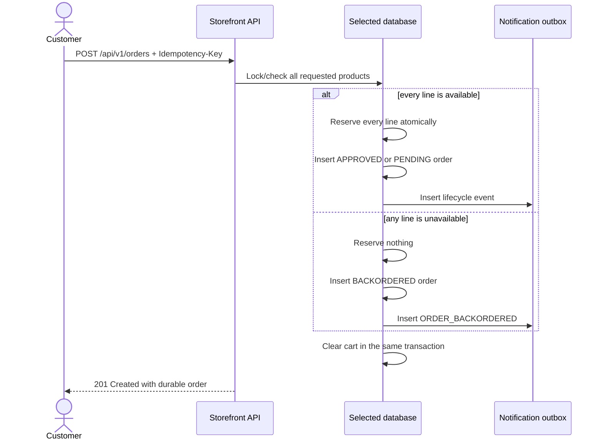
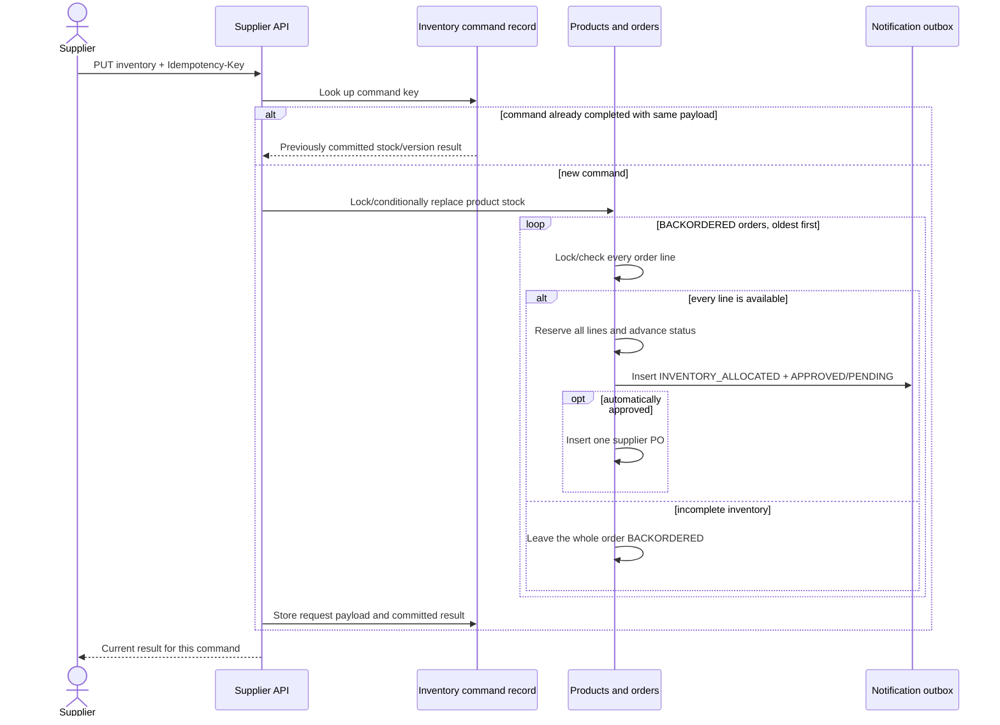

# Backorders and supplier replenishment

## User-visible behavior

Checkout now accepts an order even when one or more requested products are unavailable. The order is stored as `BACKORDERED`, the cart is cleared, and no inventory is reserved partially. The customer can see the status in order history and receives a durable **Order backordered** inbox/timeline event.

The supplier portal has a **Backorders** view. Replacing a product's absolute stock quantity automatically checks waiting orders oldest first. An order is released only when every line can be reserved together. A released order returns to the normal policy path: totals below `$500.00` become `APPROVED` and create one supplier purchase order; totals at or above `$500.00` become `PENDING` for administrator review.

## Order state diagram

```mermaid
stateDiagram-v2
    [*] --> BACKORDERED: Checkout cannot reserve every line
    [*] --> APPROVED: Checkout reserves all lines and total < threshold
    [*] --> PENDING: Checkout reserves all lines and total >= threshold
    BACKORDERED --> APPROVED: Replenishment allocates all lines; total < threshold
    BACKORDERED --> PENDING: Replenishment allocates all lines; total >= threshold
    PENDING --> APPROVED: Administrator approves
    PENDING --> DENIED: Administrator denies
    APPROVED --> COMPLETED: Supplier processes PO
    DENIED --> [*]
    COMPLETED --> [*]
```



## Checkout sequence



## Replenishment and retry sequence



## Consistency and race guarantees

- **No partial allocation:** checkout and release reserve either every order line or none of them.
- **No overselling:** Oracle locks product rows in stable product-ID order; MongoDB uses conditional stock updates inside a transaction. Stock cannot become negative.
- **Oldest-first scan:** waiting orders are considered by `createdAt` ascending. An older order that is still incomplete does not consume partial stock, while a later fully satisfiable order may proceed.
- **Durable command idempotency:** `Idempotency-Key` is stored in `PS_SUPPLIER_INV_COMMAND` or `supplierInventoryCommands` together with the request and result. Replaying the same key/payload returns the original result; reusing a key for a different payload receives HTTP 409.
- **Exactly-once release effects:** the order status transition, inventory reservation, notification events, and automatic supplier PO are committed together. A transaction retry cannot duplicate them.
- **High-value policy preserved:** replenishment does not bypass administrator approval.
- **Observable operations:** inventory replace/replay and backorder reads appear as `supplier.inventory.replace`, `supplier.inventory.replay`, and `supplier.backorders.all` in the operations dashboard; business transitions also emit structured logs and request IDs.

## API surface

```text
GET /api/v1/supplier/backorders
PUT /api/v1/supplier/inventory/{productId}
    Idempotency-Key: <unique command key>
    { "expectedVersion": 0, "quantity": 13 }
```

Both routes require the supplier role. The mutation also requires CSRF protection for browser/session clients.

## Manual walkthrough

1. Sign in at `http://localhost:8080/login` as `alice` / `petstore-demo`.
2. Search for **Tiger Shark**, add it to the cart, change quantity to `13` (seed stock is `12`), and place the order.
3. Confirm that the order says `BACKORDERED`, the cart is empty, and Inbox contains **Order backordered**.
4. In a private browser window, open `http://localhost:8080/supplier/` and sign in as `supplier` / `supplier`.
5. Open **Backorders** and confirm the Tiger Shark order shows quantity `13`.
6. Open **Inventory**, set Tiger Shark stock to `13`, and click **Update**.
7. Confirm the response toast mentions waiting orders, the visible stock becomes `0`, the Backorders count becomes `0`, and exactly one purchase order appears.
8. Process that PO. In Alice's window, confirm Inbox contains **Inventory allocated**, **Order confirmed**, and **Order completed**, and order history says `COMPLETED`.

For the high-value branch, order `5` Bulldogs while seed stock is `4`, then replenish to `5`. The order becomes `PENDING`; approve it at `/admin/orders.html` before the supplier PO appears.

When the Oracle variant is running on port `8081`, repeat the same walkthrough with `http://localhost:8081`.

## Automated coverage

- Domain tests cover creation and post-allocation policy transitions.
- The shared persistence contract runs atomic release and simultaneous same-key replenishment against both MongoDB and Oracle.
- API E2E tests cover backordered multi-line checkout, two-customer last-stock races, authorization, durable inventory-command replay, timeline events, and high-value policy behavior.
- The Chromium E2E test performs the visible customer → supplier → customer journey, including PO processing and notifications.

See [the complete testing matrix](../e2e/README.md) and [the database schema](database-schema.md).
