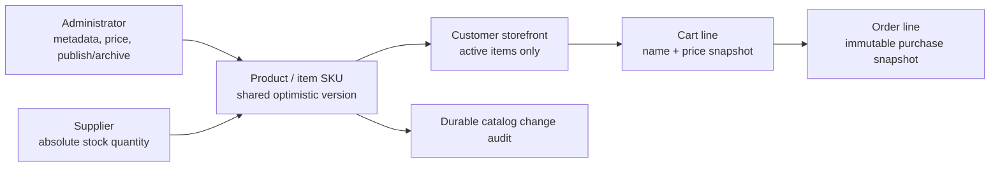

# Catalog and price management

## What was implemented

Administrators can manage the sellable item/SKU layer from `/admin/catalog.html` on MongoDB port `8080` or Oracle port `8081`:

- create an item variant with stable SKU, group, category, and descriptive metadata;
- change names, descriptions, variants, categories, and customer prices;
- publish or archive an item without deleting historical references;
- search all administrative items, including archived ones;
- review a durable administrator-attributed audit trail.

The supplier still owns stock through `/supplier/`. A new catalog item starts at stock `0`, so catalog administration cannot invent physical inventory.

## Ownership and snapshots



Administrator and supplier mutations advance the same product version, so they cannot silently overwrite one another. Existing carts and orders keep their quoted `unitPrice`; changing the current catalog price never rewrites purchase history.

## Idempotency and conflicts

The SKU is the natural idempotency key for creation. An identical repeated POST returns the committed item without a second audit entry. Reusing the SKU for different details returns HTTP `409`.

```mermaid
sequenceDiagram
    actor Admin
    participant API as Admin catalog API
    participant DB as Oracle or MongoDB
    actor Supplier

    Admin->>API: POST item CT-001
    API->>DB: transaction: item + CREATED audit
    DB-->>Admin: version 0, stock 0
    Admin->>API: retry identical POST CT-001
    API->>DB: read matching item
    DB-->>Admin: same version; no duplicate audit
    Admin->>API: PUT price 425 → 450, expected v7
    API->>DB: lock/conditional update v7 + audit
    DB-->>Admin: committed v8
    Supplier->>DB: stock update using stale v7
    DB-->>Supplier: 409 refresh and retry
    Admin->>API: replay identical price request using v7
    API->>DB: requested state already committed
    DB-->>Admin: existing v8; no duplicate audit
```

Oracle locks the product row and verifies its version. MongoDB conditionally matches `_id + version` inside a transaction. A different stale update receives HTTP `409`.

## Publishing and archiving

Archiving is reversible state, not deletion:

- public product/category APIs return only `active=true` items;
- new cart additions cannot resolve an archived item;
- admin catalog and supplier inventory retain it;
- carts/orders already containing it preserve their snapshots;
- the audit records before/after price, publishing state, and version.

Pre-feature rows with no `active` value are treated as active during rolling migration.

## APIs

| Method | Path | Purpose |
|---|---|---|
| `GET` | `/api/v1/admin/catalog/items` | All items, including archived. |
| `POST` | `/api/v1/admin/catalog/items` | Create a normalized SKU at stock 0. |
| `PUT` | `/api/v1/admin/catalog/items/{id}` | Update catalog fields using `expectedVersion`. |
| `GET` | `/api/v1/admin/catalog/changes` | Newest-first durable audit. |

All require `ROLE_ADMIN`; mutations require CSRF. Prices are decimal `0.01`–`999999.99`, identifiers normalize to uppercase, and input lengths match both physical schemas.

## Manual walkthrough

1. Open `http://localhost:8080/admin/catalog.html` for MongoDB or `http://localhost:8081/admin/catalog.html` for Oracle.
2. Sign in as `admin` / `admin`.
3. Select **Add catalog item** and create an item. Confirm stock is `0`.
4. Open `/supplier/` as `supplier` / `supplier` and set stock for that SKU.
5. Return to the catalog page, change its price, and confirm the version/audit advance.
6. Confirm the item and new price in the customer storefront.
7. Edit it, clear **Published in the customer storefront**, and save. It remains `ARCHIVED` in admin and disappears publicly.

## Verification

- Unit tests cover normalization, supplier-stock preservation, and missing items.
- The shared 17-scenario persistence contract covers create replay, price snapshots, auditing, stale conflicts, and archive visibility on MongoDB and Oracle.
- API E2E covers roles/CSRF, create replay, supplier/catalog concurrency, repricing, conflicts, snapshots, archiving, and audit ordering.
- Browser E2E performs create, reprice, and archive through the real dashboard.

See [the testing matrix](../e2e/README.md) and [physical database schema](database-schema.md).
