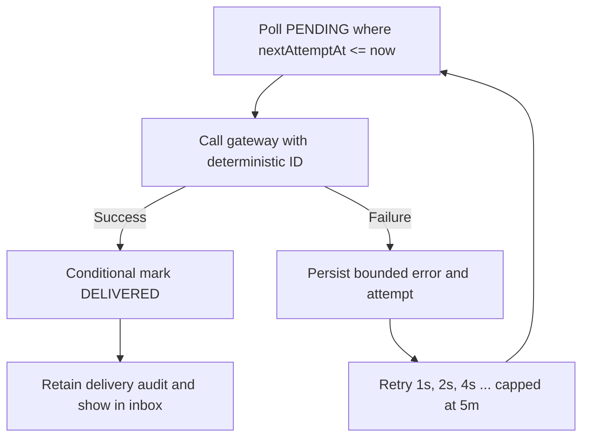

# Customer order notifications: durable outbox, inbox, and timeline

## Legacy behavior and modernization goal

Java Pet Store 1.3.2 routed approval, denial, and completed-order messages through OPC customer-relations components and the shared mailer. The relevant legacy sources are `OrderApprovalMDB`, `MailOrderApprovalMDB`, `MailOrderApprovalTransitionDelegate`, and `MailCompletedOrderTD` under `src/apps/opc`, plus `src/components/mailer`.

The modern implementation preserves those customer-visible messages while making the hand-off durable and observable. Every notification is stored in the same Oracle or MongoDB transaction as the order transition, exposed in a role-protected inbox, rendered as an order timeline, and delivered by a retrying outbox dispatcher. The initial adapter is the in-app/log channel; a later email provider can implement the same gateway and use the notification ID as its provider idempotency key.

## Customer-visible lifecycle

```mermaid
stateDiagram-v2
    [*] --> BACKORDERED: Checkout lacks inventory
    [*] --> PENDING: High-value checkout
    [*] --> APPROVED: Auto-approved checkout
    BACKORDERED --> PENDING: Inventory allocated; high value
    BACKORDERED --> APPROVED: Inventory allocated; auto-approved
    PENDING --> APPROVED: Administrator approves
    PENDING --> DENIED: Administrator denies
    APPROVED --> COMPLETED: Supplier processes PO
    DENIED --> [*]
    COMPLETED --> [*]

    note right of PENDING
      Inbox: Order awaiting review
    end note
    note right of BACKORDERED
      Inbox: Order backordered
      Then: Inventory allocated
    end note
    note right of APPROVED
      Inbox: Order confirmed or approved
    end note
    note right of DENIED
      Inbox: Order denied
    end note
    note right of COMPLETED
      Inbox: Order completed
    end note
```

Orders below `$500.00` produce `ORDER_APPROVED` at checkout. Orders at or above the threshold first produce `ORDER_PENDING`, then exactly one `ORDER_APPROVED` or `ORDER_DENIED`. An unavailable order produces `ORDER_BACKORDERED`; successful replenishment adds `ORDER_INVENTORY_ALLOCATED` followed by the normal `ORDER_APPROVED` or `ORDER_PENDING` policy event. Supplier completion adds `ORDER_COMPLETED`.

## Transactional outbox boundary

```mermaid
sequenceDiagram
    participant Actor as Customer/Admin/Supplier
    participant API as Spring API
    participant Store as Oracle/Mongo adapter
    participant Order as Order/cart/inventory
    participant Outbox as Notification outbox
    participant Worker as Delivery scheduler
    participant Inbox as Customer inbox

    Actor->>API: State-changing command
    API->>Store: Execute with key/version
    Store->>Order: Lock/CAS and apply transition
    Store->>Outbox: Upsert orderId:eventType
    Note over Order,Outbox: One database transaction
    alt either write fails
        Store-->>API: Roll back both
    else commit succeeds
        Store-->>API: Return committed state
    end
    Worker->>Outbox: Poll due PENDING records
    Worker->>Worker: Deliver with deterministic ID
    Worker->>Outbox: Mark DELIVERED or schedule retry
    Inbox->>Outbox: Read customer-scoped events
```

The deterministic primary key is `<order-id>:<event-type>`. Checkout retries, duplicate administrator decisions, and duplicate supplier processing converge on one event without a separate distributed lock. The customer ID always comes from the committed order; callers cannot select another customer's inbox.

## Retry and concurrency behavior



- Delivery is at-least-once because a process can stop after an external provider accepts a message but before acknowledgement commits. A production email adapter must pass the deterministic ID to a provider that supports idempotency.
- Delivery acknowledgement and failures use optimistic versions, so workers cannot overwrite newer delivery state.
- Mark-read is monotonic and replay-safe. An already-read notification returns its committed state; cross-customer access returns 404 rather than revealing existence.
- Structured events carry notification, customer, order, type, attempt, and retry fields while existing request/correlation IDs remain in logging context.

## API and UI

| Surface | Behavior |
|---|---|
| `GET /api/v1/notifications` | Lists only the signed-in customer's newest-first inbox. |
| `POST /api/v1/notifications/{id}/read` | CSRF-protected, replay-safe read acknowledgement. |
| Storefront **Inbox** | Shows unread badge, lifecycle message, time, and delivery state. |
| Storefront **Orders** | Groups durable events into a chronological timeline per order. |

Only `ROLE_CUSTOMER` can call the notification API. Administrators and suppliers receive HTTP 403.

## Manual verification

Use `http://localhost:8080` for MongoDB or `http://localhost:8081` for Oracle.

1. Sign in as `alice` / `petstore-demo`.
2. Add **Bulldog** (`$850`) and check out. The order is `PENDING`; **Inbox** shows **Order awaiting review** and its badge becomes 1.
3. In a private window, open `/admin/orders.html`, sign in as `admin` / `admin`, and approve the order.
4. Open `/supplier/`, sign in as `supplier` / `supplier`, open **Purchase orders**, and process the new PO.
5. Return to Alice, open **Inbox**, and confirm exactly three cards: awaiting review, approved, and completed.
6. Click **Mark read** and confirm the badge decreases. Refresh; the read state remains.
7. Open **Orders** and confirm the same three events appear chronologically beneath the order.
8. Optionally open `/admin/health.html` and inspect `notifications.*` database operations, then search logs for `notification.delivery`.

Automated coverage and exact commands are in [the testing guide](../e2e/README.md).
