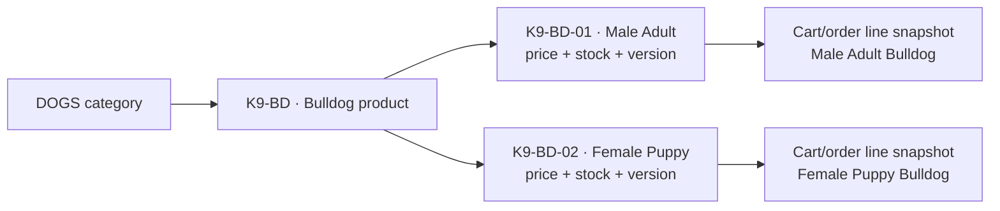
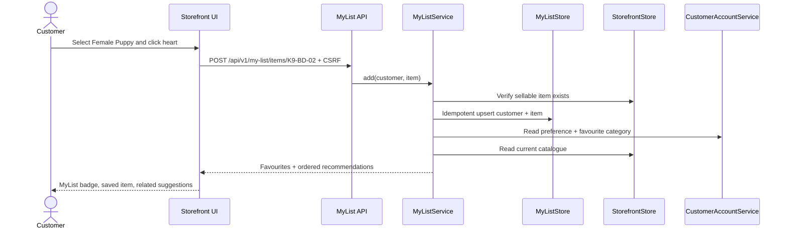
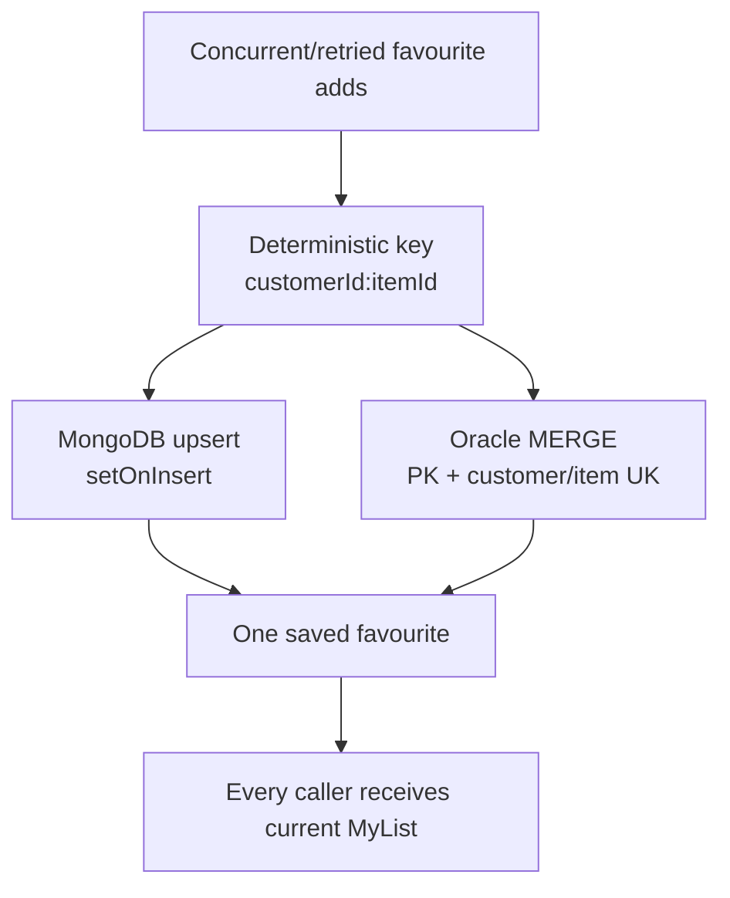

# MyList, personalized recommendations, and item variants

## Legacy behavior restored

The J2EE PetStore separated a product such as **Bulldog** from sellable items such as **Male Adult Bulldog** (`EST-6`) and **Female Puppy Bulldog** (`EST-7`). Its `mylist.jsp` used the signed-in customer's `favoriteCategory` and `myListPreference` to surface preferred products. The modernized flow preserves those ideas and makes the customer choice explicit: each saved favourite is a durable item/SKU, while recommendations also use the configured favourite category.

The modern catalogue keeps the existing item ID as the inventory/cart/order key and adds:

- `productGroupId`: the parent product identity, for example `K9-BD`;
- `variantName`: the item-level attribute, for example `Male Adult`; and
- `id`: the independently stocked sellable item, for example `K9-BD-01`.

This avoids rewriting historical cart/order/supplier references while restoring the legacy product-to-item distinction.

## Catalogue and selection model

The storefront groups API item rows by `productGroupId`, renders one Bulldog card, and exposes a variant selector. The selected item—not the parent product—is added to the cart, reserved from inventory, snapshotted in an order, and sent to the supplier flow.

## MyList and recommendation flow

Recommendations are deterministic and exclude already-saved items. They are selected in this order:

1. sibling variants of a saved product;
2. items in the account's `favoriteCategory`;
3. items in categories represented by saved favourites; and
4. at most four unique results.

With **Male Adult Bulldog** saved, **Female Puppy Bulldog** is first because it is the closest item-level alternative. A customer with `DOGS` as the favourite category then sees other dog items. Turning off `myListPreference` pauses recommendations but preserves saved favourites, so toggling a display preference never destroys customer data.

## Persistence parity and race safety

- MongoDB uses `_id = customerId:itemId` and an atomic upsert.
- Oracle uses the same deterministic primary key, a unique `(CUSTOMER_ID, ITEM_ID)` constraint, and `MERGE`; a unique-key race is resolved by reading the winning row.
- Repeated deletes are no-ops, making removal safe to retry.
- Customer identity comes from the authenticated principal, never from request JSON or a path parameter.
- Unknown catalogue items return 404 before persistence.
- Mutations require the normal same-origin CSRF token and `ROLE_CUSTOMER`; admin, supplier, and anonymous sessions cannot use the API.

Database operations appear in the existing observability dashboard as `my_list.items.all`, `my_list.item.add`, and `my_list.item.remove`. Structured add/remove logs include the authenticated customer and item ID plus the request/correlation context.

## API

| Endpoint | Behavior |
|---|---|
| `GET /api/v1/my-list` | Returns `enabled`, the signed-in customer's saved item snapshots, and current recommendations. |
| `POST /api/v1/my-list/items/{itemId}` | CSRF-protected, idempotently saves a known item and returns the refreshed view. |
| `DELETE /api/v1/my-list/items/{itemId}` | CSRF-protected, replay-safe removal and refreshed view. |
| `GET /api/v1/catalog/products` | Returns item rows with `productGroupId` and `variantName`; the UI groups them into product cards. |

## Manual browser walkthrough

1. Open `http://localhost:8080`, sign in as `alice` / `petstore-demo`, and return to **Catalog**.
2. Find **Bulldog**. Confirm there is one product card with **Male Adult** and **Female Puppy** choices.
3. Select **Female Puppy** and click the empty heart. Confirm the toast says `Saved to MyList` and the MyList badge becomes `1`.
4. Open **MyList**. Confirm **Female Puppy Bulldog** appears under **Your favourites** and **Male Adult Bulldog** appears first under **Recommended for you**.
5. Add the female puppy from MyList to the cart. Open **Cart** and confirm the line says **Female Puppy Bulldog** rather than only `Bulldog`.
6. Return to MyList and click the filled heart twice if desired; both removal and a repeated API removal are safe.
7. Open **Account**, clear **Keep a personal pet list**, and save. MyList retains the saved items but displays that recommendations are paused.
8. For telemetry, sign out, sign in as `admin` / `admin`, open `/admin/health.html`, and inspect the `my_list.*` database operations.

The API, browser, unit, and both-store concurrency coverage is listed in [the testing guide](../e2e/README.md). The exact Oracle and MongoDB fields and indexes are in [the database schema](database-schema.md).
