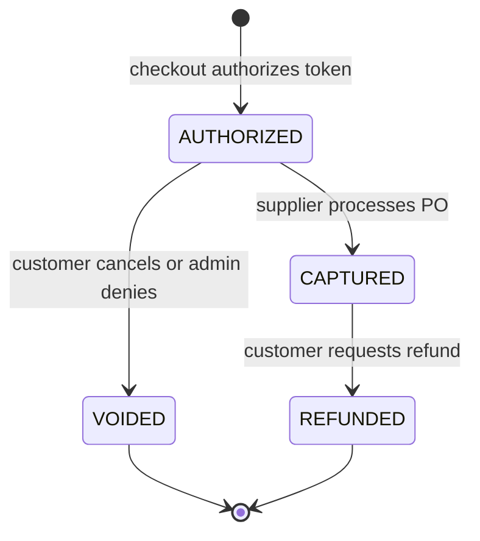
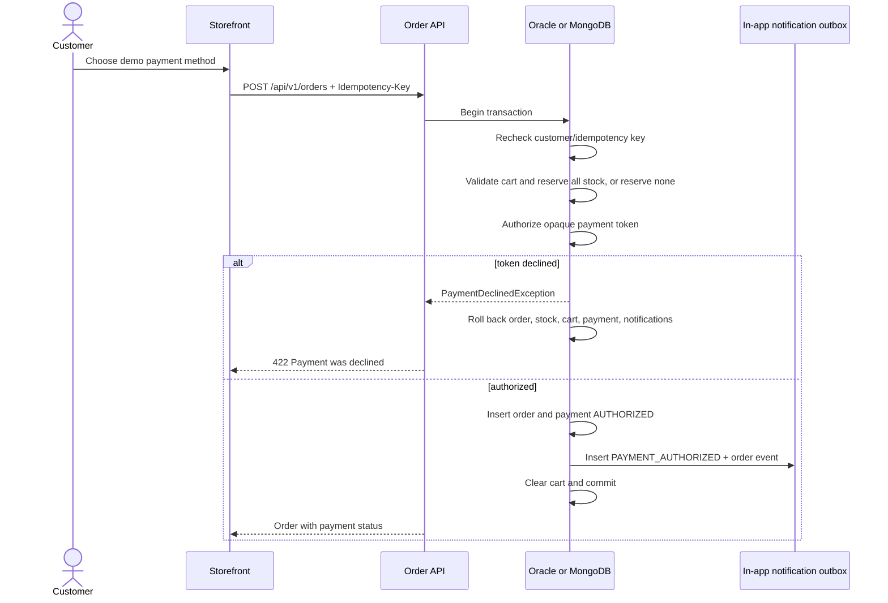
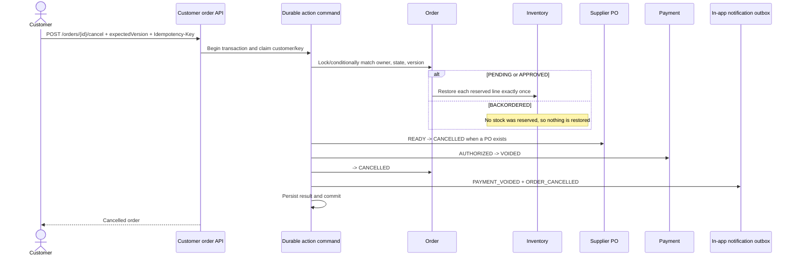
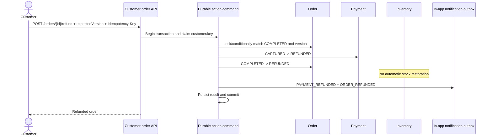

# Payment, customer cancellation, and refund lifecycle

## What is implemented

The storefront now models the payment lifecycle explicitly in both MongoDB and Oracle. Checkout authorizes a demo payment token, supplier fulfilment captures it, an eligible customer cancellation voids the authorization, and a customer refund returns a captured payment. Every payment/order/inventory/purchase-order/notification change commits atomically in the database selected by `APP_STORE`.

This is a deterministic local payment ledger, not a connection to a real card processor. The browser sends an opaque test token; the application never accepts or stores a PAN, CVV, expiry date, or billing secret. The supported tokens are:

- `tok_demo_visa` — approved and displayed as `Demo Visa ending 4242`.
- `tok_demo_declined` — deterministically rejected with HTTP 422.

Customer communication is deliberately in-app only. Payment and order events use the existing transactional notification outbox and appear in the storefront inbox/order timeline. No email is sent and no email-delivery infrastructure is required.

## State machines



```mermaid
stateDiagram-v2
    [*] --> BACKORDERED: checkout cannot reserve every line
    [*] --> PENDING: stock reserved; admin review required
    [*] --> APPROVED: stock reserved; auto-approved
    BACKORDERED --> PENDING: replenished; review required
    BACKORDERED --> APPROVED: replenished; auto-approved
    BACKORDERED --> CANCELLED: customer cancels
    PENDING --> CANCELLED: customer cancels
    APPROVED --> CANCELLED: customer cancels
    PENDING --> DENIED: administrator denies
    PENDING --> APPROVED: administrator approves
    APPROVED --> COMPLETED: supplier processes PO
    COMPLETED --> REFUNDED: customer requests refund
```

`CANCELLED` means fulfilment did not complete. `REFUNDED` means fulfilment already completed and the financial lifecycle was reversed. A refund intentionally does not restore inventory: returning physical stock needs a separate return-receipt/inspection workflow and must not be inferred from a financial refund.

## Checkout and authorization flow



The unique `(customerId, idempotencyKey)` order constraint makes a transport retry return the original order rather than authorize twice or reserve inventory twice. Payment identity is derived from the order ID, so there can be only one payment lifecycle per order.

## Customer cancellation flow

Cancellation is allowed while an order is `BACKORDERED`, `PENDING`, or `APPROVED`.



A `PROCESSED` supplier PO cannot be cancelled. A stale `expectedVersion` returns HTTP 409. If the same idempotency key and identical request are retried, the stored result is returned. Reusing the key for a different order, action, version, or reason returns HTTP 409.

The stock restoration, PO cancellation, authorization void, order transition, two notifications, and durable command record are one transaction. A crash cannot leave stock restored with an active order, or cancel an order while leaving a supplier PO processable.

## Capture and refund flow

Supplier processing changes a `READY` PO to `PROCESSED`, the order from `APPROVED` to `COMPLETED`, and the payment from `AUTHORIZED` to `CAPTURED` in one transaction. It creates `PAYMENT_CAPTURED` and `ORDER_COMPLETED` notifications.



Only the owning authenticated customer can see the payment or operate on the order. The service derives `customerId` from Spring Security's authenticated principal; it is not accepted in the request body.

## HTTP API

| Method and path | Request | Result |
|---|---|---|
| `POST /api/v1/orders` | Existing checkout body plus optional `paymentToken`; `Idempotency-Key` header | Authorizes payment and creates the order atomically. Missing token defaults to the approved demo token for backward compatibility. |
| `GET /api/v1/payments` | None | Returns only the signed-in customer's payment records, newest first. |
| `POST /api/v1/orders/{orderId}/cancel` | `{ "expectedVersion": n, "reason": "..." }`; `Idempotency-Key` | Cancels an eligible owned order, restores reserved stock when applicable, cancels its ready PO, and voids payment. |
| `POST /api/v1/orders/{orderId}/refund` | Same command shape | Refunds the captured payment for a completed owned order. |

All mutations require the normal same-origin CSRF token. Validation errors are 400, missing/non-owned resources are 404, stale versions or invalid state/idempotency reuse are 409, and a declined payment is 422.

## Persisted data

### Payment

Both adapters store the same fields: `id`, `orderId`, `customerId`, immutable `amount` and `currency`, masked `methodLabel`, lifecycle `status`, synthetic authorization/capture/refund references, lifecycle timestamps, and an optimistic `version`. The opaque token itself is not stored.

Oracle uses `PS_PAYMENT`; MongoDB uses `payments`. `orderId` is unique, so one order cannot have two payment aggregates. A customer/time index supports the payment-history query.

### Durable customer action command

Oracle uses `PS_CUSTOMER_ORDER_COMMAND`; MongoDB uses `customerOrderCommands`. Its ID is the deterministic `<customerId>:<Idempotency-Key>` value. It stores the complete request identity (`orderId`, action, expected version, reason), the resulting order status/version, and completion time. This is why an identical retry can return the committed result even after later state changes.

### In-app events

The existing notification collection/table now also supports `PAYMENT_AUTHORIZED`, `PAYMENT_CAPTURED`, `PAYMENT_VOIDED`, `PAYMENT_REFUNDED`, `ORDER_CANCELLED`, and `ORDER_REFUNDED`. Their deterministic IDs remain `<orderId>:<eventType>`, so workflow replay cannot duplicate a timeline event.

## Concurrency and failure guarantees

| Race or failure | Protection | Observable result |
|---|---|---|
| Double-click checkout | Checkout idempotency UK + transaction recheck | One order, one authorization, one stock reservation. |
| Decline during checkout | Authorization occurs inside checkout transaction | No order/payment/notification; cart and inventory remain unchanged. |
| Two identical cancellations/refunds | Durable command PK and stored result | Both callers converge on one committed result. |
| Same key, different request | Stored request-tuple comparison | HTTP 409; original command is untouched. |
| Customer cancel versus admin/supplier action | Oracle row locks or Mongo conditional version update, plus DB retry executor | One transition commits; the loser receives/re-evaluates a conflict. |
| Cancel versus stale PO creation | PO creation reloads the current order and requires supplier-ready state | A cancelled order cannot acquire a new PO. |
| Cancel after supplier processing | PO/order/payment state guards | HTTP 409; no partial reversal. |
| Refund before capture | Order/payment state guards | HTTP 409. |
| Retryable DB conflict/deadlock | Bounded database retry around the whole transaction | The complete operation retries, never an isolated side effect. |
| Notification worker failure | Transactional outbox retry fields and deterministic event ID | Business commit remains intact; in-app delivery retries independently. |

Oracle uses pessimistic locks for the order, PO, payment, and affected inventory rows. MongoDB combines replica-set transactions, optimistic versions, conditional updates, unique indexes, and transaction retries. Both implementations execute the same shared persistence contract and Playwright API/browser scenarios.

## Manual UI walkthrough

1. Open `http://localhost:8080/`, sign in as `alice/petstore-demo`, add an in-stock item, and check out with **Demo Visa ending 4242**.
2. Open **Orders & updates**. Confirm the order shows `Payment: AUTHORIZED` and the inbox contains the authorization and order-status events.
3. Click **Cancel order** before supplier completion. Confirm the order becomes `CANCELLED`, payment becomes `VOIDED`, and both new in-app events appear. For an order that had reserved stock, verify the storefront stock is restored.
4. Create another auto-approved order. Sign out, sign in as `supplier/supplier`, open `/supplier/`, and process its purchase order.
5. Sign back in as `alice/petstore-demo`. Confirm order `COMPLETED`, payment `CAPTURED`, then click **Request refund**.
6. Confirm order `REFUNDED`, payment `REFUNDED`, and the capture/refund/order notifications appear.
7. For rollback evidence, choose **Declined test card** during checkout. The UI reports the decline while the cart and inventory remain unchanged and no order is created.

Repeat against the Oracle-backed application at `http://localhost:8081/`; the API and UI behavior are identical.

## Deliberate production boundaries

- Replace the local token decision and synthetic references with a PCI-compliant provider adapter and provider idempotency key.
- Keep raw card data outside this service; hosted fields or provider tokenization should remain the browser boundary.
- Authenticate and deduplicate provider webhooks before allowing asynchronous payment transitions.
- Add refund amount/partial-refund support only with an explicit ledger and reconciliation rules.
- Add a merchandise return/inspection/restock workflow before coupling refunds to inventory.
- The current in-app outbox is the complete requested notification channel. Email can be added later as another idempotent delivery adapter without changing order/payment transactions.

## Implementation map

- Payment domain/API: `src/main/java/com/mongodb/modernization/petstore/payments/`
- Customer action port: `src/main/java/com/mongodb/modernization/petstore/orders/application/CustomerOrderActionStore.java`
- MongoDB transactions: `MongoStorefrontStore`, `MongoCustomerOrderActionStore`, `MongoSupplierStore`, `MongoAdminOrderStore`
- Oracle transactions: `OracleStorefrontStore`, `OracleCustomerOrderActionStore`, `OracleSupplierStore`, `OracleAdminOrderStore`
- Storefront UI: `src/main/resources/static/index.html` and `static/assets/app.js`
- Cross-store contract: `src/test/java/com/mongodb/modernization/petstore/persistence/StorefrontStoreContract.java`
- HTTP/browser E2E: `e2e/api-contract.spec.js` and `e2e/petstore.spec.js`
