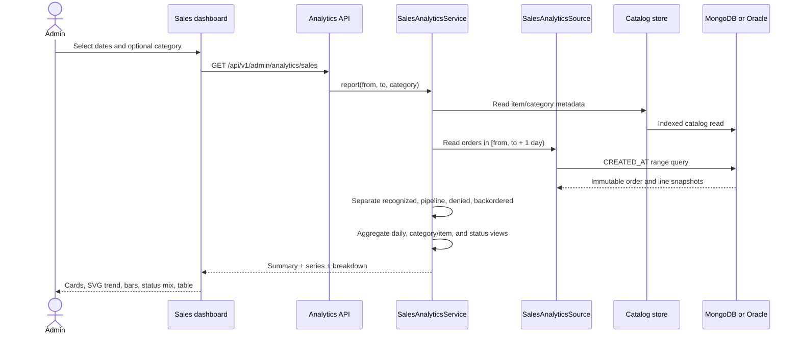
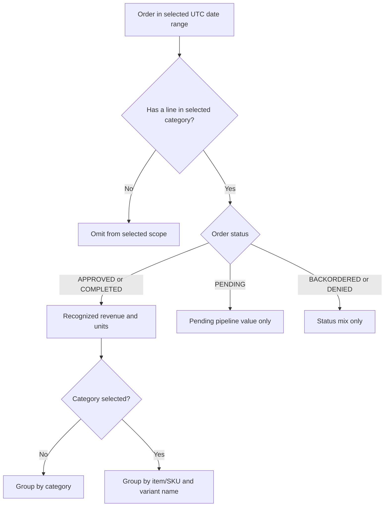

# Sales and revenue analytics

## Legacy behavior and modernization decision

Java Pet Store 1.3.2 exposed sales analytics through its Java Web Start administrator client. The legacy `OPCAdminFacadeEJB.getChartInfo` scanned purchase orders between two dates, summed line-item quantities for **orders**, summed `quantity × unitPrice` for **revenue**, grouped the top-level view by category, and drilled a chosen category down to item IDs. `BarChartPanel` and `PieChartPanel` rendered those results.

Evidence in the supplied source tree:

- `src/apps/opc/src/com/sun/j2ee/blueprints/opc/admin/ejb/OPCAdminFacadeEJB.java`
- `src/apps/admin/src/client/com/sun/j2ee/blueprints/admin/client/BarChartPanel.java`
- `src/apps/admin/src/client/com/sun/j2ee/blueprints/admin/client/PieChartPanel.java`
- `src/apps/admin/src/client/com/sun/j2ee/blueprints/admin/client/DataSource.java`

The modern dashboard retains the date range, quantity/revenue calculations, category view, and item drilldown. It makes one accounting distinction explicit: **recognized revenue** contains `APPROVED` and `COMPLETED` orders, while `PENDING` value is displayed separately as pipeline. `DENIED` and `BACKORDERED` orders remain visible in the status mix but do not inflate revenue.

## Administrator flow



## Recognition and drilldown rules



- Date boundaries are inclusive calendar dates interpreted in UTC; the database query uses an exclusive start-of-next-day upper boundary.
- Ranges are limited to 367 days to bound response size and the zero-filled daily series.
- Revenue uses immutable order-line subtotals, not current catalog prices.
- Category names come from the current catalog using the immutable line `productId`. Unknown/removed items are excluded rather than guessed.
- Order count is distinct per reporting bucket even when an order contains multiple lines.
- Average order value is recognized revenue divided by distinct accepted orders in the selected scope.
- A category filter changes the breakdown dimension from category to item/SKU, restoring the legacy drilldown while displaying variant names such as **Male Adult Bulldog**.

## API

```text
GET /api/v1/admin/analytics/sales
GET /api/v1/admin/analytics/sales?from=2026-08-01&to=2026-08-26
GET /api/v1/admin/analytics/sales?from=2026-08-01&to=2026-08-26&category=DOGS
```

The response contains:

- `summary`: accepted orders, units sold, recognized revenue, average order value, and pending value;
- `daily`: zero-filled daily recognized revenue/order/unit series;
- `breakdown`: category rows or item rows when drilled down;
- `statuses`: order counts and scoped values for every status present; and
- `categories`: valid filter options.

The API and `/admin/sales.html` require `ROLE_ADMIN`. Customers and suppliers receive HTTP 403. Invalid/reversed/overlong ranges receive Problem Details with HTTP 400, and unknown categories receive HTTP 404.

## Persistence, indexing, and observability

The shared calculator guarantees identical money, status, grouping, and date semantics. Only the bounded date-range read is store-specific:

- MongoDB queries `orders.createdAt` through `ix_order_analytics_created`.
- Oracle queries `PS_ORDER.CREATED_AT` through `IX_PS_ORDER_ANALYTICS_CREATED` and loads owned `PS_ORDER_LINE` rows.

The read is retry-safe because it has no mutations. Database timing/failure/retry telemetry is recorded as `admin.analytics.sales`, while every successful report emits a structured `admin.sales_analytics.viewed` event containing the dates, category scope, accepted order count, and revenue. No customer personal information is logged.

## Manual walkthrough

1. Sign in at `http://localhost:8080` as `alice` / `petstore-demo`.
2. Add one Canary and check out. Its `$125.00` order is auto-approved.
3. Add either Bulldog variant and check out. Its `$850.00` order remains pending.
4. Sign out, open `http://localhost:8080/admin/sales.html`, and sign in as `admin` / `admin`.
5. Confirm **Recognized revenue** is `$125.00` and **Pending pipeline** includes `$850.00`.
6. Confirm the daily trend, `APPROVED`/`PENDING` status rows, and the Birds category bar.
7. Select **Birds** in the category filter or click its bar. Confirm the breakdown changes to item mode and shows Canary.
8. Open `/admin/orders.html`, approve the Bulldog order, then return to Sales analytics. Its value moves from pending pipeline into recognized revenue.
9. Repeat on Oracle at `http://localhost:8081/admin/sales.html`; the behavior is identical.

## Automated coverage

- Unit tests cover recognition versus pipeline, exact decimal totals, zero-filled days, category/item drilldown, status ordering, invalid ranges, and unknown categories.
- The shared persistence contract creates a real accepted sale and verifies the reporting delta against MongoDB and Oracle.
- API E2E covers roles, values, category drilldown, range validation, the page alias, and both stores.
- Chromium E2E creates accepted and pending orders, signs into the dashboard, checks the visible cards/charts/statuses, and drills from Birds into Canary.
