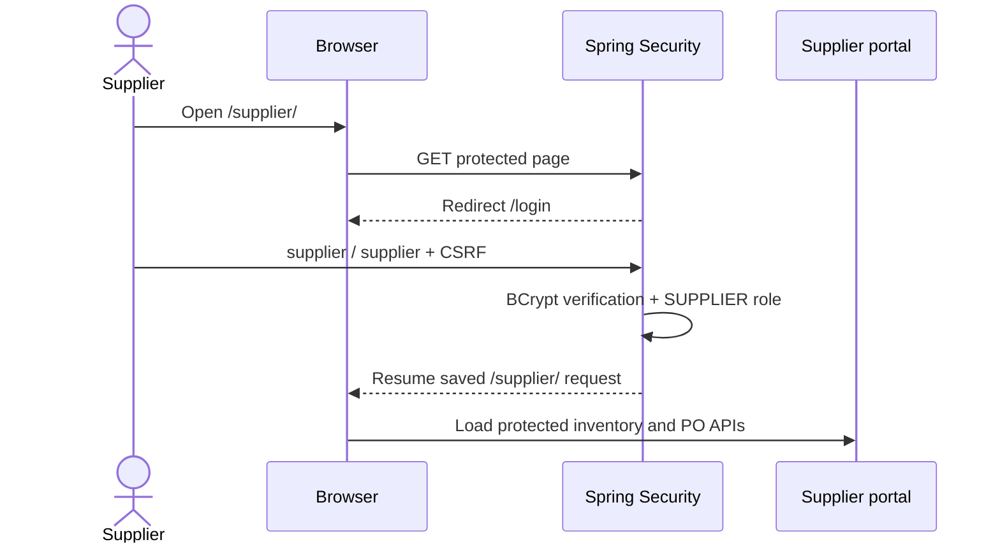
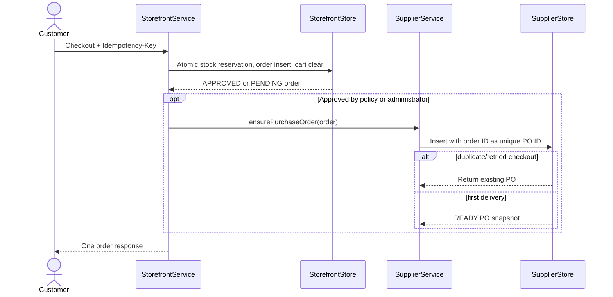
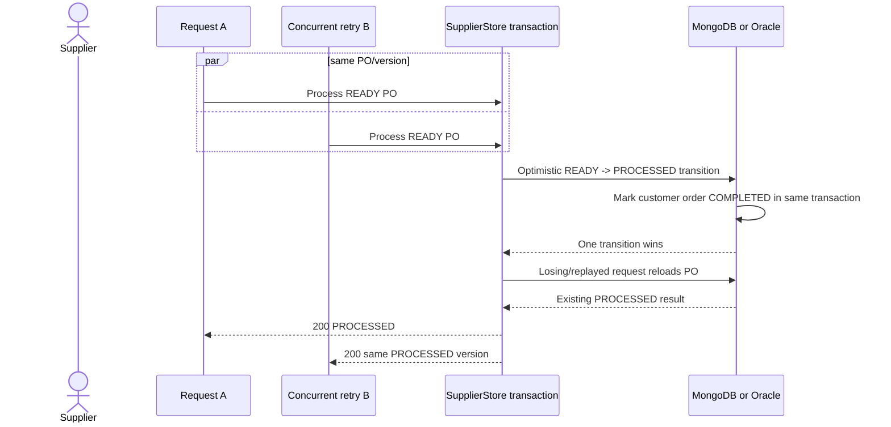

# Supplier portal: design, reliability, and verification

## Legacy behavior preserved

Java Pet Store 1.3.2 shipped a separate `supplier.ear`. Its supplier user could sign in, display inventory,
replace item quantities, receive purchase orders from the Order Processing Center, fulfil them, and return an
invoice/completion signal. The modernized application preserves that user-visible behavior inside the modular
monolith, with the database selected by the existing MongoDB/Oracle profile.

Open the running portal at `http://localhost:8080/supplier/` (MongoDB) or
`http://localhost:8081/supplier/` (Oracle), then sign in with `supplier` / `supplier`.

## 1. Supplier authentication and authorization



`CUSTOMER`, `ADMIN`, and `SUPPLIER` are separate roles. A customer or administrator receives HTTP 403 from
supplier APIs; an anonymous caller receives HTTP 401 or is redirected to login for the HTML portal.

## 2. Inventory viewing and replacement

```mermaid
sequenceDiagram
    actor Supplier
    participant UI as Supplier UI
    participant API as SupplierController
    participant Store as SupplierStore
    participant DB as MongoDB or Oracle
    Supplier->>UI: Enter absolute quantity and Update
    UI->>API: PUT productId, quantity, expectedVersion, CSRF
    API->>Store: replaceInventory(...)
    Store->>DB: Compare version and replace stock atomically
    alt same request replay
        DB-->>Store: Quantity already equals request
        Store-->>API: Return current product without another write
    else competing writer won
        DB-->>Store: Version mismatch
        Store-->>API: HTTP 409; refresh required
    else first valid write
        DB-->>Store: Increment version once
        Store-->>API: Updated product
    end
    API-->>UI: Render authoritative stock/version
```

The endpoint uses PUT semantics. Repeating the identical absolute quantity is safe even with the original
version, while attempting a different value with that stale version receives HTTP 409. Transient database
failures use the existing bounded exponential-jitter retry policy and appear in database telemetry.

## 3. Storefront order to supplier purchase order



The purchase-order ID is the customer order ID, giving the hand-off a natural durable idempotency key. Orders below the approval threshold arrive immediately; high-value orders arrive only after an administrator approves them. The
hand-off runs for both a new checkout and an idempotent checkout replay. If the application is interrupted after
the order commits but before the hand-off returns, repeating checkout repairs the missing hand-off without
decrementing inventory or creating another order.

## 4. Purchase-order processing and races



Processing is a state transition, not an increment. Sequential retries and simultaneous retries converge on the
same processed record. The supplier PO and customer order status change in one database transaction. Structured
events (`supplier.purchase_order.ready`, `supplier.purchase_order.processed`, and
`supplier.inventory.updated`) carry correlation IDs, while named database operations appear on the existing
observability dashboard.

## Manual verification

1. Sign in to the storefront as `alice` / `petstore-demo`, add one pet, and place an order.
2. Sign out, open `/supplier/`, and sign in as `supplier` / `supplier`.
3. In **Inventory**, change one absolute quantity and click **Update**. Refresh to confirm it remains stored.
4. Open **Purchase orders**. The storefront order appears once as `READY`.
5. Click **Process purchase order**. It changes to `PROCESSED` and the customer's order changes to `COMPLETED`.
6. Open `/admin/health.html` as `admin` / `admin` and inspect the `supplier.*` database operations and logs.

Automated coverage and exact commands are maintained in [the testing guide](../e2e/README.md).
