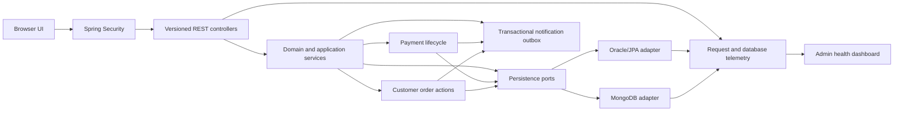
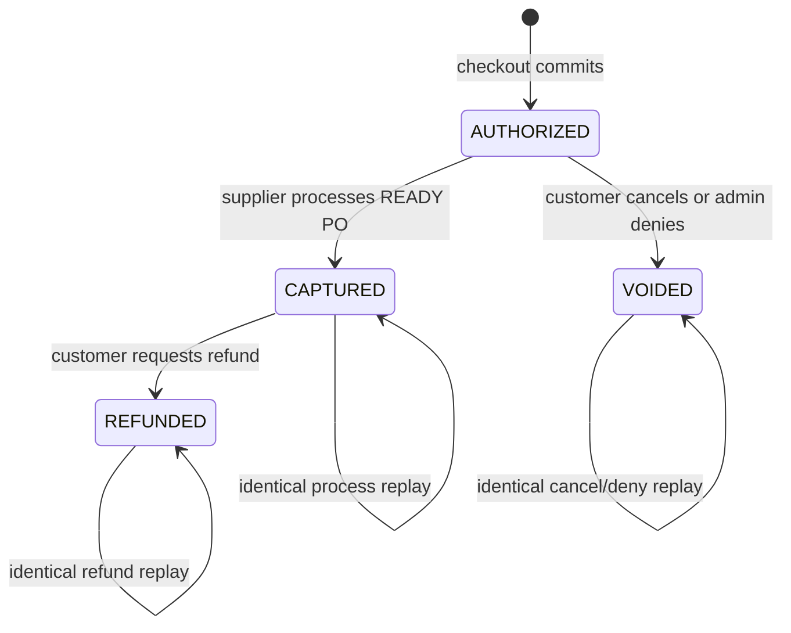

# Java Pet Store modernization: complete technical walkthrough script

> **Living document.** This is the canonical, speaker-ready explanation of the modernization effort. It describes the implementation as it exists in the repository, not an aspirational target architecture. Every feature change must update the relevant functionality, API, security, schema, concurrency, observability, testing, and demo sections here before the change is considered complete.

Last reconciled with the codebase: **2026-08-27**

Related detail:

- [Modernization summary](modernization-summary.md)
- [Oracle and MongoDB schema dictionary](database-schema.md)
- [Executable test matrix](../e2e/README.md)
- [Administrator approval](feature-admin-order-approval.md)
- [Supplier portal](feature-supplier-portal.md)
- [Backorder replenishment](feature-backorder-replenishment.md)
- [Customer notifications](feature-customer-notifications.md)
- [MyList and item variants](feature-mylist-and-item-variants.md)
- [Sales analytics](feature-sales-revenue-analytics.md)
- [Catalog and price management](feature-catalog-price-management.md)

---

## How to use this document

This document is deliberately written as a script. Text prefixed with **Say:** can be read aloud. Text prefixed with **Show:** is a demonstration cue. Text prefixed with **Why:** explains the design decision and its tradeoff. Text prefixed with **Evidence:** points to something that can be verified in the running application, source, database, logs, or tests.

A complete presentation can take several hours. For a shorter review:

1. Read the opening, architecture, security, concurrency, observability, and outcomes chapters.
2. Select the feature chapters most relevant to the audience.
3. Use the live-demo runbook near the end.
4. Keep the API and schema chapters available for technical questions.

The words “product,” “item,” and “SKU” have distinct meanings here. A product group is the customer-facing pet type, such as Bulldog. An item or SKU is the independently priced and stocked variant, such as Male Adult Bulldog. `K9-BD` can therefore be a group while `K9-BD-01` is a sellable item.

---

## 1. Opening: what we modernized

**Say:**

“We started with the Oracle Java Pet Store 1.3.2 reference application, a representative J2EE 1.3 system. It was designed around EAR files, EJBs, a front controller, application-server descriptors, JNDI resources, CMP persistence, JMS destinations, message-driven beans, and an installation toolchain from the early 2000s. The application was useful, but its runtime and operational assumptions made it difficult to build, run, test, secure, observe, and evolve on a current developer machine.

We rebuilt the business experience as a Java 21 and Spring Boot 4.1 modular monolith. The modern application preserves the customer storefront and adds complete browser-driven workflows for accounts, item variants, MyList, recommendations, carts, checkout, approval, backorders, supplier fulfilment, customer notifications, sales analytics, and catalog and price administration.

The same application behavior runs against Oracle or MongoDB. The database is always a separate service from the application container. Both adapters are tested against one shared behavior contract, so selecting a store does not silently change the user-facing rules.

The work was not just a syntax or framework upgrade. We made previously implicit reliability behavior explicit: optimistic versions, database predicates, transactions, idempotency records, deterministic event identities, stable lock order, safe retry classification, structured logging, health probes, live telemetry, query-plan diagnostics, and repeatable end-to-end tests.”

**Why:** A modernization succeeds when it improves changeability and operational confidence while preserving required outcomes. Rewriting classes without addressing deployment, race conditions, recovery, security, and verification would only create a newer-looking version of the same operational risk.

---

## 2. Scope and evidence

**Say:**

“The legacy comparison is based on the supplied Pet Store 1.3.2 tree at `/Users/adkunwar/Downloads/petstore1.3.2`. The legacy source contains four applications—the storefront, administrator, order-processing center, and supplier application. The storefront EAR alone contains seven EJB modules plus the web module. The runtime documentation expects the J2EE SDK 1.3.1, Cloudscape, a J2EE server, and Ant 1.4.1.

Our modernization covers the primary demonstrable commerce lifecycle end to end. It does not claim a byte-for-byte reproduction of every sample integration. Payment authorization, capture, void, and refund are implemented as a deterministic local ledger using opaque demo tokens; a PCI-compliant provider remains an explicit production adapter. Customer communication is intentionally in-app, so legacy mail delivery is not required. External OPC messaging and production identity-provider integration remain explicit external boundaries. Raw card data and even the opaque input token are never persisted.”

**Evidence:** Legacy architecture references include `src/apps/petstore/src/application.xml`, `petstore.war/WEB-INF/web.xml`, `sun-j2ee-ri.xml`, the async sender and mailer components, and the legacy installing and building guides.

**Why:** Honest scope matters. Recreating obsolete infrastructure solely for visual parity would consume effort without improving the candidate system. The design preserves the business seams so a real payment, email, queue, or enterprise identity adapter can be added later.

### Implemented scope

- Public category, catalog, item, and search browsing.
- Product groups with independently priced and stocked item variants.
- Customer registration, login, profile, preferences, and default address.
- MyList favourites and personalized recommendations.
- Versioned cart add, update, remove, totals, and quoted-price snapshots.
- Replay-safe checkout, order history, shipping snapshot, and stock reservation.
- Opaque-token payment authorization, supplier-time capture, pre-fulfilment void, and completed-order refund.
- Customer cancellation/refund with durable commands, optimistic versions, PO cancellation, and exact stock restoration policy.
- Automatic approval below the configured threshold and pending review above it.
- Administrator approval/denial queue with race-safe decisions.
- Durable backorders and atomic supplier-driven replenishment.
- Supplier login, inventory management, backorder view, PO view, and PO processing.
- Transactional order/payment lifecycle notifications with retry audit and read state; in-app delivery is the requested customer channel.
- Administrator sales/revenue analytics and item/category drilldown.
- Administrator item creation, repricing, publishing/archive, and audit history.
- Structured logs, correlation IDs, liveness/readiness, application telemetry, database-pool metrics, retry metrics, and query plans.
- Oracle and MongoDB runtime variants with shared tests.
- Unit, service, dual-store integration, API E2E, and browser E2E suites.
- CI, CodeQL artifact generation, container smoke tests, and CycloneDX SBOM generation.

### Explicitly not production-complete

- Enterprise OIDC/SSO, MFA, account recovery, email verification, and secret-manager integration.
- A PCI-compliant payment provider; the local ledger proves lifecycle behavior, and card data/token input is not stored.
- External email/SMS delivery is deliberately unnecessary; the durable in-app gateway is complete for this scope.
- Partial refunds, disputes/chargebacks, provider webhooks/reconciliation, and physical merchandise return/inspection/restock.
- Production database migrations and rollback tooling; schema creation is application-driven for the challenge.
- Distributed metrics/tracing retention; dashboard telemetry is local to the process.
- Horizontal multi-instance coordination for the scheduled notification poller.
- Full legacy visual/JSP fidelity and every historical sample integration.

---

## 3. Architecture: before, after, and why

### 3.1 Legacy baseline

**Say:**

“The original system uses the patterns expected of its period. EARs define deployment boundaries. EJBs own business and persistence behavior. The web tier routes through a front controller and talks through facades. JNDI resolves JDBC, JMS, and server resources. CMP lets the application server own much of the persistence lifecycle. Asynchronous work moves through queues, topics, and message-driven beans.

Those choices were reasonable for J2EE 1.3, but today they introduce a large compatibility surface: old application-server behavior, vendor descriptors, retired tooling, legacy JVM constraints, and multiple deployable artifacts that are hard to reproduce on Apple Silicon.”

### 3.2 Modern architecture



**Say:**

“The modern code is a modular monolith. Packages are organized by business capability: accounts, analytics, catalog, cart, MyList, notifications, orders, payments, supplier, observability, and persistence. HTTP controllers validate and translate input. Application services orchestrate use cases. Domain records own invariants and state transitions. Persistence ports describe required behavior. Oracle and MongoDB adapters implement those ports. Customer cancellation/refund is an order capability that coordinates the order, payment, inventory, supplier PO, notification, and durable-command stores inside one transaction.

One executable application serves the static same-origin UI and `/api/v1` JSON APIs. This avoids CORS and split-deployment complexity for a challenge-sized application while retaining clean API contracts.”

**Why modular monolith:** The workflows have strong transactional relationships. Splitting catalog, carts, orders, inventory, approval, notifications, and supplier fulfilment into networked services would introduce distributed transactions, message ordering, partial failure, service discovery, and many more deployment units. A modular monolith retains clear seams without paying that cost prematurely.

**Why ports and adapters:** The application must run with Oracle and MongoDB. Business rules belong above database-specific code. A shared port lets both adapters return the same domain model and lets one contract suite detect behavioral drift.

**Why one UI origin:** The browser can use session cookies and CSRF tokens without permissive CORS configuration. Security policy, correlation, and deployment remain simpler.

**Why Java 21 and Spring Boot:** Java 21 provides a current LTS baseline and mature runtime tooling. Spring Boot replaces server-specific deployment with an executable artifact, external configuration, Actuator probes, validation, security, and supported persistence integrations.

---

## 4. Runtime and deployment design

**Say:**

“The application and database do not share a container. A selected Compose profile starts exactly two relevant services: one application container and one database container. MongoDB data is stored in the `mongo-data` named volume. Oracle uses the database container’s persistent writable layer in the current local setup. Application JSON logs use the `app-logs` named volume.

MongoDB runs as a single-node replica set because multi-document transactions require replica-set semantics. Oracle uses the ARM-native `ghcr.io/gvenzl/oracle-free:23.9-slim-faststart` image because the newer image repeatedly exited while starting PMON on the tested Apple Silicon/Docker Desktop runtime. These are local development decisions; production topology would be managed outside Compose.”

### Local topology

| Variant | App URL | Database service | Default DB port | Persistence location |
|---|---|---|---:|---|
| MongoDB | `http://localhost:8080` | `mongo:8.2.11`, replica set `rs0` | 27017 | Docker named volume `mongo-data` |
| Oracle | conventionally `http://localhost:8081` when run beside Mongo | Oracle Free 23.9 ARM64 | 1521 | Oracle container writable storage in the current Compose design |

**Why separate containers:** The application must be independently replaceable and horizontally scalable; database lifecycle, storage, backup, resource limits, and patching are different concerns. Packing a database into the app image would couple state to an ephemeral process and make recovery unsafe.

**Why profiles:** Only the selected database should start. This prevents duplicate database containers and accidental port conflicts while keeping both adapters reproducible.

**Why named storage:** Container replacement should not silently erase MongoDB data or application logs. For destructive test runs the E2E runner deliberately removes its isolated volumes.

**Why readiness dependencies:** Compose waits for the database health check before starting the app. The app has its own readiness probe. “Process exists” is not sufficient evidence that the service can accept traffic.

### Runtime configuration decisions

- `APP_STORE=oracle|mongo` selects the adapter at startup.
- Environment variables own credentials, ports, pool size, retry policy, threshold, and log location.
- Graceful shutdown has a 20-second phase timeout.
- Unknown JSON properties fail validation, catching misspelled client fields instead of silently ignoring them.
- Error responses never include stack traces or internal exception messages from the framework.
- Default database pool bounds are minimum 1, maximum 10, 10-second wait, and 5-minute idle.
- Default safe database retry policy is five attempts, 25 ms initial delay, and 500 ms maximum delay.

---

## 5. Security model and the reasons behind it

### 5.1 Roles and trust boundaries

| Actor | Role | Allowed capabilities |
|---|---|---|
| Visitor | unauthenticated | Storefront assets, catalog reads, session/CSRF discovery, registration, liveness/readiness |
| Customer | `ROLE_CUSTOMER` | Profile, MyList, cart, checkout, own payment history, own order cancellation/refund, notification inbox/read state |
| Administrator | `ROLE_ADMIN` | Approval queue, sales analytics, catalog management, protected operational health and logs |
| Supplier | `ROLE_SUPPLIER` | Inventory, backorders, supplier purchase orders, processing |

**Say:**

“Authorization is deny-by-default. Public routes are enumerated; customer, supplier, and administrator routes are role-scoped. A customer cannot read another customer’s records because customer identity is taken from the authenticated principal, never from a caller-supplied customer ID. The same rule partitions carts, order history, payments, favourites, notifications, and cancel/refund commands. An order ID in a URL is only a lookup hint: the persistence query must still match the authenticated customer or return 404.”

**Why role separation:** Administrative price changes, supplier stock changes, and customer purchases have different blast radii. A single broad authenticated role would make privilege escalation or a UI mistake materially more dangerous.

### 5.2 Authentication design

**Say:**

“Business workflows use form login and an HTTP session. Passwords are BCrypt hashes. The two local operational JSON endpoints—admin health and logs—also support HTTP Basic through a higher-priority, narrowly matched security chain.

Basic authentication is deliberately not enabled for business APIs. Browsers cache Basic credentials by origin. Earlier in the implementation, a cached customer Basic identity could replace a valid administrator form session and cause persistent 403 errors. Splitting the chains means cached Basic credentials are considered only for the two read-only diagnostic endpoints. The business chain stores and restores one stable form-login security context in the HTTP session.”

“The diagnostic chain also reads an existing form-login session so the HTML health
dashboard works after an administrator signs in normally. A Basic-auth identity is
stored only in the current request and is never written over that HTTP session.
Therefore curl and health tooling can use Basic, the browser dashboard can use its
admin session, and an admin Basic request made alongside a customer session leaves
that customer session unchanged.”

**Why BCrypt:** It is a salted, adaptive password hash and avoids raw or reversibly encrypted passwords. Production would tune cost and migrate identity to an enterprise provider.

**Why sessions rather than browser tokens here:** The UI is same-origin and server-rendered/static. Secure server-side sessions reduce token storage and refresh complexity. A mobile/public API would justify a different OAuth/OIDC design.

**Why fresh `UserDetails` copies:** Spring Security erases credentials after authentication. Returning a fresh copy prevents one successful login from erasing the shared in-memory demo admin or supplier password for later logins.

### 5.3 CSRF, validation, and browser policy

**Say:**

“Authenticated mutations require CSRF tokens from a readable `XSRF-TOKEN` cookie or the `/api/v1/csrf` response. Registration is the only mutation exempted because it creates an unauthenticated principal and cannot mutate the current customer session. Logout is also CSRF protected.

Every request DTO applies length, format, range, and decimal constraints. Spring is configured to reject unknown JSON properties. A restrictive Content Security Policy permits only same-origin scripts, styles, and images, blocks objects, blocks foreign base URIs, and prevents framing.”

**Why CSRF:** Session cookies are sent automatically by browsers. Without a per-session token, a malicious site could cause authenticated inventory, cart, order, or catalog mutations.

**Why server-side validation:** UI validation is convenience, not a security boundary. APIs must reject malformed usernames, oversized strings, invalid prices, negative inventory, impossible quantities, and stale versions even when called directly.

### 5.4 Information handling

- Registration responses never include `passwordHash`.
- Raw passwords and payment-card data are not persisted. The checkout token is used only to select the deterministic local authorization result and is discarded before persistence.
- Payment responses contain a masked method label and synthetic references, never the submitted token, PAN, expiry, CVV, or billing secrets.
- Customer order-action command rows contain the reason and replay identity but no payment credential.
- Data-store failures return a generic 503 while the server log retains the exception.
- Framework error responses hide stack traces and internal messages.
- The log endpoint reads one deployment-controlled normalized file; callers cannot choose a filesystem path.
- `requestId` filters accept only 1–64 safe alphanumeric/period/underscore/hyphen characters.
- Supplied request IDs failing the safe pattern are discarded and replaced with UUIDs, preventing log injection.
- Operational endpoints require the administrator role.
- Liveness, readiness, and aggregate health remain public for orchestrators; non-health Actuator information and metrics are administrator-only.

Payment and customer-action threat controls:

| Threat | Control in the current implementation | Remaining production boundary |
|---|---|---|
| Customer reads or mutates another customer’s payment/order | Principal supplies `customerId`; owned lookup returns 404 for a mismatched order; no caller-supplied customer ID | Enterprise identity assurance, session anomaly detection |
| Browser forges cancel/refund | `ROLE_CUSTOMER`, same-origin session, CSRF token, validated DTO | TLS, secure deployment cookies, rate limiting |
| Retry causes double void/refund/restock | Per-customer durable idempotency command plus transactional state/version guards | Retention policy for command receipts |
| Reused key changes meaning | Stored order/action/version/reason fingerprint; mismatch returns 409 | Cross-region/global command-key policy if the app is distributed |
| Sensitive card data enters storage/logs | Only two recognized opaque demo tokens; input discarded; response/persistence uses masked label and synthetic references | Hosted provider fields/tokenization and PCI-scoped provider adapter |
| Supplier completes a cancelled order | PO/order status checks, PO lock or conditional update, one transaction | Distributed provider/broker reconciliation if boundaries are later extracted |
| Refund manufactures inventory | Refund deliberately leaves stock unchanged | Separate authorized return, inspection, and restock capability |

### 5.5 Security gaps before production

**Say:**

“The current credentials are local demo defaults. Before production we would move secrets to a secret manager, use TLS end to end, configure secure cookie flags for the deployment, integrate OIDC/MFA, add rate limiting and account lockout, add password reset/email verification, define audit retention, and perform a threat model and penetration test. The current CSP is intentionally strict, but other headers and proxy trust settings must be reviewed in the target platform.”

---

## 6. Schema design across Oracle and MongoDB

### 6.1 The central design choice

**Say:**

“The domain contract is the source of business behavior; Oracle rows and MongoDB documents are alternate physical representations. Current mutable aggregates carry optimistic versions. Historical commerce facts are snapshots. Natural or deterministic keys enforce replay safety where a client or workflow can repeat a command.”

**Why snapshots:** If an administrator changes a pet name, price, publication state, or a customer changes an address, a past order must not change. Cart lines quote the selected price; order and PO lines snapshot product ID, display name, unit price, quantity, and subtotal; orders snapshot shipping address and total.

**Why logical references in historical data:** Order/PO history must remain readable even if a catalog or account record later changes. Oracle therefore enforces parent-child ownership FKs for line tables but stores many cross-aggregate IDs as scalar logical references. MongoDB similarly stores references without database FKs and embeds aggregate-owned data.

### 6.2 Aggregate and key inventory

| Aggregate | Business key / primary key | Important uniqueness | Versioned? | Design reason |
|---|---|---|---:|---|
| Product/item | SKU string, e.g. `K9-BD-01` | One row/document per SKU | Yes | Catalog, supplier inventory, checkout reservation, and denial restoration share one concurrency token |
| Catalog change | UUID | One immutable audit entry | No | Audit is append-only and ordered by occurrence time |
| Customer account | Username | Username unique | No current profile version | Login name is the stable customer partition key |
| Favourite | `customerId:itemId` | Customer + item unique | No | Deterministic key makes duplicate add converge |
| Cart | Customer ID | One cart per customer | Yes | Prevents lost updates between tabs/requests |
| Order | UUID | Customer + checkout idempotency key unique | Yes | Prevents duplicate checkout and protects decisions/completion |
| Payment | Order UUID | One payment per order | Yes | Preserves immutable amount and serializes authorize/capture/void/refund |
| Customer order command | `customerId:Idempotency-Key` | Command key unique per customer | No; stores result version | Exact cancel/refund replay returns the original committed result |
| Supplier PO | Order ID/UUID | Order ID unique | Yes | Exactly one PO per eligible order; process replay converges |
| Notification | `orderId:eventType` | Order + type unique | Yes | Exactly one lifecycle event, with guarded delivery/read transitions |
| Supplier inventory command | Idempotency-Key | Command key unique | No; stores result version | Durable replay returns the original committed result |

### 6.3 Oracle physical model

**Say:**

“Oracle uses normalized parent and child tables where ownership matters. `PS_CART` owns `PS_CART_LINE`; `PS_ORDER` owns `PS_ORDER_LINE`; `PS_SUPPLIER_PO` owns `PS_SUPPLIER_PO_LINE`. Child primary keys combine the parent ID and `LINE_NUMBER`, preserving list order and preventing duplicate positions. Address fields are flattened into account and order rows. `@Version` columns protect mutable aggregates. Decimal monetary values use fixed-scale `NUMBER`, never floating point.”

| Oracle table | Primary key | Foreign/unique/index design | Main content |
|---|---|---|---|
| `PS_PRODUCT` | `ID` | category index | group/variant/category metadata, name, description, `PRICE NUMBER(12,2)`, stock, active, version |
| `PS_CATALOG_CHANGE` | `ID` | occurred-time index; logical product reference | actor, action, timestamp, before/after price, active state, versions |
| `PS_CUSTOMER_ACCOUNT` | `USERNAME` | no email uniqueness | BCrypt hash, profile, flattened default address, preferences |
| `PS_FAVORITE_ITEM` | deterministic `ID` | unique `(CUSTOMER_ID, ITEM_ID)`; customer/time index | saved item and first-save time |
| `PS_CART` | `CUSTOMER_ID` | one cart per customer | version |
| `PS_CART_LINE` | `(CUSTOMER_ID, LINE_NUMBER)` | FK to cart | product/name/price snapshot and quantity |
| `PS_ORDER` | `ID` | unique `(CUSTOMER_ID, IDEMPOTENCY_KEY)`; history and analytics indexes | status, address, total, review audit, version |
| `PS_ORDER_LINE` | `(ORDER_ID, LINE_NUMBER)` | FK to order | immutable purchase snapshots |
| `PS_SUPPLIER_PO` | `ID` | unique `ORDER_ID`; created-time index | customer, status, version, processed time |
| `PS_SUPPLIER_PO_LINE` | `(SUPPLIER_PO_ID, LINE_NUMBER)` | FK to PO | immutable approved-order snapshots |
| `PS_CUSTOMER_NOTIFICATION` | `ID` | unique `(ORDER_ID, TYPE)`; inbox and due-delivery indexes | customer event, outbox status, retry/read audit, version |
| `PS_SUPPLIER_INV_COMMAND` | `ID` | product audit index | original request tuple and committed result snapshot |
| `PS_PAYMENT` | `ID` equal to order ID | unique `ORDER_ID`; customer/created index | amount/currency, masked method, lifecycle references/timestamps, status, version |
| `PS_CUSTOMER_ORDER_COMMAND` | `customer:Idempotency-Key` | customer/order/time audit index | cancel/refund request tuple and committed order result |

**Why normalized children in Oracle:** Relational ownership constraints and indexed parent joins are natural, and child rows can be cascaded with their owning aggregate. Cross-aggregate product/account FKs are intentionally omitted for historical resilience.

**Why pessimistic locks in selected Oracle flows:** Checkout and complex cross-row supplier/admin transitions need a stable serialized boundary. Locking the cart/product rows in deterministic order prevents two transactions from both reasoning over stale shared state. Optimistic versions still provide explicit conflict semantics to callers.

### 6.4 MongoDB physical model

**Say:**

“MongoDB stores each aggregate in the shape most often read and changed. Cart lines live inside a cart document. Shipping address and lines live inside an order document. PO lines live inside the PO. These children have no independent lifecycle and embedding avoids joins for normal reads. Cross-aggregate checkout still needs a transaction because it changes products, order, cart, and notifications together.”

| MongoDB collection | `_id` | Embedded data and indexes | Reason |
|---|---|---|---|
| `products` | SKU | category and product-group indexes; price as Decimal128; version | Direct item reads and conditional stock/version updates |
| `catalogChanges` | UUID | occurred-time descending index | Append-only audit reads |
| `customerAccounts` | username | embedded default address | Profile reads are one document |
| `favoriteItems` | `customer:item` | customer/time index | Atomic upsert and customer list order |
| `carts` | customer | embedded lines; unique customer ID; version | Cart is one aggregate/document |
| `orders` | UUID | embedded address/lines; unique customer+idempotency; history and analytics indexes | One-document history read plus replay protection |
| `supplierPurchaseOrders` | order ID | embedded lines; unique order ID; version | One PO per order and direct supplier read |
| `customerNotifications` | `order:event` | customer/time and delivery/due indexes; version | Inbox and scheduled outbox queries |
| `supplierInventoryCommands` | idempotency key | product index and result snapshot | Replay exact result after later stock changes |
| `payments` | order ID | customer/time index; version | One masked payment lifecycle per order |
| `customerOrderCommands` | `customer:Idempotency-Key` | customer/order/time index | Replay exact cancel/refund outcome after later transitions |

**Why a replica set locally:** MongoDB only supports multi-document transactions in replica-set or sharded configurations. A one-node replica set gives local E2E tests the same transactional semantics without pretending a standalone server can provide them.

**Why Decimal128:** Prices and totals require exact decimal behavior. Binary floating point can turn equality, totals, and reporting into rounding bugs.

**Why no MongoDB JSON Schema validator yet:** Java validation and mappings govern current writes and tolerate a small amount of old data, such as missing versions. Production should add controlled collection validators and migrations after compatibility requirements are finalized.

### 6.5 Payment and customer-command storage in detail

**Say:**

“The payment record is deliberately one-to-one with the order. Its ID and `orderId` are the order UUID; Oracle additionally enforces `ORDER_ID` unique. It stores `customerId`, exact decimal `amount`, three-character `currency`, a safe masked `methodLabel`, current status, synthetic authorization/capture/refund references, lifecycle timestamps, and an optimistic version. There is no column or document field capable of retaining the submitted token or raw card data.

The customer command record is not another copy of the order. It is a durable receipt for a mutating request. Its deterministic ID is `customerId:Idempotency-Key`. It records customer, key, order, action, expected order version, normalized reason, result status, result version, and creation time. On replay, the code compares the original order/action/version/reason tuple. An exact match converges; any mismatch is a 409 conflict. This prevents a caller from reinterpreting an old key as a different cancellation or refund.”

| Stored field group | Oracle | MongoDB | Purpose |
|---|---|---|---|
| Payment identity | `PS_PAYMENT.ID`, unique `ORDER_ID`, `CUSTOMER_ID` | `payments._id`, `orderId`, `customerId` | One ledger per order and customer-scoped history |
| Monetary fact | `AMOUNT NUMBER(12,2)`, `CURRENCY` | Decimal128 `amount`, `currency` | Exact immutable authorized/refunded amount |
| Safe method data | `METHOD_LABEL`, synthetic reference columns | `methodLabel`, synthetic reference fields | Auditable demonstration without retaining the token or card data |
| Lifecycle audit | status, created/authorized/captured/voided/refunded timestamps, `VERSION` | same fields plus `@Version` | State guard, chronology, and concurrent-update detection |
| Command identity | `PS_CUSTOMER_ORDER_COMMAND.ID`, `IDEMPOTENCY_KEY` | `customerOrderCommands._id`, `idempotencyKey` | Durable per-customer replay boundary |
| Command fingerprint | order, action, expected version, reason | same | Detect same-key/different-payload misuse |
| Command result | result status/version and created time | same | Audit which terminal transition the command committed |

**Why separate payment and command aggregates:** The order answers what is being fulfilled, the payment answers what happened to funds, and the command answers whether a mutation has already been interpreted. Combining all three would conflate different lifecycles and make exact replay and audit less clear.

### 6.6 Index design

**Say:**

“Indexes follow demonstrated query paths, not speculative fields: category browsing; customer order history; checkout idempotency lookup; audit chronology; analytics date ranges; favourites by customer/time; notifications by customer/time and delivery/due time; supplier command audit. The health dashboard exposes query-plan evidence so index use is observable.”

**Why not index everything:** Every index consumes storage and adds write amplification. Indexes should correspond to bounded, frequent queries and be verified with execution plans.

**Why application-driven schema is temporary:** It speeds the challenge, but production requires reviewed Flyway/Liquibase and MongoDB migration scripts with explicit backfills, constraint names, rollout order, and rollback behavior.

---

## 7. Functionality walkthrough

### 7.1 Public catalog, search, and item variants

**Say:**

“Visitors can browse categories and published items without authenticating. Search preserves the legacy contains-style behavior across variant, name, and description. Category filtering is database-backed so its index can be used.

The storefront groups item rows by `productGroupId`. This restores the legacy distinction between a pet type and a sellable item: Male Adult Bulldog and Female Puppy Bulldog share a group but retain separate SKU, price, stock, and version. Selecting a variant changes the exact item added to MyList or cart.”

**Why:** A single product row cannot accurately model price or inventory differences between variants. The item/SKU is the stock and price boundary; the group is a presentation boundary.

**Correctness:** Archived items disappear from public listing and direct public lookup but remain in admin history. Existing cart/order snapshots remain valid after archive or repricing.

### 7.2 Customer account lifecycle

**Say:**

“A visitor can register with username, password, profile, contact details, default address, language, favourite category, MyList preference, and banner preference. The password is BCrypt-hashed before persistence and is never returned. Duplicate usernames return 409. After login, the customer can read and update only their own profile.”

**Why:** The authenticated principal determines the account. No customer ID appears in the profile URL, removing an insecure direct-object-reference opportunity.

**Validation:** Username is 3–50 safe characters; password is 12–100 characters; email has email syntax and a 254-character bound; address and preference fields have explicit bounds.

### 7.3 MyList and recommendations

**Say:**

“A customer can save or remove an exact item variant. Duplicate additions and removals are idempotent. Recommendations first prefer an unsaved sibling variant in the same product group, then products in the customer’s favourite category. Disabling the MyList preference pauses recommendations without deleting saved favourites.”

**Why deterministic favourite keys:** Two tabs saving the same item simultaneously should create one favourite, not an error or duplicate row.

**Why sibling-first:** It makes variant-level modernization visible and provides a deterministic, explainable recommendation rather than an opaque scoring model.

### 7.4 Cart

**Say:**

“The cart holds server-sourced item name and unit-price snapshots. Adding the same item combines quantities. Quantities are restricted to 1–99 and accumulated overflow is rejected. Every response carries a cart version. The next mutation must present that expected version. If two tabs edit the same version, one commits and the other receives 409 rather than silently overwriting the winner.”

**Why optimistic concurrency:** Cart contention is normally low. A version token avoids long locks and gives the browser a clear refresh-and-retry signal.

**Why quoted prices:** An administrator repricing an item must not rewrite what a customer already saw in the cart. Checkout uses the trusted cart snapshot; the server still computes totals.

### 7.5 Checkout and order history

**Say:**

“Checkout requires the expected cart version, shipping address, opaque demo payment token, CSRF token, and an `Idempotency-Key`. The transaction validates the cart, attempts all stock reservations, creates one immutable order, authorizes one payment, emits lifecycle notifications, and clears the cart.

A unique customer-plus-idempotency-key constraint makes network retry safe. The same customer and key returns the existing order instead of charging stock twice. A key is scoped to the authenticated customer, so customers cannot collide with one another.”

**Why transaction:** Stock, order, payment authorization, notification, and cart-clear are one business fact. Partial commit would cause overselling, duplicate purchase, a payment without an order, missing history, or a cleared cart without an order. The deterministic declined token proves rollback: no inventory, order, payment, notification, or cart change commits.

**Why immutable order snapshots:** A purchase is an audit fact. Later profile, catalog, or price changes must not mutate it.

### 7.5a Payment, customer cancellation, and refund

**Say:**

“The payment aggregate is an explicit ledger with `AUTHORIZED`, `CAPTURED`, `VOIDED`, and `REFUNDED` states. The checkout UI sends `tok_demo_visa` or the deterministic decline token. The approved token produces the safe label `Demo Visa ending 4242` and synthetic references. Neither token nor card number, expiry, or CVV is stored.

Supplier PO processing captures an authorized payment in the same transaction that moves the PO to `PROCESSED` and order to `COMPLETED`. An administrator denial voids the authorization in the denial/inventory-restoration transaction.

The owning customer can cancel an order while it is `BACKORDERED`, `PENDING`, or `APPROVED`. A reserved pending/approved order restores each line once; a backorder restores nothing because it reserved nothing. Any ready supplier PO becomes `CANCELLED`, the authorization becomes `VOIDED`, the order becomes `CANCELLED`, and payment/order events enter the outbox together. A processed PO cannot be cancelled.

The owning customer can refund only a `COMPLETED` order whose payment is `CAPTURED`. Payment becomes `REFUNDED` and order becomes `REFUNDED` together. Inventory is deliberately unchanged: a financial reversal is not evidence that a physical pet/item has been received, inspected, and accepted back into stock.”

**Why a ledger rather than a boolean:** `paid=true` cannot distinguish funds merely reserved from settled funds, voided authorization, or returned funds. Explicit states make invalid transitions rejectable and auditable.

**Why opaque tokens:** A production system should delegate sensitive payment collection to hosted provider fields/tokenization. The service needs a provider-safe token and masked label, never primary account data.

**Why durable customer commands:** Cancellation/refund carries `expectedVersion`, a bounded reason, and an `Idempotency-Key`. `PS_CUSTOMER_ORDER_COMMAND` or `customerOrderCommands` stores the full request identity and committed order result under `customerId:key`. Identical retry returns that result even if the order later changes. Same-key/different-order/action/version/reason returns 409.

**Why two notifications per financial/order transition:** Customers need both the financial fact and fulfilment fact. Deterministic IDs such as `orderId:PAYMENT_VOIDED` and `orderId:ORDER_CANCELLED` prevent replay duplicates while retaining an understandable timeline.

#### Payment state machine



**Say:**

“There is deliberately no direct `AUTHORIZED` to `REFUNDED` edge: an uncaptured authorization is voided, not refunded. There is no `CAPTURED` to `VOIDED` edge because settled funds require a refund. The `Payment` domain record owns these guards. Its `capture`, `voidAuthorization`, and `refund` methods converge when already in the requested target state and reject every other source state.”

#### Order, PO, and inventory relationship

```mermaid
stateDiagram-v2
    [*] --> BACKORDERED: checkout cannot reserve every line
    [*] --> PENDING: stock reserved and total >= threshold
    [*] --> APPROVED: stock reserved and total < threshold
    BACKORDERED --> PENDING: fully allocated; review required
    BACKORDERED --> APPROVED: fully allocated; auto-approved
    PENDING --> APPROVED: admin approves
    PENDING --> DENIED: admin denies / restore stock / void
    BACKORDERED --> CANCELLED: customer cancels / no restock / void
    PENDING --> CANCELLED: customer cancels / restock / void
    APPROVED --> CANCELLED: customer cancels / cancel READY PO / restock / void
    APPROVED --> COMPLETED: supplier processes PO / capture
    COMPLETED --> REFUNDED: customer refunds / no automatic restock
```

**Say:**

“Inventory treatment follows reservation history, not simply the final status. `PENDING` and `APPROVED` mean checkout or replenishment already reserved every line, so cancellation compensates that reservation exactly once. `BACKORDERED` means no line was reserved, so adding inventory during cancellation would manufacture stock. `COMPLETED` means the supplier has fulfilled the PO; refund reverses the money but does not pretend a physical return occurred.”

#### Cancellation transaction, as implemented

```mermaid
sequenceDiagram
    actor Customer
    participant API as Order API / StorefrontService
    participant Tx as Store adapter transaction
    participant Order as Order record
    participant PO as Supplier PO
    participant Stock as Product inventory
    participant Pay as Payment ledger
    participant Event as Notification outbox
    participant Cmd as Customer command

    Customer->>API: POST /orders/{id}/cancel + CSRF + key + version + reason
    API->>Tx: cancel(authenticated customer, order, request)
    Tx->>Cmd: find customer:key
    alt exact command already committed
        Cmd-->>Tx: replay receipt
        Tx-->>Customer: converged cancelled order
    else new command
        Tx->>Order: load owned order and guard state/version
        Tx->>PO: cancel READY PO; reject PROCESSED
        opt order had reserved stock
            Tx->>Stock: restore every line once
        end
        Tx->>Pay: AUTHORIZED -> VOIDED
        Tx->>Order: -> CANCELLED
        Tx->>Event: insert PAYMENT_VOIDED and ORDER_CANCELLED
        Tx->>Cmd: insert request fingerprint + result
        Tx-->>Customer: commit one atomic result
    end
```

**Code walkthrough:**

- `Payment.authorize` accepts only the approved local token, defaults a missing token to that approved demo method for backward compatibility, rejects the declined/unknown token with `PaymentDeclinedException`, and constructs the masked ledger without retaining input secrets.
- `StorefrontService.cancelOrder` and `refundOrder` take the authenticated username plus the request idempotency key, delegate to `CustomerOrderActionStore`, and emit the safe structured `order.cancelled` or `order.refunded` event only after the store returns.
- `OracleCustomerOrderActionStore` locks the owned order for review and locks the related PO before deciding. Its transaction restores Oracle product rows, changes payment and order state, inserts deterministic outbox events, and persists the command receipt.
- `MongoCustomerOrderActionStore` performs the same write set in a replica-set transaction. Conditional filters include the current order/PO status and version so a stale interleaving changes zero documents and becomes a 409.
- Both adapters catch a duplicate command insertion race, reload `customerId:key`, compare the stored request fingerprint, and converge only when the payload is identical.
- `OracleSupplierStore` and `MongoSupplierStore` capture payment only after the PO and customer order have both reached their completed states; the capture and two completion events share that transaction.
- `PaymentController` lists only payments belonging to the authenticated principal. The API has no customer ID parameter and exposes only the masked ledger.

#### Atomic write sets

| Command | Must commit together | Must never happen |
|---|---|---|
| Checkout succeeds | product reservations or durable backorder decision, order, `AUTHORIZED` payment, authorization/order events, cart clear | payment without order; cleared cart without durable order; partial stock reservation |
| Checkout declines | no database mutation | order, payment, event, stock, or cart-clear surviving the 422 |
| Admin denies | order `DENIED`, reserved-stock restoration, payment `VOIDED`, denial/void events | restored stock with authorized payment or non-denied order |
| Supplier processes | PO `PROCESSED`, order `COMPLETED`, payment `CAPTURED`, capture/completion events | captured money while PO/order remains incomplete |
| Customer cancels | order `CANCELLED`, optional READY PO cancellation, reservation-aware restock, payment `VOIDED`, two events, command receipt | processing a cancelled PO; double restock; restocking a backorder |
| Customer refunds | order/payment `REFUNDED`, two events, command receipt | refund of an authorization; automatic physical restock |

For the complete state machines, sequences, schema, and manual checks, see `docs/feature-payment-cancellation-refund.md`.

### 7.6 Approval policy and administrator decisions

**Say:**

“Orders below $500 by default are approved automatically and handed to the supplier. Exactly $500 and above become `PENDING`. The administrator queue shows current pending work and history. An approval creates one supplier PO. A denial restores reserved stock once. Each decision supplies the expected order version.

Repeating the already committed decision converges on the existing state. Reversing a decision conflicts. If approve and deny race, one transaction wins; the loser receives 409. Final inventory and PO state match the winner.”

**Why strict threshold:** It preserves the legacy comparison behavior: $499.99 is auto-approved; $500.00 requires review.

**Why one PO per order:** A unique order reference prevents duplicate supplier fulfilment even if the administrator request or handoff is retried.

### 7.7 Backorders and replenishment

**Say:**

“If any checkout line lacks stock, the application reserves none of the lines and creates a durable `BACKORDERED` order. The cart still clears because the customer’s request is now safely represented by the order. A notification explains that it is queued.

When a supplier replaces stock, the same transaction examines waiting orders oldest first. It allocates an order only if every line can be satisfied. The released order returns to the normal approval policy: below threshold it is approved and receives one PO; at or above threshold it becomes pending. Allocation and status notifications are inserted once.”

**Why all-or-nothing allocation:** Partially reserving an order creates difficult customer promises and compensating logic. Atomic allocation makes the state understandable and testable.

**Why oldest first:** It is deterministic and reduces starvation. A richer production allocator could use SLA or priority, but must preserve atomicity.

### 7.8 Supplier portal, inventory, and purchase orders

**Say:**

“The supplier has a separate role and portal. They can see every item-level inventory row, waiting backorders, and purchase orders. Inventory is an absolute replacement command with expected version and an idempotency key. New catalog items start at stock zero because the administrator owns merchandising and price while the supplier owns physical availability.

A purchase order begins `READY`. Processing changes it once to `PROCESSED`, records `processedAt`, moves the customer order to `COMPLETED`, captures its authorized payment, and emits payment-captured plus order-completed notifications. Concurrent identical process requests converge on the same result. Customer cancellation can change an unprocessed PO to `CANCELLED`; stale handoff code reloads the order and refuses to create a PO for a cancelled order.”

**Why durable inventory command records:** Returning only “current product state” is not enough. A retry may arrive after another order consumes stock. The command record stores original input and original committed result, so the same key returns the same outcome. Reusing a key for different input returns 409.

**Why ownership separation:** An administrator decides what is sold and at what price. The supplier decides what physically exists. Keeping those mutations separate prevents catalog creation from inventing inventory.

### 7.9 Customer notifications and delivery retry

**Say:**

“Order and payment transitions create customer notifications inside the same database transaction as the transition. The deterministic ID is `orderId:eventType`, so checkout, authorization, approval, denial/void, allocation, capture/completion, cancellation, and refund replays cannot create duplicate events.

Notifications form an in-app inbox and ordered timeline. Read acknowledgement uses an expected version and is customer-scoped. A scheduled delivery worker selects up to 50 due pending records, calls a gateway, and conditionally marks success. Failure records the bounded last error, increments attempts, and schedules exponential retry from one second up to five minutes.”

**Why transactional outbox:** Saving an order and sending a message in two unrelated actions creates a dual-write problem. A crash between them either loses the message or sends one for an uncommitted transition. Persisting the event in the transaction makes delivery recoverable.

**Why conditional acknowledgement:** Two workers or retries must not both rewrite delivery state. The version makes one acknowledgement authoritative.

### 7.10 Sales and revenue analytics

**Say:**

“Administrators can report a UTC date range, defaulting to the latest 30 days, with an optional category filter. `APPROVED` and `COMPLETED` orders count as recognized revenue. `PENDING` value is shown separately as pipeline. `BACKORDERED`, `DENIED`, `CANCELLED`, and `REFUNDED` are visible in status distribution but are not revenue. A completed order therefore leaves recognized revenue when its refund commits.

The response includes accepted orders, units, revenue, average order value, pending value, selectable categories, revenue breakdown, daily series, and status totals. With no category the breakdown is by category; after selecting a category it drills down to item/SKU. Ranges are inclusive, from must not exceed to, and the range cannot exceed 367 calendar days.”

**Why recognized status semantics:** Counting pending or backordered orders as revenue would overstate sales. Showing pipeline separately preserves business visibility without confusing it with accepted value.

**Why bounded range:** An unbounded analytical scan can harm the transactional application. The limit is explicit and testable.

### 7.11 Catalog and price administration

**Say:**

“Administrators can list all items, create a SKU, update metadata and price, publish or archive it, and view a durable newest-first change history. Create normalizes codes and starts stock at zero. A repeated create of the same SKU and identical payload returns the existing item. The same SKU with different data conflicts.

Updates require expected version. Catalog and supplier changes share the product version, so a stale price edit cannot overwrite a supplier stock update, and a stale inventory update cannot overwrite catalog state. The audit record and item mutation commit together.”

**Why natural-SKU create idempotency:** Administrators think in SKU identifiers. Treating an identical repeat as success makes double clicks and network retry safe without inventing a second command key.

**Why shared version:** Price, publication, and stock inhabit one current item. Independent version fields would allow one adapter to persist an old copy of fields owned by another workflow.

### 7.12 Operational health and logs

**Say:**

“Administrators have a friendly health dashboard and protected JSON endpoint. The dashboard shows readiness, selected store, uptime, traffic, errors, latency, JVM memory and threads, database pool usage, operation calls/failures/retries/latency, and read-only query-plan diagnostics. It refreshes every five seconds.

Every HTTP response gets safe request and correlation IDs. Completion logs include method, path, status, duration, and authenticated principal when available. An administrator can search the recent JSON log by request ID.”

**Why exclude health polling from traffic telemetry:** Monitoring should not create the traffic it claims to observe. `/api/v1/admin/health` and `/actuator/` are excluded from request charts.

---

## 8. Complete HTTP API and UI contract

### 8.1 Public and session endpoints

| Method and path | Access | Input | Result and guarantees |
|---|---|---|---|
| `GET /api/v1/catalog/products` | Public | optional `category`, optional `query` | Published item rows; DB category filter and case-insensitive contains search |
| `GET /api/v1/catalog/products/{id}` | Public | item ID | Published item or 404; archived direct lookup is not exposed |
| `GET /api/v1/catalog/categories` | Public | none | Distinct `{id,name}` categories derived from published items |
| `GET /api/v1/session` | Public | current session cookie if present | `authenticated`, `username`, `store`, `admin`, `supplier` |
| `GET /api/v1/csrf` | Public | session | CSRF header name and token; also establishes token cookie |
| `POST /api/v1/accounts` | Public, CSRF-exempt | validated registration DTO | Account response without hash; duplicate username 409 |
| `GET /actuator/health/liveness` | Public | none | Process liveness |
| `GET /actuator/health/readiness` | Public | none | Traffic readiness including store health |
| `GET /actuator/health` | Public | none | Aggregate health status; detail follows Actuator disclosure policy |
| `GET /actuator` | Administrator | admin session | Discovery links for exposed non-health management endpoints |
| `GET /actuator/info` | Administrator | admin session | Build/application information exposed by configuration |
| `GET /actuator/metrics` | Administrator | admin session | Available Micrometer meter names |
| `GET /actuator/metrics/{name}` | Administrator | meter name | One Micrometer meter snapshot |

### 8.2 Customer endpoints

| Method and path | Input | Concurrency/idempotency | Result |
|---|---|---|---|
| `GET /api/v1/accounts/me` | authenticated customer | principal-scoped | Own profile only |
| `PUT /api/v1/accounts/me` | profile DTO + CSRF | authenticated identity, server validation | Updated profile without password hash |
| `GET /api/v1/my-list` | none | principal-scoped | favourites and deterministic recommendations |
| `POST /api/v1/my-list/items/{itemId}` | CSRF | deterministic upsert; duplicate add converges | Updated list; unknown item 404 |
| `DELETE /api/v1/my-list/items/{itemId}` | CSRF | missing/duplicate remove converges | Updated list |
| `GET /api/v1/cart` | none | one cart per principal | Cart ID, customer, version, lines, total |
| `POST /api/v1/cart/items` | `{productId, quantity:1..99, expectedVersion>=0}` + CSRF | optimistic version; duplicate item combines | Updated cart or 409 stale version |
| `PUT /api/v1/cart/items/{productId}` | `{quantity:1..99, expectedVersion>=0}` + CSRF | optimistic version | Updated cart; missing line 404; stale 409 |
| `DELETE /api/v1/cart/items/{productId}` | `expectedVersion>=0` query + CSRF | optimistic version | Updated cart; missing line 404; stale 409 |
| `GET /api/v1/orders` | none | principal-scoped | Customer’s newest-first immutable orders |
| `POST /api/v1/orders` | `Idempotency-Key` <=100, expected cart version, address, optional opaque `paymentToken`, CSRF | transaction + unique customer/key + stock predicates + authorization | 201 with existing/new approved, pending, or backordered order; declined payment 422 and full rollback |
| `POST /api/v1/orders/{id}/cancel` | `Idempotency-Key`, `{expectedVersion>=0, reason}` + CSRF | durable command + owner/state/version guard | `CANCELLED`; reserved stock restored once, ready PO cancelled, authorization voided |
| `POST /api/v1/orders/{id}/refund` | `Idempotency-Key`, `{expectedVersion>=0, reason}` + CSRF | durable command + completed/captured guard | order/payment `REFUNDED`; inventory unchanged pending a real return workflow |
| `GET /api/v1/payments` | none | principal-scoped | Own masked payment ledger only; never token/card data |
| `GET /api/v1/notifications` | none | principal-scoped | Own inbox/timeline events only |
| `POST /api/v1/notifications/{id}/read` | `{expectedVersion>=0}` + CSRF | optimistic conditional update; replay safe | Read event; wrong customer/missing event 404 |

### 8.3 Administrator business endpoints

| Method and path | Input | Guarantees | Result |
|---|---|---|---|
| `GET /api/v1/admin/orders` | admin session | role-protected | Approval queue/history orders |
| `POST /api/v1/admin/orders/{id}/decision` | `{expectedVersion>=0, decision: APPROVED|DENIED}` + CSRF | serialized winner, replay convergence, opposite decision 409 | Reviewed order; approval creates one PO, denial restores once |
| `GET /api/v1/admin/analytics/sales` | optional ISO `from`, `to`, `category` | UTC inclusive range; max 367 days; unknown category 404 | Summary, categories, breakdown, daily series, statuses |
| `GET /api/v1/admin/catalog/items` | admin session | includes active and archived | All item/SKU rows |
| `POST /api/v1/admin/catalog/items` | validated create DTO + CSRF | natural SKU replay; audit atomic; stock 0 | 201 product; conflicting reuse 409 |
| `PUT /api/v1/admin/catalog/items/{id}` | expected version + complete validated item DTO + CSRF | shared optimistic item version; identical replay converges | Updated product/audit or stale 409 |
| `GET /api/v1/admin/catalog/changes` | admin session | newest first | Durable catalog audit entries |

Catalog DTO limits: item ID is 3–40 alphanumeric/hyphen characters beginning alphanumeric; group/category code begins alphanumeric and is 2–40 characters; variant 80; category name 80; pet name 120; description 1000; price $0.01–$999,999.99 with at most two decimal places.

### 8.4 Supplier endpoints

| Method and path | Input | Guarantees | Result |
|---|---|---|---|
| `GET /api/v1/supplier/inventory` | supplier session | role-protected | All item/SKU inventory including zero stock |
| `PUT /api/v1/supplier/inventory/{productId}` | `Idempotency-Key` <=100, `{expectedVersion>=0, quantity:0..1,000,000}`, CSRF | durable command, atomic backorder allocation, payload mismatch/stale 409 | Original committed product result on replay |
| `GET /api/v1/supplier/backorders` | supplier session | role-protected | Waiting backordered orders |
| `GET /api/v1/supplier/purchase-orders` | supplier session | role-protected | READY, PROCESSED, and CANCELLED POs for fulfilment/audit visibility |
| `POST /api/v1/supplier/purchase-orders/{id}/process` | `{expectedVersion>=0}` + CSRF | versioned transition; concurrent identical requests converge | PROCESSED PO and completed customer order |

### 8.5 Operational and friendly page routes

| Route | Access | Purpose |
|---|---|---|
| `GET /api/v1/admin/health` | admin Basic or admin within diagnostic chain | Full operational snapshot |
| `GET /api/v1/admin/logs?requestId=&limit=1..1000` | admin Basic or diagnostic access | Tail matched structured JSON entries from fixed log file |
| `GET /admin/health.html` | admin | Health dashboard |
| `GET /admin/orders` or `/admin/orders.html` | admin | Approval UI |
| `GET /admin/sales` or `/admin/sales.html` | admin | Sales dashboard |
| `GET /admin/catalog` or `/admin/catalog.html` | admin | Catalog/price UI |
| `GET /supplier` or `/supplier/` | supplier | Supplier portal |
| `GET /login` | public | Spring Security form login |
| `POST /logout` | authenticated + CSRF | Session termination |

### 8.6 Error semantics

| Status | Meaning in this system |
|---:|---|
| 400 | DTO/method validation, quantity rule, or invalid analytics range |
| 401 | Authentication required or invalid credentials for a Basic diagnostic request |
| 403 | Authenticated but wrong role, or missing/invalid CSRF for a mutation |
| 404 | Missing/hidden item, line, account-scoped order/payment/notification, or unknown category |
| 409 | Optimistic conflict, invalid order/payment transition, stock/decision race, duplicate checkout conflict, conflicting idempotency-key reuse, or duplicate account |
| 422 | Deterministic payment decline/unknown opaque payment token; checkout transaction is rolled back |
| 503 | Data store or log file temporarily unavailable; internal exception hidden from client |

**Why RFC-style problem details:** Clients receive consistent status, title, detail, and instance information instead of parsing Whitelabel HTML or implementation exceptions.

---

## 9. Transaction, concurrency, race, retry, and idempotency design

### 9.1 The governing rule

**Say:**

“A retry is safe only if the operation is naturally read-only or the entire transaction is protected by durable idempotency. We never blindly retry an ambiguous cart mutation, optimistic conflict, or constraint violation. Those are business outcomes, not infrastructure outages.”

### 9.2 Concurrency matrix

| Race or failure | Protection | Expected outcome |
|---|---|---|
| Two cart edits from version N | optimistic cart version | one commit, one 409; no lost update |
| Two customers buy remaining stock | conditional `stock >= quantity` within transactions | one reserves; other becomes durable backorder; stock never negative |
| Same checkout submitted twice | unique customer + idempotency key, transaction recheck | same order returned; stock/order/notifications happen once |
| Checkout crashes before response | committed idempotency lookup | retry returns committed order; uncommitted transaction leaves nothing partial |
| Payment token is declined | authorization inside checkout transaction | no order/payment/event/stock/cart-clear commits; HTTP 422 |
| Approve request repeated | order version/state + unique PO by order | same approved state and one PO |
| Deny request repeated | state/version + transactional restoration | stock restored exactly once |
| Approve and deny race | serialized transaction/conditional version | one winner, one 409; winner determines stock and PO |
| Two suppliers process same PO | PO version/state and idempotent completion | both converge on one processed PO; one capture and one pair of capture/completion events |
| Cancel versus supplier/admin transition | order/PO/payment locks or conditional versions | one complete transaction wins; loser conflicts/re-evaluates; no mixed states |
| Cancel after stock reservation | order version + transactional per-line restore | stock restored exactly once, ready PO cancelled, payment voided |
| Cancel a backorder | order state and absence of prior reservation | no inventory is added; payment voided and order cancelled |
| Stale handoff after cancellation | reload order and require supplier-ready state | cancelled order cannot acquire a new PO |
| Same cancel/refund submitted twice | durable customer/key command with request/result snapshot | original result returned; no double restore, void, or refund |
| Customer key reused for different command | compare order/action/version/reason tuple | 409; original result remains authoritative |
| Refund versus another transition | completed order + captured payment locks/versions | one refund commits; replay converges; no physical stock mutation |
| Same favourite added twice | deterministic key/upsert/unique constraint | one favourite |
| Same favourite removed twice | missing treated as desired end state | list remains empty; both calls safe |
| Same inventory command retried later | durable key/request/result snapshot | original result returned, even if stock changed later |
| Same inventory key with new payload | compare stored request tuple | 409; never reinterpret an old key |
| Two replenishments use same key | durable command plus transaction | one allocation path; callers converge |
| Multiple backorders become satisfiable | oldest-first, whole-order allocation in transaction | deterministic allocation, no partial reservation |
| Notification event inserted twice | deterministic order/type ID and unique constraint | one event |
| Two delivery workers acknowledge | notification version | one conditional transition; no version clobber |
| Catalog update vs supplier stock update | shared product version | stale operation conflicts instead of overwriting another owner’s fields |
| Reprice/archive after cart add | snapshots | cart/order retain quoted name/price; public catalog reflects current state |

### 9.3 Oracle strategy

**Say:**

“Oracle uses transaction templates, optimistic `@Version`, row-level pessimistic write locks at complex orchestration boundaries, database uniqueness, and conditional updates. Rows are acquired in a stable order to reduce deadlock risk. Checkout rechecks idempotency after acquiring the cart lock so a concurrent winner becomes visible before a duplicate is created.”

### 9.4 MongoDB strategy

**Say:**

“MongoDB uses a transaction manager against the replica set, document versions, conditional update predicates, unique indexes, and atomic upserts. Embedding makes cart-line and order-line ownership single-document, while cross-document checkout, replenishment, approval, and notification changes remain one transaction.”

### 9.5 Database retry executor

Retryable conditions:

- MongoDB `TransientTransactionError`, `UnknownTransactionCommitResult`, and `RetryableWriteError` labels.
- Mongo socket and timeout failures.
- `SQLTransientException` and `SQLRecoverableException`.
- Other Spring transient data-access failures after nested-cause inspection.

Not retryable by policy:

- Optimistic locking failures.
- Plain data-integrity/unique violations without a nested transient label.
- Validation, missing entities, insufficient inventory, or conflicting decision state.
- Operations marked unsafe by the caller, even if the transport failure looks transient.

Backoff uses equal jitter between half the exponential cap and the cap. The default cap sequence begins at 25 ms and is bounded by 500 ms. A non-zero floor gives the winning transaction time to commit and publish its idempotency record. Interrupted retry stops and records failure.

**Why jitter:** Identical clients retrying at the same deterministic intervals can collide repeatedly. Jitter spreads load and reduces synchronized contention.

**Why maximum attempts:** Infinite retry hides outages, increases latency, and can exhaust request threads. Bounded retry hands control back to the caller and makes failure visible.

---

## 10. Observability, health, and diagnostics

### 10.1 Request correlation and structured logs

**Say:**

“The correlation filter accepts `X-Request-ID` first and the challenge-compatible `X-Correlation-ID` second. A safe value is echoed in both response headers and placed in the logging MDC. Otherwise a UUID is generated. One `http.request.completed` event is written in a `finally` block with method, path, status, duration, and principal where available.”

Important structured events include:

- `http.request.completed`
- `api.conflict`
- `data.store.unavailable`
- `database.operation.retry`
- `notification.delivery.retry_scheduled`
- `payment.authorization.declined`
- `order.cancelled`
- `order.refunded`
- `admin.sales_analytics.viewed`
- feature-specific catalog/order/supplier lifecycle events recorded by their services

The structured application log and the notification outbox serve different purposes. `order.cancelled` and `order.refunded` are operator-facing JSON log events enriched with request/correlation context. `PAYMENT_AUTHORIZED`, `PAYMENT_CAPTURED`, `PAYMENT_VOIDED`, `PAYMENT_REFUNDED`, `ORDER_CANCELLED`, and `ORDER_REFUNDED` are durable customer-facing outbox event types stored in the selected database. The former helps investigate a request; the latter guarantees an in-app customer timeline even after the request and process have ended.

Logs use Logstash JSON on console and file. The local file rotates at 10 MB and retains seven histories by default.

### 10.2 Health surfaces

| Surface | Audience | Meaning |
|---|---|---|
| `/actuator/health/liveness` | orchestrator/public probe | JVM process is alive; avoid restarting for ordinary dependency outage |
| `/actuator/health/readiness` | orchestrator/public probe | application can receive traffic and its selected store is ready |
| `/api/v1/admin/health` | administrator | rich first-response diagnostics, not just UP/DOWN |
| `/admin/health.html` | administrator | five-second polling, UI-friendly operational dashboard |

### 10.3 Health response contract

The dashboard response contains:

- `status`, `store`, `startedAt`, `uptimeSeconds`.
- Traffic lifetime requests, 4xx, and 5xx.
- Rolling 60-minute requests, 4xx, 5xx, client/server error percentages, current-minute requests, average latency, maximum latency.
- Sixty per-minute traffic points with timestamp, request/error counts, average and maximum latency.
- JVM heap used/committed/max, live and peak threads, processors.
- Database pool snapshot.
- Per-operation calls, failures, retries, average and maximum latency.
- Store-specific read-only query-plan report.

### 10.4 Request telemetry internals

**Say:**

“The rolling traffic collector uses 60 minute buckets in an `AtomicReferenceArray`, `LongAdder` counters, and atomic maximum tracking. It is safe under concurrent request completion without serializing every request on one lock. Lifetime counters do not expire; rolling buckets do. Telemetry is intentionally in memory and resets on application restart.”

**Why local telemetry:** It gives the challenge an immediate operational surface with no extra Prometheus/Grafana containers. Production should export Micrometer metrics and traces to a durable platform.

### 10.5 Database telemetry and query plans

**Say:**

“Every wrapped database operation reports calls, failures, retries, total latency, average latency, and maximum latency. Pool metrics reveal saturation and wait pressure. Query-plan diagnostics are cached for 60 seconds so the dashboard does not repeatedly run explain operations.

MongoDB reports execution stats such as `IXSCAN`, `COLLSCAN`, documents examined, and keys examined. Oracle reports optimizer operation, selected index, estimated rows, and cost. Diagnostics are read-only.”

**Why plans in the dashboard:** An index in source code is not evidence that a database uses it. Plans connect design intent to runtime behavior.

### 10.6 Operational investigation script

**Say/Show:**

1. Send a request with `X-Request-ID: demo-investigation-1`.
2. Read the echoed request ID from the response.
3. Open the health dashboard and check error rates, latency, pool pressure, retry count, and plan type.
4. Query `/api/v1/admin/logs?requestId=demo-investigation-1` as administrator.
5. Correlate the completion event, any conflict/retry event, database latency, and returned status.
6. If readiness is down, inspect the selected database container health before restarting the application.

---

## 11. Automated verification strategy

**Say:**

“The test pyramid checks invariants at the lowest useful level and repeats business contracts through both stores. Unit/service tests explain policy quickly. The shared persistence contract proves transaction and race behavior in Oracle and MongoDB. Playwright API tests verify security and HTTP semantics. Browser tests prove that real users can complete the workflows.”

### Current test inventory

- **34** unit/service executions.
- **18 shared persistence contract cases per database**, for **36 executions**.
- **28 API E2E scenarios per database**, for **56 executions**.
- **13 browser E2E journeys per database**, for **26 executions**.
- **152 total executions** across both configured stores and **93 unique specifications** at the current test-matrix reconciliation.

The August 27, 2026 reconciliation completed all 70 Java tests with no skips and both uninterrupted 41-test Playwright matrices. Always treat [the executable test matrix](../e2e/README.md) and generated test reports as the exact run evidence for the current commit.

### What unit and service tests prove

- Exact cart money, duplicate combination, quantity bounds, and missing-line behavior.
- Product/item display names and variants.
- Catalog normalization, ownership, zero-stock creation, repricing, archive, and replay.
- Recommendation sibling/category ordering and preference behavior.
- Sales recognition, pending pipeline, totals, AOV, daily/status ordering, drilldown, and date validation.
- Checkout replay short-circuit and supplier handoff repair.
- Strict approval threshold and backorder transition policy.
- Admin approval/denial orchestration.
- BCrypt role-separated principals.
- PO snapshot and idempotent transition.
- Payment secret handling and authorize/capture/void/refund state guards.
- Notification deterministic identities, delivery acknowledgement, failure, and five-minute retry cap.
- Concurrent request telemetry with no lost counts.
- Transient database retry classification, unsafe failure behavior, and equal jitter bounds.

### What each shared persistence adapter must prove

- Seeded variants and optimistic cart versioning.
- Concurrent MyList add/remove convergence.
- Atomic and idempotent checkout.
- Simultaneous cart writes.
- Simultaneous buyers without negative stock.
- Replay-safe supplier inventory.
- Idempotent and concurrent PO processing.
- Concurrent same-key checkout replay.
- Approval/denial replay and opposing race.
- Durable notification timeline/read state.
- Atomic backorder creation and release.
- Concurrent replenishment retry.
- Sales analytics parity.
- Replay-safe catalog create/reprice.
- Archived storefront visibility and immutable quotes.
- Atomic payment/cancellation/refund behavior: decline rollback, capture at fulfilment, cancellation stock/PO/void consistency, refund without synthetic restock, and idempotent replay.

### What API E2E proves

The 28 scenarios collectively exercise session, CSRF, catalog, accounts, MyList, cart, checkout, payment history, cancellation, refund, orders, notification, supplier, admin decision, analytics, catalog administration, logs, health, page aliases, login, logout, role isolation, validation, stale versions, decline rollback, idempotency, concurrent races, and the cached-Basic/form-session regression.

### What browser E2E proves

The 13 real-Chromium journeys cover purchase, search, multiple customer logins, health dashboard, approval queue, supplier portal, backorder/replenishment, notification timeline, account registration/profile, item variants/MyList recommendations, sales analytics, catalog management, and visible authorize/cancel/void/capture/refund behavior.

### Why the E2E runner uses one worker

The fixture owns one disposable database state. Running unrelated cases concurrently would make stock/order assertions nondeterministic. Race coverage is not removed: concurrency tests intentionally launch simultaneous requests or threads behind latches inside a single isolated test.

---

## 12. CI/CD and supply-chain controls

**Say:**

“GitHub Actions separates fast failure domains. Java verification runs on Temurin 21. MongoDB and Oracle each run their own complete API/browser E2E job. A container-smoke job builds the image, waits for readiness, and verifies public readiness plus secured operational health. Failure artifacts retain test reports and service logs.”

| Workflow/job | Purpose |
|---|---|
| `ci / java` | Maven unit and dual-store integration verification; uploads Surefire reports |
| `ci / e2e-mongo` | Installs Chromium and runs MongoDB API/browser E2E; uploads Playwright report |
| `ci / e2e-oracle` | Runs the same contract against Oracle; uploads separate report |
| `ci / container-smoke` | Builds Compose application, waits for Mongo readiness, probes app, always cleans isolated resources |
| `codeql` | Java manual build plus JS analysis; stores SARIF artifacts when repository security upload is unavailable |
| `supply-chain / sbom` | Generates CycloneDX aggregate BOM and uploads it |
| Dependabot | Tracks dependency/workflow updates according to repository configuration |

**Why separate database jobs:** One adapter failure should be immediately identifiable. Combining output makes triage slow and can hide that only one persistence implementation drifted.

**Why artifacts even on failure:** A red job without reports, screenshots, traces, logs, or SARIF forces a local reproduction and loses the original environment evidence.

**Why CodeQL `upload: never`:** The private personal repository does not have the GitHub Code Security upload entitlement. Analysis still runs and retains SARIF instead of failing on an unavailable upload API.

---

## 13. Problems encountered and what they taught us

### Root URL returned Whitelabel 404

**Say:** “The API was healthy, but `/` initially had no explicit content mapping, so browsers showed a Spring Whitelabel 404. Browser choice was irrelevant. We added a same-origin storefront and friendly page aliases, then verified them with browser E2E.”

### Too many containers and two MongoDB-looking services

**Say:** “Multiple Compose project names and unrelated local Kubernetes/Oracle work made `docker ps` look like one application had packed or duplicated databases. We clarified service ownership, used stable project/profile commands, kept one selected database per deployment, and documented volumes and ports. Kubernetes system containers such as CoreDNS, Traefik, and metrics-server were not Pet Store dependencies.”

### X.509/download/toolchain friction

**Say:** “Legacy and modern dependency downloads encountered certificate/toolchain friction. The solution was to use supported current runtimes and pinned images rather than weakening certificate verification. Java 21 can be selected temporarily for the project; the user’s prior shell Java selection can be restored by removing that temporary override or re-exporting the previous `JAVA_HOME`.”

### Legacy 32-bit VM installation consumed too much effort

**Say:** “Trying to reconstruct the exact old J2EE runtime on Apple Silicon required x86 emulation, archived installers, and fragile networking. Because the objective was to understand appearance and behavior, we pivoted to source inspection and a lightweight legacy UI tour rather than treating emulator setup as the modernization deliverable.”

### Oracle PMON container exits

**Say:** “The newer Oracle Free image repeatedly exited during PMON startup on the local ARM runtime. The schema and app were not the cause. Pinning the stable ARM-native 23.9 faststart image made the local Oracle variant healthy and reproducible.”

### Repeated invalid credentials and 403 after role switches

**Say:** “The live server accepted the documented credentials, but browsers cache HTTP Basic identities by origin. A cached customer identity could supersede the desired administrator session. Incognito mode did not solve the architecture. We limited Basic auth to read-only diagnostics and made all business workflows exclusively form-session based. An E2E regression now proves a cached Basic customer cannot override an admin login.”

### Health dashboard loaded but reported `UNAVAILABLE`

**Say:** “After Basic authentication was isolated, the protected HTML page could be
opened with an administrator form session, but its fetch to the separately matched
diagnostic chain returned 401/403. The application and database were healthy; the
chain was not loading the existing HTTP-session security context. We made the
diagnostic chain read form sessions while saving Basic identities only in the
request. Live verification now proves admin session 200, customer session 403,
anonymous 401, admin Basic 200, and no Basic-to-session identity overwrite.”

### Catalog create appeared not to work

**Say:** “The catalog form was valid, but the same cached-Basic role collision caused the admin mutation to be forbidden. The security-chain fix restored create/update, and the workflow was verified through the API, browser, and both runtime variants.”

### Concurrent Oracle PO processing initially conflicted instead of converging

**Say:** “The new payment capture made supplier processing a larger atomic transition: PO, order, payment, and two outbox events. Two simultaneous Oracle requests could both observe the PO before one update committed, causing the loser to surface an optimistic conflict. We added a pessimistic `findByIdForUpdate` boundary for the PO, kept the expected-version/state guards, and retained replay handling. The winner performs the transition; an identical follower observes `PROCESSED`, verifies the completed order/payment/events, and returns the converged PO.”

**Why this matters:** Idempotency is not merely suppressing a duplicate insert. Every dependent aggregate must either already represent the same completed fact or be repaired inside a transaction before replay is reported as success.

### Full dual-runtime testing exceeded local resource limits

**Say:** “Running normal Mongo and Oracle deployments alongside another isolated Oracle E2E stack exhausted Docker Desktop resources and Oracle exited with code 41. We did not treat a resource-induced process death as a business-code failure. We stopped the redundant Oracle pair, ran the isolated test matrix, and then restored one healthy Oracle variant on port 8081. The lesson is to run one stateful Oracle test topology at a time on a constrained laptop and to distinguish container capacity failures from schema or transaction failures.”

### Payment browser tests needed commit-aware synchronization

**Say:** “A browser journey initially queried the payment list immediately after the checkout UI changed view. The UI transition was not itself proof that the API response and database transaction were observable to the following assertion. The test now waits on the relevant network/visible lifecycle result before checking payment and notification state. This avoids arbitrary sleeps while preserving a meaningful end-to-end assertion.”

**Why record failures:** Modernization documentation should preserve diagnostic reasoning, not only the final diagram. These failures explain why otherwise non-obvious configuration and security boundaries exist.

---

## 14. Live demonstration script

### 14.1 Start one variant

**Show:** Start MongoDB on the default application port with the repository’s documented Compose command. Wait for `app-mongo` and `mongo` to become healthy. Do not start a second project name for the same variant.

**Say:** “Two containers are expected: stateless application and stateful database. The database is not inside the application image.”

For Oracle side-by-side, use the documented Oracle profile with `APP_PORT=8081` and ensure the Mongo and Oracle database host ports do not conflict.

### 14.2 Public storefront

1. Open `http://localhost:8080/`.
2. Browse categories and search for `iguana`.
3. Find Bulldog and switch between Male Adult and Female Puppy.
4. Explain product group versus exact item/SKU.

### 14.3 Customer and MyList

1. Register a new customer or log in as `alice / petstore-demo`.
2. Open/update the profile and preferences.
3. Save Female Puppy Bulldog to MyList.
4. Show Male Adult Bulldog as the sibling recommendation.
5. Disable recommendations and show favourites remain saved; re-enable afterward.

### 14.4 Cart and ordinary checkout

1. Add an item from MyList or catalog.
2. Change quantity and explain the visible version-backed mutations.
3. Checkout with a low-value total and **Demo Visa ending 4242**.
4. Refresh/retry without creating a second order.
5. Show the approved order, `AUTHORIZED` payment, and authorization/order notifications.
6. Optionally choose the declined test method on a fresh cart and show that the order, payment, inventory, and cart-clear all roll back.

### 14.4a Customer cancellation and refund

1. On an approved/pending/backordered order, click **Cancel order**.
2. Show `CANCELLED`, payment `VOIDED`, the cancelled ready PO where applicable, and the two new in-app events.
3. For a previously reserved order, show stock restored exactly once; for a backorder, show no stock was created.
4. Create and fulfil a second order through the supplier portal.
5. Return as the customer and show `COMPLETED` plus payment `CAPTURED`.
6. Click **Request refund** and show order/payment `REFUNDED` plus the two refund events.
7. Explain why stock did not change: the financial refund is complete, but a physical return/inspection/restock flow is a distinct future capability.
8. Open the in-app notification timeline and point out the paired financial and order events. No SMTP or external email service is required for this scope.
9. Repeat the original cancel/refund request with the same key and payload through the API test/demo tooling; show that the stored result converges without another stock/payment/event mutation. Then reuse the key with a different reason and show 409.

### 14.5 High-value approval

1. Create a cart at or above the configured threshold.
2. Checkout and show `PENDING`.
3. CSRF-protected logout.
4. Login as `admin / admin`.
5. Open `http://localhost:8080/admin/orders`.
6. Approve the order and show it leaves pending history with one supplier PO handoff.
7. Explain that a deny path restores stock once and opposite decisions race safely.

### 14.6 Supplier fulfilment and backorders

1. Logout and login as `supplier / supplier`.
2. Open `http://localhost:8080/supplier/`.
3. Show item-level inventory and the READY PO.
4. Process it and show PROCESSED, customer order COMPLETED, and payment CAPTURED in one transaction.
5. For the backorder demo, set a product stock to zero, place a customer order, then replenish it.
6. Show the waiting order disappear, the PO appear, and the customer timeline gain allocation and approval events exactly once.

### 14.7 Catalog and pricing

1. Login as administrator.
2. Open `http://localhost:8080/admin/catalog`.
3. Create a new SKU and point out stock starts at zero.
4. Login as supplier and set stock.
5. Return as admin, change price, then archive.
6. Show it disappears publicly but remains in admin and audit history.
7. Show that an earlier cart/order retains its quoted price.

### 14.8 Sales dashboard

1. Login as administrator.
2. Open `http://localhost:8080/admin/sales`.
3. Select a date range.
4. Explain accepted revenue versus pending pipeline.
5. Click a category to drill down to item/SKU.
6. Point out that denied/backordered/cancelled/refunded orders are visible in state reporting but not recognized revenue.
7. Refund a completed order, refresh the same date range, and show that its value leaves recognized revenue while the `REFUNDED` status remains visible.

### 14.9 Health and incident drilldown

1. Open `http://localhost:8080/admin/health.html` as administrator.
2. Show UP, selected store, uptime, request/error/latency graphs, JVM, pool, operations, retry counters, and query plans.
3. Generate a safe request ID on an API request.
4. Search `/api/v1/admin/logs?requestId=<id>`.
5. Explain how UI symptom, HTTP status, structured event, database telemetry, and plan evidence join into one investigation.

### 14.10 Repeat against Oracle

**Say:** “The strongest persistence-modernization evidence is not a second slide. It is running the same API/browser and shared concurrency contracts against the Oracle-backed service on port 8081.”

---

## 15. Why the modernized system is better

| Outcome | Legacy constraint | Modern improvement |
|---|---|---|
| Developer setup | Archived J2EE SDK, application server, Ant, Cloudscape, multiple EARs | Java 21, Maven Wrapper, Compose, one app artifact and selected DB profile |
| Portability | Server/JNDI/vendor descriptor dependence | External configuration and standard containers |
| Changeability | Technical-tier and EJB boundaries | Business-capability modules and persistence ports |
| Persistence choice | CMP/JDBC tied to server assumptions | Oracle and Mongo adapters behind one tested behavior contract |
| Correctness | Many container-managed effects implicit | Explicit versions, predicates, transactions, states, idempotency, and snapshots |
| User experience | Legacy pages/Java Web Start administration | Responsive same-origin storefront and role portals |
| Security | Broad server-era configuration | Enumerated public routes, roles, CSRF, BCrypt, CSP, safe errors and operational isolation |
| Observability | Log/server inspection | Correlation, JSON logs, probes, live telemetry, pool and query plans |
| Recovery | External workflow failure hard to reason about | Transactional outbox and bounded retry audit |
| Confidence | Manual sample verification | Unit, dual-store contract, API, browser, CI, CodeQL, and SBOM evidence |

**Say:**

“The most important improvement is explicitness. We can point to the transaction boundary, version field, unique key, state transition, retry classification, role matcher, metric, query plan, and executable race test. That makes behavior reviewable rather than dependent on application-server convention or developer memory.”

---

## 16. Design tradeoffs and future evolution

### Why not microservices now?

The current workflows share strong atomicity and are operated by one small application. Module boundaries are sufficient. Extract a service only when independent scale, ownership, release cadence, or regulatory isolation outweighs distributed-system cost.

### Why support both Oracle and MongoDB?

It separates application modernization from database cutover. Teams can compare behavior and operational characteristics while retaining fallback. The cost is duplicated adapter code and tests; the shared contract keeps that cost controlled.

### Why in-process dashboards rather than a full stack?

It avoids extra containers and gives immediate review value. Production should export metrics/traces to Prometheus/OpenTelemetry and use Grafana or the organization’s platform for retention, alerting, and multi-instance aggregation.

### Why transaction outbox but no message broker?

The durable event is the correctness boundary. A broker is a delivery mechanism. The gateway can later publish to Kafka/JMS/email without changing order transactions or event identity.

### Why no physical FK for every reference?

Aggregate-owned child FKs are enforced in Oracle. Historical cross-aggregate snapshots are intentionally independent. This improves history resilience but requires service-level integrity and careful future delete behavior.

### Recommended next production steps

1. Enterprise OIDC/MFA, managed secrets, TLS, cookie/proxy hardening, and rate limiting.
2. Flyway/Liquibase and controlled MongoDB index/validator migrations.
3. OpenTelemetry traces and durable metrics/log export with SLO alerts.
4. Real notification provider with provider idempotency using the deterministic event ID.
5. Replace the deterministic local payment adapter with provider tokenization, idempotent provider calls, webhooks/reconciliation, partial refunds, disputes, and a physical return/inspection/restock workflow. Preserve the existing explicit authorization/capture/void/refund states and never store raw card data.
6. Multi-instance-safe outbox claiming/leases and load/failure testing.
7. Backup/restore tests, disaster recovery objectives, data retention, and privacy deletion policy.
8. Accessibility, cross-browser, performance, security, and dependency-policy gates.

---

## 17. Living-document maintenance contract

This document must change whenever implementation behavior changes. A feature is not “done” until its documentation evidence is current.

### Required update checklist for every feature change

- [ ] Update the implemented-scope list and explicitly state any remaining gap.
- [ ] Update the feature walkthrough and its **Why** rationale.
- [ ] Add/change every affected API row, validation rule, status code, role, CSRF rule, and response behavior.
- [ ] Update the security trust boundary and threat/mitigation notes.
- [ ] Update Oracle tables/columns/PKs/FKs/unique keys/indexes and MongoDB collections/fields/indexes.
- [ ] Update snapshots, ownership, deletion, and data-retention implications.
- [ ] Document transaction boundaries and every relevant concurrent interleaving.
- [ ] State idempotency-key scope, replay result, and different-payload behavior.
- [ ] Classify which failures are safely retried and which return to the caller.
- [ ] Add structured event names, correlation behavior, metrics, health, and query-plan effects.
- [ ] Add unit/service, Oracle/Mongo shared contract, API E2E, and browser E2E cases.
- [ ] Reconcile the numeric test inventory with `e2e/README.md`.
- [ ] Update CI/deployment/configuration if the feature changes runtime needs.
- [ ] Add or revise the manual demonstration script.
- [ ] Record a short entry in the change log below.

### Review questions every feature must answer

1. What user or operator outcome did we add or change?
2. Why is this the appropriate module and transaction boundary?
3. Who is authorized, and how is object ownership enforced?
4. What is the source of truth and what is a snapshot?
5. What happens when the same command is sent twice?
6. What happens when two different commands race?
7. What happens if the process or database fails before, during, or after commit?
8. Which errors are retryable, by whom, and with what bound?
9. How will an operator detect and investigate failure?
10. Which tests prove the happy path, validation, authorization, rollback, replay, and races in both stores?
11. How can a reviewer demonstrate it manually?
12. What is still intentionally not production-ready?

### Document change log

| Date | Change |
|---|---|
| 2026-08-27 | Reconciled the script with the completed payment lifecycle and customer cancellation/refund implementation. Added payment/order state diagrams, the cancellation sequence, atomic write sets, exact Oracle/Mongo persistence fields, principal-scoped security behavior, durable event identities, implementation-class walkthrough, race/resource lessons, test evidence, and an expanded manual demonstration. Corrected the production roadmap so the already implemented payment states are not presented as future work. |
| 2026-08-27 | Corrected diagnostic authentication so the operations dashboard can read health with an administrator form session while Basic authentication remains request-only and limited to read-only health/log APIs. Added live and E2E role/session regression evidence. |
| 2026-08-27 | Created the canonical deep-dive script from the implemented storefront, account, MyList/variant, cart, checkout, approval, backorder, supplier, notification, analytics, catalog, security, dual-schema, observability, deployment, CI, and test behavior. Included design rationale and historical troubleshooting decisions. |

---

## 18. Closing script

**Say:**

“This modernization is not simply the old Java Pet Store compiled on a newer JDK. It is a deliberate translation of its useful business behavior into an architecture that can be built, run, secured, observed, tested, and changed today.

We kept one deployable modular application because the domain benefits from local transactions. We separated persistence so Oracle and MongoDB can be evaluated without rewriting business rules. We separated the app and database lifecycles. We made customer, supplier, and administrator capabilities explicit. We preserved historical truth through immutable snapshots. We made retries safe through durable identities and state machines rather than hope. We made races executable in tests. We made runtime behavior visible through correlation, health, telemetry, pool metrics, and query plans.

The result is not presented as a finished production commerce platform. It is a well-evidenced modernization foundation: behaviorally rich, operationally understandable, honest about its boundaries, and structured so the next feature can be added without losing the guarantees already built.”
